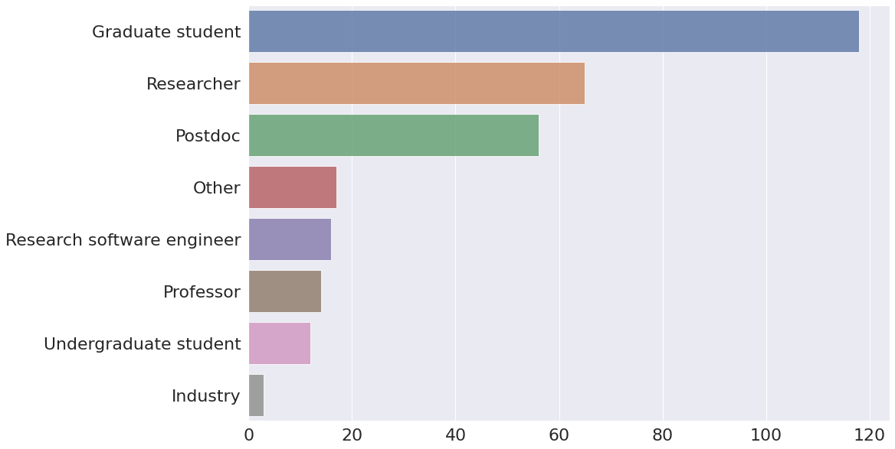
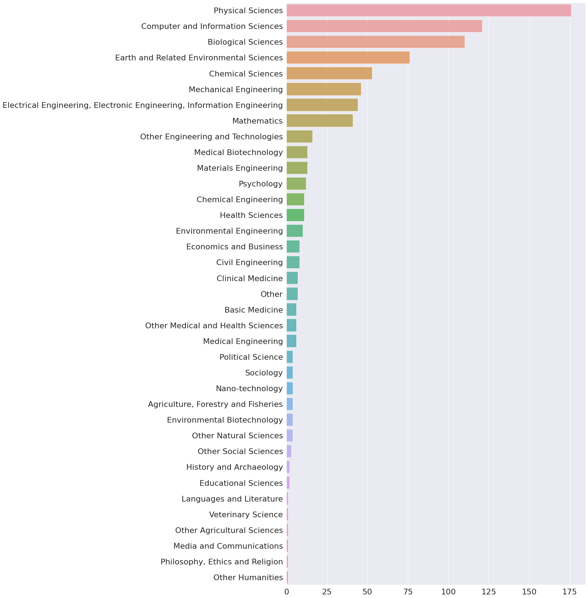
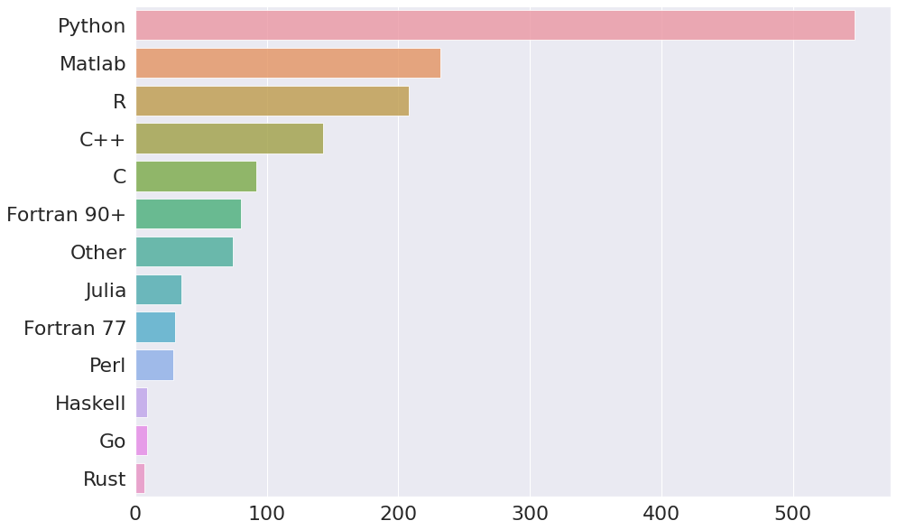
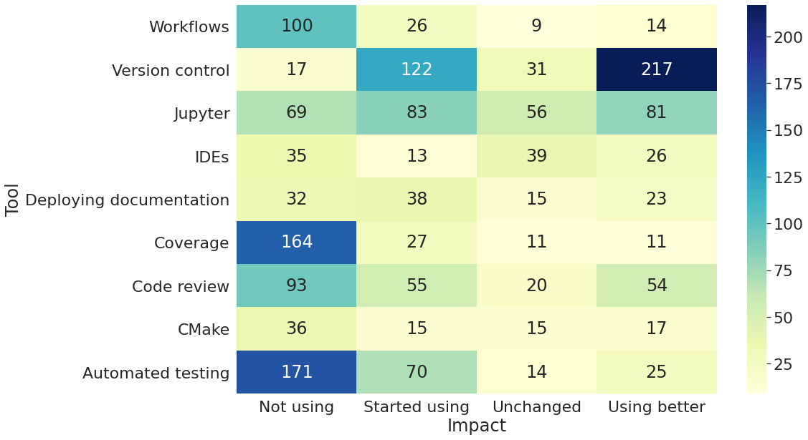
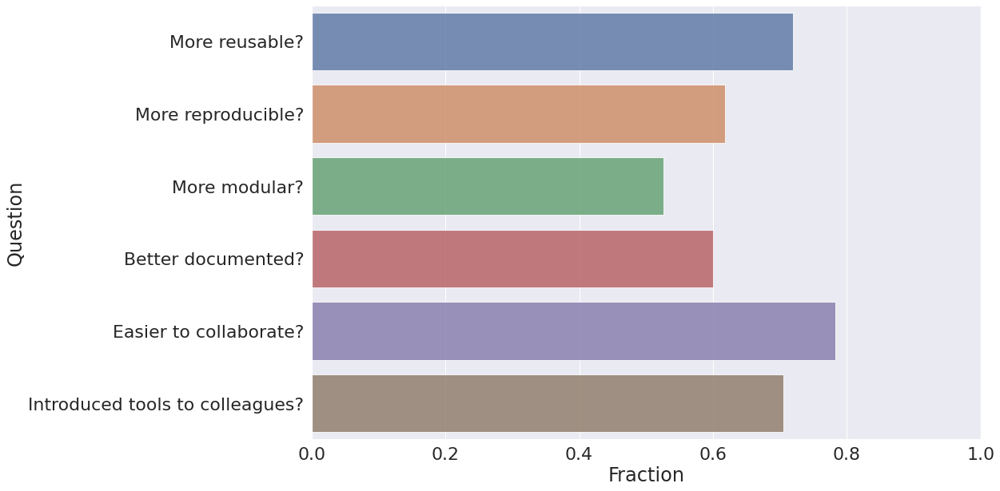

class: center, middle

## FAIR4RS BoF

# CodeRefinery project

## Radovan Bast [@\_\_radovan](https://twitter.com/__radovan)

Nordic e-Infrastructure Collaboration/
UiT The Arctic University of Norway

---

## CodeRefinery

We teach tools and practices for the
development of reproducible and reusable research software.

.left-column50[

- https://coderefinery.org
- https://coderefinery.org/workshops/past/
]
.right-column50[

]

---

## CodeRefinery: strategy statement

CodeRefinery acts as a .emph[hub for FAIR] (Findable, Accessible, Interoperable, and
Reusable) .emph[software practices]. It currently focuses on the Nordic/Baltic
countries, but aims to expand beyond this region. CodeRefinery aims to operate
as a community project with support from academic organizations.

### We wish to provide

- .emph[For organizations]: an opportunity to pool competence and offer more training
  and development opportunities than they could individually.
- .emph[For volunteers and the team]: a community around teaching and opportunity for
  skill development, both in pedagogy and practical skills.
- .emph[For learners]: a welcoming and useful environment for learning many necessary
  practical skills that may otherwise not be explicitly taught. This can be
  through courses, hackathons, and the like.

---

## CodeRefinery: stats

### History

- Project grew out of a 1-week course started at KTH Stockholm in 2014
- Since 2016 **funded by NeIC**:
  - **31 full workshops**
  - 25 other workshops/events
  - 3 instructor training events
  - **over 1600 persons trained** across all academic disciplines
- Last 4 workshops: **8 volunteer instructors**, over **80 volunteer helpers**

### We just got funding for 3 more years 🎉

---

## Typical curriculum

.left-column60[
- Basic and collaborative Git
- Code review
- Social coding and open software
- Reproducible research
- Jupyter notebooks
- Code documentation
- Automated testing
- Modular code development

### All our material is open and CC-BY

- https://coderefinery.org/lessons/
- https://github.com/coderefinery

We are now in the process of making the lessons citable.
]
.right-column40[
### 3 days on-site in person

### Now: 6 half-days online

### Dates for 2022
- March 22-24, 29-31
- September 20-22, 27-29
]

---

## CodeRefinery: bridging the gap

---

## Scaling up during 2020: effective team work

- Before 2020: ~25 participants, ~2 helpers
- Now: routinely 100+ participants, 20+ helpers
- Lectures & code-along exercises in the main room: .emph[stream and also record]
- Get help and group exercises in a breakout room
- Participants can register as teams (.emph["bring your own breakout room"])
- Installation sessions and helper preparation sessions
- Asynchronous Q&A via [HackMD](https://hackmd.io/) ->
  we publish these ([example](https://coderefinery.github.io/2020-10-20-online/#questions-answers-and-feedback))

### More details

- [Operation manuals](https://coderefinery.github.io/manuals/):
  reference and training for our teaching style
- Blog post: https://coderefinery.org/blog/2020/07/31/mega-coderefinery/
- [Presentation at CarpentryCon@Home 2020](https://github.com/coderefinery/carpentrycon-2020)

---

class: center, middle, inverse

# Who is our community?

# What is our impact?

---

## Pre-workshop survey: Who comes to our workshops?

- https://github.com/coderefinery/pre-workshop-survey
- https://doi.org/10.5281/zenodo.2671578

---

---

## Pre-workshop survey: Programming languages

---

## Post-workshop survey: impact on usage of tools

- https://github.com/coderefinery/post-workshop-survey
- https://doi.org/10.5281/zenodo.2671576

---

## Post-workshop survey: impact on code quality and collaboration

- 284 answers

---

## FAIR principles have many aspects

- Principles
- Best practices
- Policies
- Standards
- Governance model
- Development of tools
- .emph[Training] (version control, notebooks, documentation, code review, version control for dependencies, licenses, testing)
- .emph[Mentorship]

---

## Future/challenges

- Transitioning to a community project
- Expand beyond the Nordic/Baltic region
- Towards a non-profit organization
- Make it easier for organizations and individuals to join
- Give .emph[better credit] for volunteer contributions
- Offer not only training but also .emph[mentorship network]
- FAIR software practices survey
- How to better advertise and reach and connect the community?
