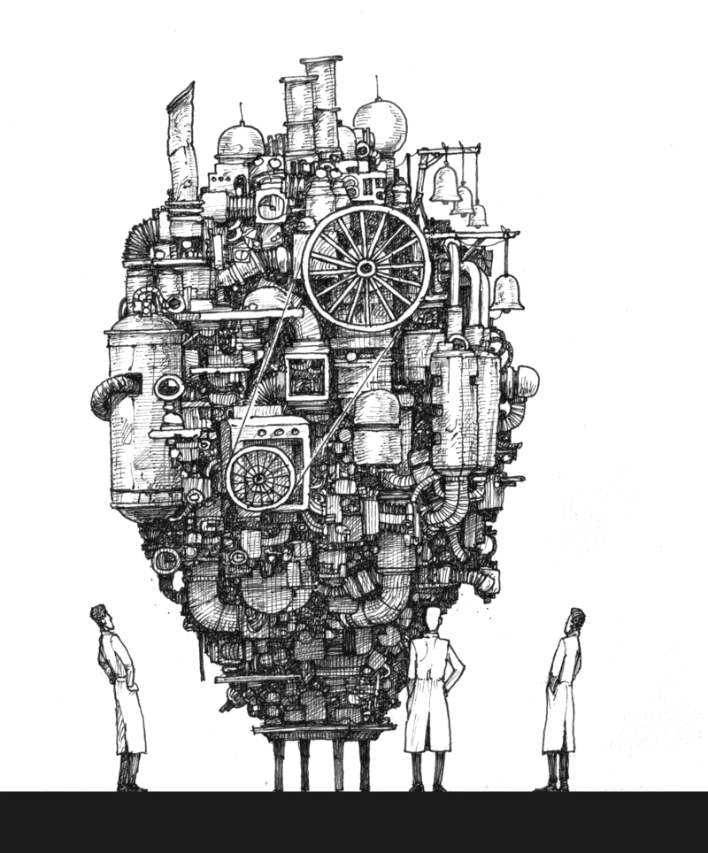
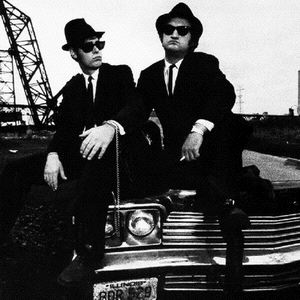
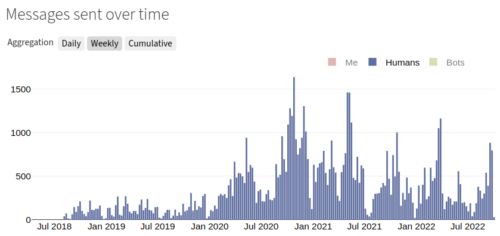
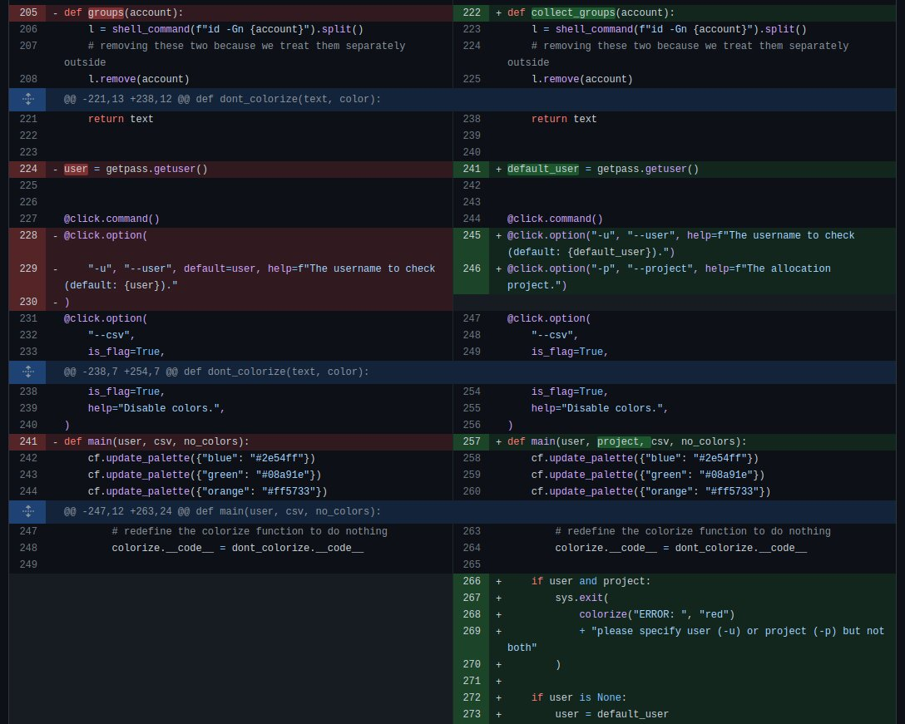

class: gray-background

# CodeRefinery - a hub for FAIR Software practices

.left-column50[
.fat[1:] Who we are

.fat[2:] Our work

.fat[3:] What we have learned

.fat[4:] Unsolved problems

.fat[5:] How you can help
]

.right-column50[
## Radovan Bast [@\_\_radovan](https://twitter.com/__radovan)

### UiT The Arctic University of Norway

]

---

# About me

.left-column30[

]

.right-column70[
- Theoretical chemist turned research software engineer.

- I write research software and teach programming to researchers and lead the
  [CodeRefinery project](https://coderefinery.org).

- I lead the [high-performance computing group](https://hpc.uit.no) and the
  [research software engineering group](https://research-software.uit.no) at UiT.
]

---

# NeIC: key facts

## Nordic e-Infrastructure Collaboration

(slide will be added - waiting for data from a colleague)

---

# FAIR principles and software

Researchers need to navigate many tools and concepts.

.cite[(c) [Scriberia](http://www.scriberia.co.uk) for [The Turing Way](https://the-turing-way.netlify.com), CC-BY]

---

.cite[Heidi Seibold, CC-BY 4.0, https://twitter.com/HeidiBaya/status/1579385587865649153]

---

# Team and project: [coderefinery.org](https://coderefinery.org/)

- Started in 2016, now we are in phase 3 until 2025
- **Partners**: NeIC (1 FTE), Aalto University, ENCCS, CSC, .emph[DeiC], Sigma2/NRIS, SNIC, T1C for interactive HPC (DK), USIT/UiO

.left-column50[
- Over 2000 persons trained
- Over 30 instructors/speakers
- Over 100 exercise leads
- **Pioneering teaching methods**
- **Working in public**
- Lesson material
- Video recordings
- Manuals
- Training network
- Brand
- Impact
- Community
- Knowledge
]

.right-column50[

]

---

# CodeRefinery: bridging the gap

---

# Our course portfolio via [coderefinery.org](https://coderefinery.org)

.left-column50[
- Version control
- Collaboration using Git
- Testing
- Documentation
- Notebooks
- Modular code development
- Reproducible research
- Software licensing
- How to share and publish code
- .emph[How to organize a code project]
- **...**

Lessons and recordings: https://coderefinery.org/lessons/
]

.right-column50[

.cite[citation needed]
]

---

class: gray-background

# A typical CodeRefinery workshop

.cite[(c) Samantha Wittke]

---

class: gray-background

# Participating as a learner

.cite[(c) Samantha Wittke]

---

class: gray-background

# Participating as an organization

.cite[(c) Samantha Wittke]

---

## How to give a concert

.left-column60[
- Assemble band
- On-board new band members
- Organize venue
- ~~Tour bus and hotel~~
- Announce
- Print posters and advertise
- Set playlist
- Deal with tickets and cancellations
- Provide rehearsal space
- Rehearse and update the set
- Provide security and manage audience
- Sound check
- Tune the instruments
- .emph[Play the show]
- Broadcast, light, and record
- Clean up
- Give interviews
- Edit and publish recording
- Publish memoirs
- Get money for the next tour
]
.right-column40[

.cite[Copyright 1980 Atlantic Records, fair use]
]

---

# What we have learned

- .emph[Coordination effort] starts to outweigh lesson preparation and teaching
- The importance of .emph[communicating value to organizations]
- .emph[Outreach and marketing] takes time and work
- Learners and volunteers typically join for a short time
- Building long lasting relationships takes effort

---

# Big problem: visibility and outreach

.quote[[ ] check this box if you would like to be informed about events in future organized by us. This is how we will store your contact information: ...]

Ideas:
- roll-ups
- info-screens
- events
- stands
- office hours
- newsletter

---

# GitLab: "adopt-a-service"

- Code repository hosting for Nordic research software: https://coderefinery.org/repository/

- Over 300 active users, 175 groups, with over 400 active projects

- .emph[Operated by DeiC]

- ~50k DKK/ year: **ca. 15 DKK per active user and month**

- Funding beyond 2024/2025 currently unclear

---

# Lessons learned/ observations

- From local computing centers towards national (e.g.
  [Sigma2/NRIS](https://www.sigma2.no/)) and international compute resources
  (e.g.
  [EuroHPC](https://eurohpc-ju.europa.eu/)/[LUMI](https://lumi-supercomputer.eu/))

- .emph[Distributed support staff]: Organizations will have to collaborate on training and .emph[stay close to the users]

- .emph[Good enough practices] that are used better than perfect practices not
  applied

- Instead of "good for others": ".emph[good for your future you] and as side
  effect good for others"

---

# Where to start: Code review

.quote["but the code is not ready"]

---

# Future

- Put the project on the map

- Non-profit organization

- .emph[Better communicate expectations, needs, and goals]

- Make this something that people put on their CVs

- Make this something that organizations put on their homepages

---

class: gray-background

# How you can help

.fat[1:] **Join as observer** and give feedback and suggestions

.fat[2:] Co-organize, co-create, **co-teach** with us

.fat[3:] Outreach, advertizing, **marketing**, social media

.fat[4:] **GitLab** future

.fat[5:] Know-how about organizational **legal forms** in the Nordics
