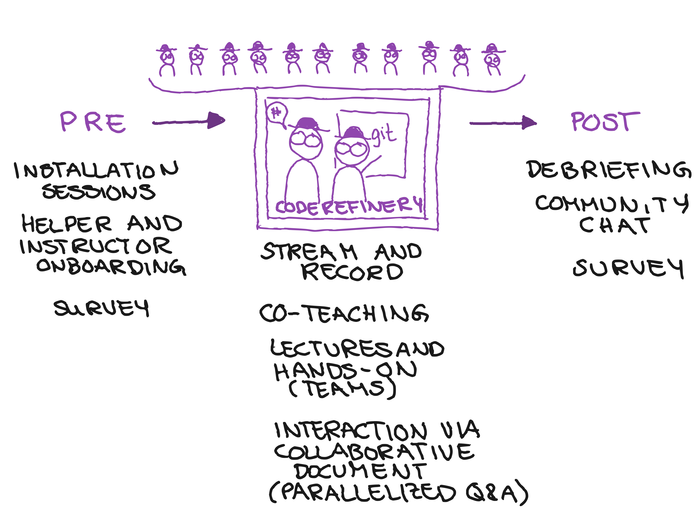
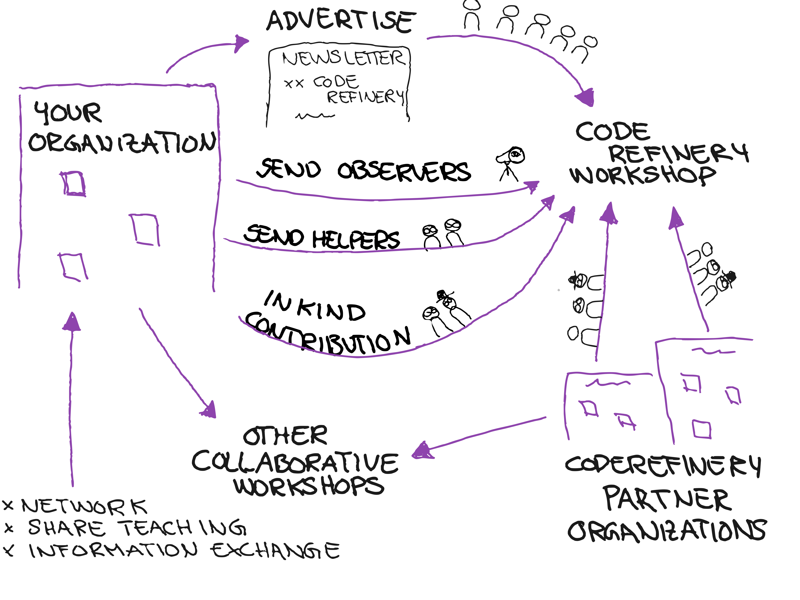

class: center, middle

# CodeRefinery Workshops – Challenges in *reverse hybrid teaching*

## CodeRefinery flashtalk at [BoF in ISC](https://app.swapcard.com/widget/event/isc-high-performance-2023/planning/UGxhbm5pbmdfMTIyMDgzNg==)

### [Matias Jääskeläinen](https://www.linkedin.com/in/matias-j-jaaskelainen/) (CSC – IT Center for Science)

&nbsp;

---

# Placeholder for ideas, about [coderefinery.org](https://coderefinery.org/) and what can cause challenges

- Since 2016, now **phase 3 until 2025**
     - What then?
- Over 30 instructors/speakers
     - How to get them onboard every time?
- Over 100 exercise leads
     - How to get people onboard?
- Innovative teaching methods
- Lesson material
     - Needs to be updated
- Video recordings
     - Needs editing

- Reporting
     - Need to adapt how we measure participation

- Community and coordination
     - .emph[Coordination effort] starts to outweigh lesson preparation and teaching
     - The importance of .emph[communicating value to organizations]
     - .emph[Outreach and marketing] takes time and work
     - Volunteer retention and building long lasting relationships takes effort

- Tech
     - Dedicate time to set up high-quality screen share
     - RKD's tech setup here
     - Sound: everyone does not have a quailty mic or good connection
          - Sound levels have to be checked
- WS arrangement
     - We removed Zoom teams because a lot of work
          - Some people got less interactivity
     - With Zoom teams:
          - drop-offs lead to too small teams or event empty rooms -> rearranging people creates overhead
     - Collaborative document 
          - might crash or user errors
          - Needs a few people to maintain / oversee
     - Level of teaching: with massive courses all participants won't have the same prerequisite level
     - Exercises: some want walkthrouhgs and some want proper problem-solving exercise
     - One large WS vs. multiple smaller ((This could actually be the whole topic 🤓))
          - Collection of topics vs. concise content
          - a lot of work in a few weeks vs. some work throughout the year
          - reserved almost whole weeks vs. occasional days
          - longer days vs. shorter days

---

# CodeRefinery workshop: Reverse hybrid

**Typical format**: 
- 6 half-days, [twice per year](https://coderefinery.org/workshops/upcoming/)
- online, free
- live-streamed, recorded
- asynchronous Q&A in collaborative document

.left-column50[
- [Version control, Collaborative coding, Reproducible research **...**](https://coderefinery.org/lessons/core/)
]

.right-column50[
**Next workshop** [September 19-21 and 26-28 2023 (6 half-day, online)](https://coderefinery.org/workshops/upcoming/)

**Lessons:** https://coderefinery.org/lessons/
**Recordings:** https://www.youtube.com/@coderefinery3414

]

---

# Participating as a learner

.center[

]

.cite[(c) Samantha Wittke]

---

# Workshop preparation

.center[

]

.cite[(c) Samantha Wittke]

---

# Participating as an organization

.center[

]

.cite[(c) Samantha Wittke]

---

### What we have learned: .emph[Teaching together and learning together]

.left-column50[

]

.right-column50[

]

.cite[R. Darst "The Future of Teaching" ([text](https://hackmd.io/KRqQirJ_Rn2SHcE-t1iAUg?view), [video](https://www.youtube.com/watch?v=S9Jor12Cxdc))]

---

R. Darst's streaming setup during "Python for Scientific
Computing".

---

---

## License and credit: CC-BY

### Credits to external references

- Jet pilot: public domain. Captain and first officer: CC0. ATC tower: CC BY 2.0 (Peter R. Miller).

### Collaborators and inspiration

- Richard Darst (design of the current workshop streaming format, developed many [novel teaching techniques that we use](https://hackmd.io/KRqQirJ_Rn2SHcE-t1iAUg?view))
- Samantha Wittke (graphics explaining the concepts, developed workshop on-boarding scheme)
- Matias Jääskeläinen (workshop coordination)
- CodeRefinery team
- [Aalto RSE group](https://scicomp.aalto.fi/rse/)
- [Nordic-RSE](https://nordic-rse.org/)

---

## Collaboration options

- Use material, give feedback
- **Join workshop** as learner, observer or co-organiser

### News, support, and social media

- Chat: https://coderefinery.zulipchat.com
- Blog: https://coderefinery.org/blog/
- Newsletter: https://tinyletter.com/coderefinery
- YouTube: https://www.youtube.com/@coderefinery3414
- Twitter: https://twitter.com/coderefine
- Mastodon: https://fosstodon.org/@coderefinery
- Support: <support@coderefinery.org>
