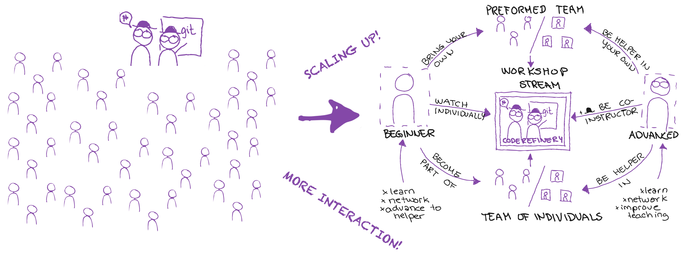

class: center, middle

# CodeRefinery Workshops:  
# Challenges in *reverse hybrid teaching*

## CodeRefinery [flashtalk](https://raw.githubusercontent.com/coderefinery/presentations/main/2023-ISC-lightning_WS-challenges.md) in [BoF at ISC](https://app.swapcard.com/widget/event/isc-high-performance-2023/planning/UGxhbm5pbmdfMTIyMDgzNg==)

### [Matias Jääskeläinen](https://www.linkedin.com/in/matias-j-jaaskelainen/) (CSC – IT Center for Science)

---

## CodeRefinery workshop: Reverse hybrid

**Next workshop:** [Sep, 2023](https://coderefinery.org/workshops/upcoming/)

- 6 half-days, [twice per year](https://coderefinery.org/workshops/upcoming/)
- Online, free, live-streamed, recorded
- Asynchronous Q&A in collaborative document
- Version control, Collaborative coding, Reproducible research **...**

[**Lessons in CodeRefinery.org**](https://coderefinery.org/lessons/) and 
[**Recordings in YouTube**](https://www.youtube.com/@coderefinery3414)  

.cite[(c) Samantha Wittke]

---

## CodeRefinery workshop: Why Reverse hybrid

- **Issue with hybrid:**
     - People onsite ≠ people online.

- **Large courses:**
     - Most students don't have time to ask a question f2f
     - They online chat with the teacher anyway

- **Reverse hybrid:**
     - Teachers via video and online chat
     - Students in onsite groups
     - Those who want interaction can get it
     - The course isn't bound to one location, anyone can attend.

- *It is actually scaling up!*
- **First challenge:** Explain how to join :D

---

## Scaling up – Technical side

R. Darst's streaming setup during "Python for Scientific
Computing".

---

### Scaling up – Technical side

- Many moving parts
     - Screenshare material and terminal / Jupyter
     - Zoom + OBS: audio and video in both (mute, on/off…)
     - Sound levels have to be checked with every speaker
     - Different scenes to screensharing, discussion, breaks…

- New bottlenecks: 
     - What we worry the most: The Q&A document
          - We get up to 40 questions per hour
          - Collaborative document might crash
          - User errors: someone selects all and delete…
          - Needs a few people to moderate
     - More people -> more technical problems -> overhead in solving them

---

## Scaling up – Arrangements

.center[

]

.cite[(c) Samantha Wittke]

---

### Scaling up – Arrangements

- Many things also before and after
     - .emph[Coordination effort] starts to outweigh lesson preparation and teaching
- We removed Zoom teams 
     - Arranging people creates overhead

- Many people:
     - Difficult to get a common understanding
     - Level of teaching: 
          - All participants won't have the same prerequisites
          - Always taking the novices into account leads all courses being basic course
     - Meeting expectations: 
          - Some want walkthrouhgs and some want proper problem-solving exercises
     - How to know how people are doing?
          - We don't see them, only the document

- Certificates: how do we assess what people have been done?
- Volunteer retention and building long lasting relationships takes effort
     - There has been 30 instructors/speakers, Over 100 exercise leads (not in one event)

---

## License and credit: CC-BY

### Credits to external references

- Jet pilot: public domain. Captain and first officer: CC0. ATC tower: CC BY 2.0 (Peter R. Miller).

### Collaborators and inspiration

- Richard Darst (design of the current workshop streaming format, developed many [novel teaching techniques that we use](https://hackmd.io/KRqQirJ_Rn2SHcE-t1iAUg?view))
- Samantha Wittke (graphics explaining the concepts, developed workshop on-boarding scheme)
- Matias Jääskeläinen (workshop coordination)
- CodeRefinery team
- [Aalto RSE group](https://scicomp.aalto.fi/rse/)
- [Nordic-RSE](https://nordic-rse.org/)

---

## Collaboration options

- Use material, give feedback
- **Join workshop** as learner, observer or co-organiser

### News, support, and social media

- Chat: https://coderefinery.zulipchat.com
- Blog: https://coderefinery.org/blog/
- Newsletter: https://tinyletter.com/coderefinery
- YouTube: https://www.youtube.com/@coderefinery3414
- Twitter: https://twitter.com/coderefine
- Mastodon: https://fosstodon.org/@coderefinery
- Support: <support@coderefinery.org>
