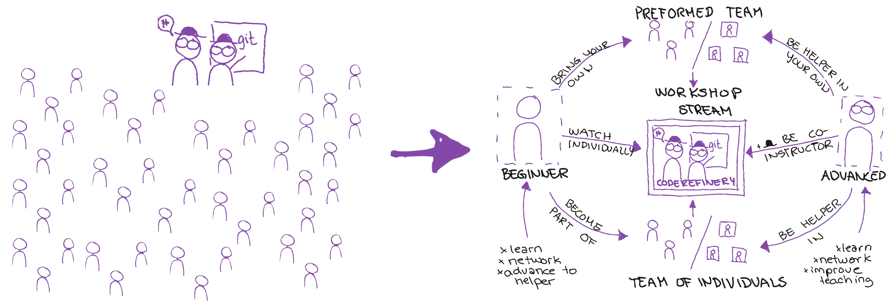

class: center, middle

# CodeRefinery Workshops:  
# Challenges in *reverse hybrid teaching*

## CodeRefinery flashtalk in [BoF at ISC](https://app.swapcard.com/widget/event/isc-high-performance-2023/planning/UGxhbm5pbmdfMTIyMDgzNg==)

### [Matias Jääskeläinen](https://www.linkedin.com/in/matias-j-jaaskelainen/) (CSC – IT Center for Science)

&nbsp;

---

# CodeRefinery workshop: Reverse hybrid

**Next workshop:** [Sep, 2023](https://coderefinery.org/workshops/upcoming/)

- 6 half-days, [twice per year](https://coderefinery.org/workshops/upcoming/)
- Online, free, live-streamed, recorded
- Asynchronous Q&A in collaborative document
- Version control, Collaborative coding, Reproducible research **...**

[**Lessons in CodeRefinery.org**](https://coderefinery.org/lessons/) and 
[**Recordings in YouTube**](https://www.youtube.com/@coderefinery3414)  

.cite[(c) Samantha Wittke]

### Lecturer notes
Why reverse hybrid
- Issue with hybrid:
     - People onsite ≠ people online.
- Large courses: 
     - most students don't have time to ask a question f2f
     - they chat with the teacher anyway
- Reverse hybrid:
     - Teachers via video and chat
     - Students in onsite groups
     - Those who want interaction can get it
     - The course isn't bound to one location, anyone can attend.

---

# Workshop preparation

.center[

]

.cite[(c) Samantha Wittke]

### Lecturer notes

---

# Technical side

- Set up nice screen share
- Sound levels have to be checked
- Collaborative document 
     - might crash or user errors
     - Needs a few people to maintain / oversee
- We removed Zoom teams because a lot of work
     - Some people got less interactivity
- With Zoom teams:
     - drop-offs lead to too small teams or event empty rooms -> rearranging people creates overhead

R. Darst's streaming setup during "Python for Scientific
Computing".

---

# Workshop arrangement

     - Level of teaching: with massive courses all participants won't have the same prerequisite level
     - Exercises: some want walkthrouhgs and some want proper problem-solving exercise
     - One large WS vs. multiple smaller ((This could actually be the whole topic 🤓))
          - Collection of topics vs. concise content
          - a lot of work in a few weeks vs. some work throughout the year
          - reserved almost whole weeks vs. occasional days
          - longer days vs. shorter days
     - Community and coordination
          - .emph[Coordination effort] starts to outweigh lesson preparation and teaching
          - The importance of .emph[communicating value to organizations]
          - .emph[Outreach and marketing] takes time and work
          - Volunteer retention and building long lasting relationships takes effort
          - Over 30 instructors/speakers, Over 100 exercise leads
               - How to get them onboard every time?

---

## License and credit: CC-BY

### Credits to external references

- Jet pilot: public domain. Captain and first officer: CC0. ATC tower: CC BY 2.0 (Peter R. Miller).

### Collaborators and inspiration

- Richard Darst (design of the current workshop streaming format, developed many [novel teaching techniques that we use](https://hackmd.io/KRqQirJ_Rn2SHcE-t1iAUg?view))
- Samantha Wittke (graphics explaining the concepts, developed workshop on-boarding scheme)
- Matias Jääskeläinen (workshop coordination)
- CodeRefinery team
- [Aalto RSE group](https://scicomp.aalto.fi/rse/)
- [Nordic-RSE](https://nordic-rse.org/)

---

## Collaboration options

- Use material, give feedback
- **Join workshop** as learner, observer or co-organiser

### News, support, and social media

- Chat: https://coderefinery.zulipchat.com
- Blog: https://coderefinery.org/blog/
- Newsletter: https://tinyletter.com/coderefinery
- YouTube: https://www.youtube.com/@coderefinery3414
- Twitter: https://twitter.com/coderefine
- Mastodon: https://fosstodon.org/@coderefinery
- Support: <support@coderefinery.org>
