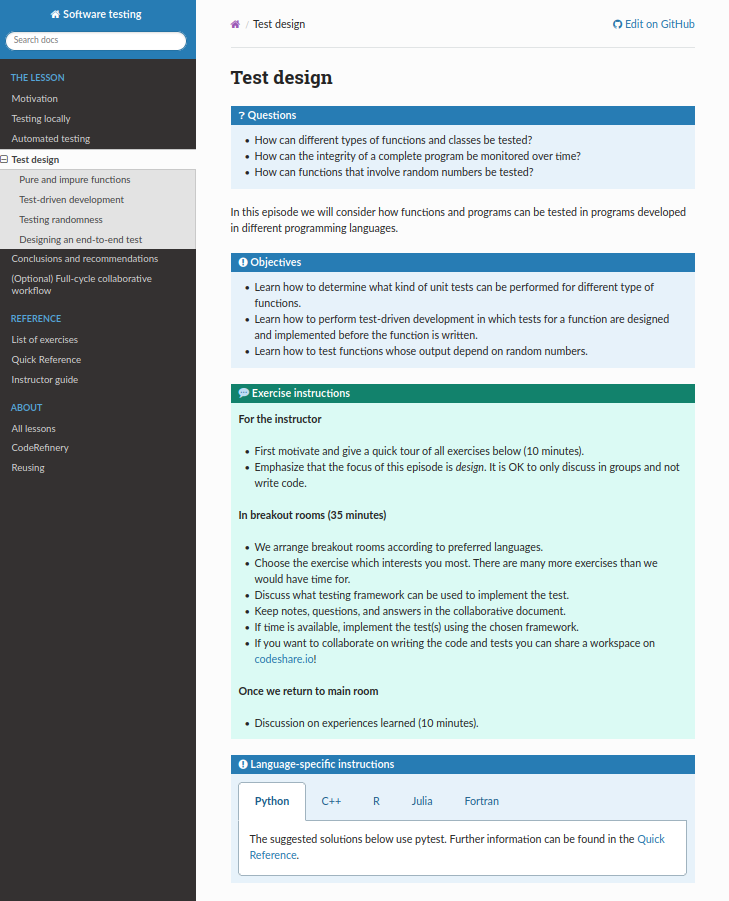
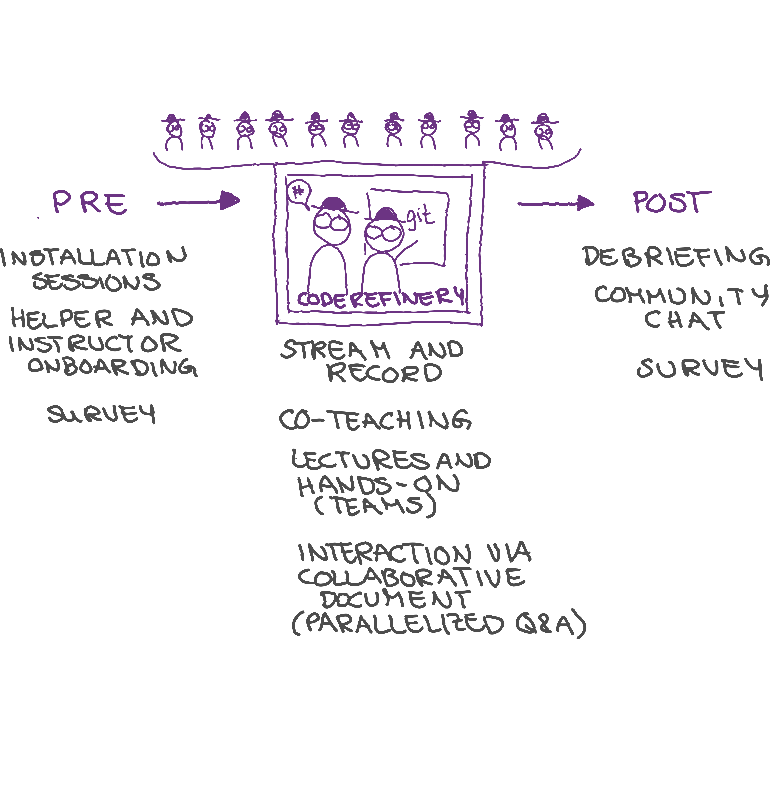
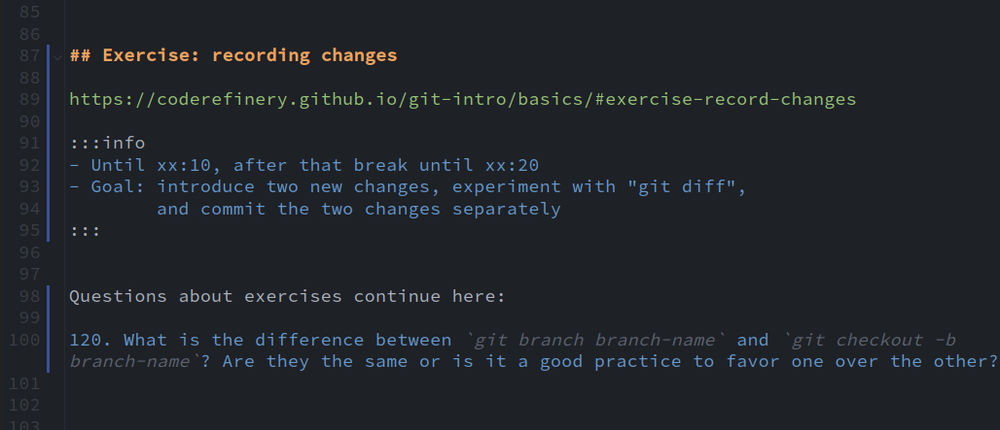
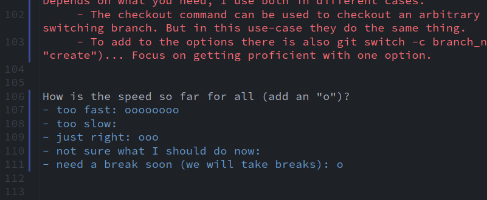
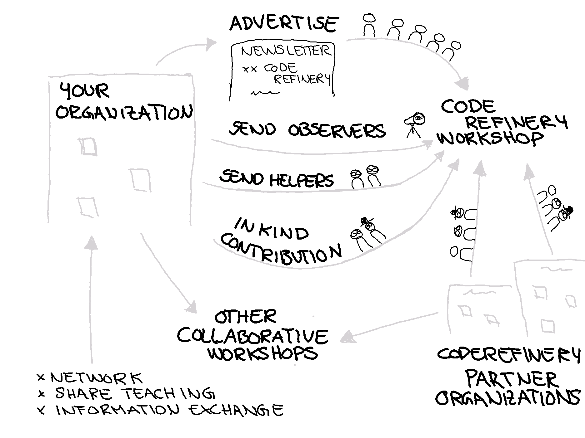

class: center, middle, gray-background

# Experiences from teaching basic RSE skills with CodeRefinery

Samantha Wittke, CSC - IT center for science, Finland

Radovan Bast, UiT - The Arcic University of Norway

### RSECon 2023, Swansea

---

# Team and project: [coderefinery.org](https://coderefinery.org/)

- a hub for FAIR research software practices

.left-column50[
- Since 2016, now **phase 3 until 2025**
- Currently funded by NeiC
- Pioneering teaching methods
- Working in public
- Lesson material
- Video recordings
- Manuals
- Training network
- Community

**Partners**:

]

.right-column50_center[
 
 

]

---

# Course portfolio: it's all CC-BY

.left-column50[
- Version control
- Collaboration using Git
- Testing
- Documentation
- Notebooks
- Modular code development
- Reproducible research
- Software licensing
- Sharing and publishing code
- File organization
- **...**
]

.right-column50[
**Next workshop** September 19-21 and 26-28, 2023, register here: https://coderefinery.github.io/2023-09-19-workshop/

**Lessons and recordings:** https://coderefinery.org/lessons/
]

---

# Lessons

--- 

# Workshop setup

.center[

]
.cite[(c) Samantha Wittke]

---

# Collaborative document: Markdown

---

## Interactive, anonymous, parallel, asynchronous

---

## New question every 1-2 minutes!

---

## ASCII-graph feedback

We publish Q&A for each workshop: [Example](https://coderefinery.github.io/2023-03-21-workshop/questions/)

---

# Participating as a learner

.center[

]
.cite[(c) Samantha Wittke]

---

# Bring your own classroom

.center[

]

---

# Workshop stats

- > 2000 persons trained
- > 30 instructors/speakers
- > 100 exercise leads
- > XX in-person satellite events
- > XX different nationalities
- > on average xx questions per lesson
- all career stages and titles

---

# Collaboration across funding borders

- current team: in-person contributions to the project + volunteers
- Cross-advertise
- Link to material
- We would like to encourage our project members to help out at other workshops
  and vice versa
- Teach together

---

# What we have learned 

## About motivating/teaching

- .emph[Good enough practices] better than perfect practices not
  applied

- Instead of "good for others": ".emph[good for your future you] and as side
  effect good for others"

## About scaling

- .emph[Installation instructions and on-boarding] become more important

- We don't "see" classrooms -> .emph[feedback mechanism] in Q&A doc

- Make exercises longer to .emph[give classrooms the chance to interact]

---

.left-column50[
### Future: Organization

- Communicate value for volunteers and organizations

- Research groups send their students to us instead of
  creating isolated material

- More collaboration with similar projects ("helper exchange program")

- Towards non-profit organization so that we can
  participate in funding applications
]

.right-column50[
### Teaching format

- Continue large-scale workshops

- Support local events

- More asynchronous content coupled with online events
]

---

## How you or your organization can participate

.center[

]

.cite[(c) Samantha Wittke]

- **Join our next workshop** September 19-21 and 26-28, 2023: https://coderefinery.github.io/2023-09-19-workshop/
- Send one or more **exercise teams**
- **Join as observer** to see how we teach and organize
- Use our material and give feedback

---

## News, support and social media

- Blog: https://coderefinery.org/blog/
- Newsletter: https://tinyletter.com/coderefinery
- Twitter: https://twitter.com/coderefine
- Mastodon: https://fosstodon.org/@coderefinery
- Chat: https://coderefinery.zulipchat.com
- Support: support@coderefinery.org

