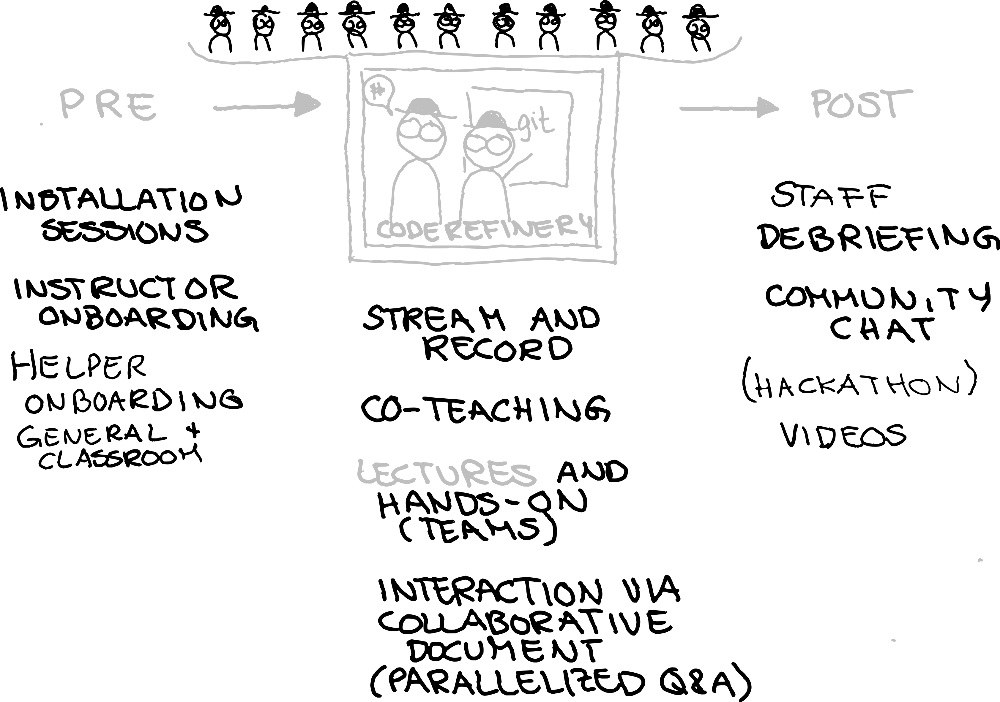
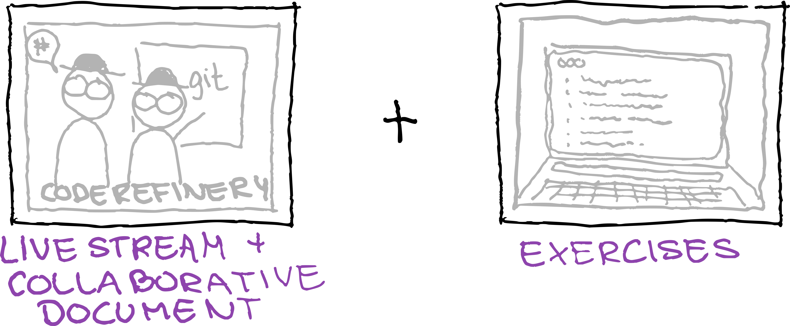
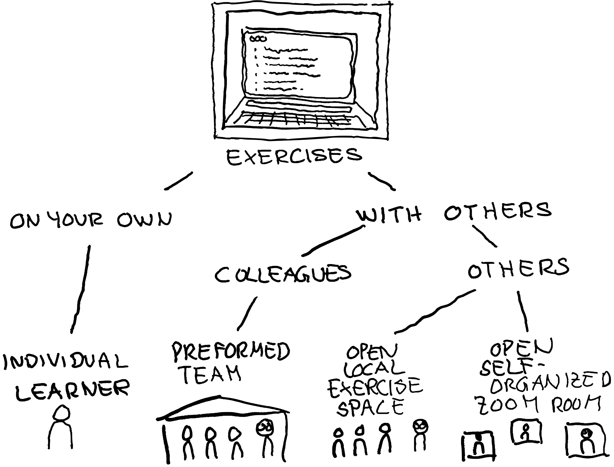
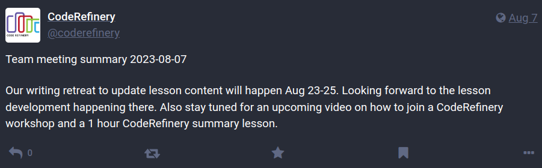

class: center, middle, gray-background

# Experiences from teaching basic RSE skills with CodeRefinery

Samantha Wittke, CSC - IT Center for Science, Finland

Radovan Bast, UiT - The Arcic University of Norway

### RSECon 2023, Swansea

---

# Team and project: [coderefinery.org](https://coderefinery.org/)

- a hub for FAIR research software practices

.left-column50[
- Since 2016, now **phase 3 until 2025**
- Currently funded by NeiC
- Pioneering teaching methods
- Working in public
- Lesson material
- Video recordings
- Manuals
- Training network
- Community

**Partners**:

]

.right-column50_center[
 
 

]

---

.cite[Heidi Seibold, CC-BY 4.0, https://twitter.com/HeidiBaya/status/1579385587865649153]

---

# Lessons

---

# Workshop setup

.center[

]

---

# Collaborative document: Markdown

---

# Interactive, anonymous, parallel, async

---

# New question every 1-2 minutes!

---

# ASCII-graph feedback

We publish Q&A for each workshop: [Example](https://coderefinery.github.io/2023-03-21-workshop/questions/)

---

# Participating as a learner

.center[

]

---

# Exercise options

.center[

]

---

# Workshop stats

- > XX workshops in total
- > 2000 persons trained in total
- > 30 instructors/speakers
- > 100 exercise leads
- all career stages and titles

- ~100 questions per workshop day

---

# Collaboration across funding borders

- current team: in-person contributions to the project + volunteers
- Cross-advertise
- Link to material
- We would like to encourage our project members to help out at other workshops
  and vice versa
- Teach together

---

# What we have learned

## About motivating/teaching

- .emph[Good enough practices] better than perfect practices not
  applied

- Instead of "good for others": ".emph[good for your future you] and as side
  effect good for others"

## About scaling

- .emph[Installation instructions and on-boarding] become more important

- We don't "see" classrooms -> .emph[feedback mechanism] in Q&A doc

- Make exercises longer to .emph[give classrooms the chance to interact]

---

.left-column50[
## Future: Organization

- Communicate value for volunteers and organizations

- Research groups send their students to us instead of
  creating isolated material

- More collaboration with similar projects ("helper exchange program")

- Towards non-profit organization so that we can
  participate in funding applications
]

.right-column50[
## Teaching format

- Continue large-scale workshops

- Support local events

- More asynchronous content coupled with online events
]

---

## How you or your organization can participate

.center[

]

- **Join our next workshop** September 19-21 and 26-28, 2023: https://coderefinery.github.io/2023-09-19-workshop/
- Send one or more **exercise teams** or **join as observer**
- Use our material and give feedback

---

# Collaborators and reusing

...

---

# How to get in touch

- **Join our next workshop** September 19-21 and 26-28, 2023: https://coderefinery.github.io/2023-09-19-workshop/

- **Chat with us**: https://coderefinery.zulipchat.com (ask questions about coding or learn about new tools)

- [Blog](https://coderefinery.org/blog/),
  [Newsletter](https://tinyletter.com/coderefinery),
  [Twitter](https://twitter.com/coderefine),
  [Mastodon](https://fosstodon.org/@coderefinery),
  [Support](support@coderefinery.org)

---

# Nordic RSE Unconference 2023

(wip)
