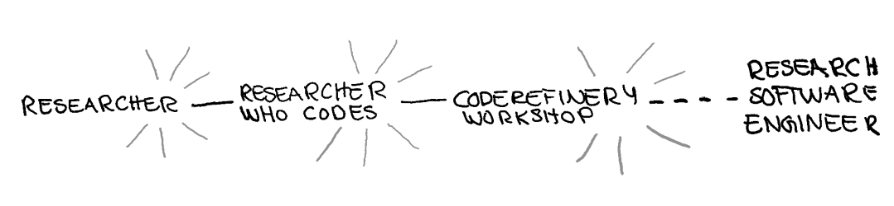

class: center, middle, gray-background

## Bring your own Classroom to a CodeRefinery workshop

Samantha Wittke, CSC - IT Center for Science, Finland

Radovan Bast, UiT - The Arctic University of Norway

## RSECon, Newcastle 2024

---

# Team and project: [coderefinery.org](https://coderefinery.org/)

### What we are

- A hub for FAIR research software practices
- Since 2016, currently funded by [NeIC](https://neic.no/)
- Training network
- Community (in our Zulip chat)

### Who we are

0.9 FTE (2 persons) + [10 persons in-kind + volunteers](https://coderefinery.org/about/contributors/)

### What we do

- We teach and co-organize workshops
- 2 annual main "tools" workshop + many others
- Share lessons, video recordings, manuals
- Teaching development
- All open source and access and mostly under CC-BY license

---

# [Available lesson material](https://coderefinery.org/lessons/)

.left-column50[
- **Introduction to version control**: Git and GitHub for own projects
- **Collaborative version control**: Branching, pull/merge requests, forks, and collaboration.
- **Reproducible research**: Reproducible dependencies, environments, and computational steps.
- **Social coding and open software**: Software and data licensing and software citation.
- **How to document your research software**
- **Reusable and reproducible Jupyter notebooks**
]

.right-column50[
- **Automated testing**: Motivation, test design, and tools.
- **Modular code development**: Organizing projects as they grow from one screen-full to larger.

### Tested in [9 online and 29 in-person](https://coderefinery.org/workshops/past/) workshops

- We reach over [500 persons/year](https://coderefinery.org/about/statistics/)
- Over [30 instructors/speakers](https://coderefinery.org/about/contributors/)
- Over [100 helpers/ exercise leaders](https://coderefinery.org/about/contributors/)
]

---

# Relation to research software engineering

- We teach topics which are .emph[helpful for researchers] and .emph[essential for RSEs].

- [Nordic RSE](https://nordic-rse.org/) colleagues hang out and discuss on the
  [CodeRefinery community chat](https://coderefinery.zulipchat.com/)

.center[

]

---

# How to participate as a learner

.center[

]

## Scaling with Community support - Bring your own classroom

- (local) partners host a "watching party"
- online or in-person
- maintaining sense of community for streamed workshop
- own team lead as support
- supportive and comfortable group environment

---

# Collaborative document: Markdown

- Real time *interaction* between learners and instructors 
- Anonymous, parallel, asynchronous
- New question every 1-2 minutes!
- ASCII-graph feedback

We publish Q&A for each workshop: [Example](https://coderefinery.github.io/2024-03-12-workshop/questions/)

---

.quote[
[...]
[BYOC] allowed us to advance with the **implementation of our vision** for
Research Data & Software Management training and the implementation of TU Delft
Research Software Policy by providing high quality and well-received training
on FAIR software practices. 

The involvement of our data stewards, software engineers and trainers as
helpers in the CodeRefinery workshops have also provided them with a **great
opportunity to continuously improve their skills** and learn from this great
community. 

The CodeRefinery learning materials are **openly available and of excellent
quality**. We often refer our researchers to use them as consultation materials
on our websites and/or guides.
[...]
]

(Paula Martinez Lavanchy, TU Delft, NL)

---

.quote[
[...] a significant challenge: those that didn’t read carefully the workshop
description on our website expected us to be the instructors and higher
levels of interactivity with them. Besides this point on expectations
management, I think your format really **allows to reach the biggest possible
audience**, while also fostering the **creation of local communities**. We had
in-room discussions during the breaks and created a local chat channel for
the participants. That was used also in the following days while they were
testing the skills learned on their setups. We were **inspired by your format**
in designing ours for the BioNT project. 
]

(Lisanna Paladin, EMBL, DE)

---

.quote[
[...] As a person taking the course from home during the pandemic I thought it
was a bit difficult to motivate myself all along the 6 half days. This is
probably why I thought it could be interesting to organize rooms here at NTNU
in order to have people sitting, talking, sharing and helping each other, ...
One of the biggest **challenge is to keep the whole classroom from first to last
day** ... I think it's impossible 🙂 [...] 

I would assume that **in person course** would definitely be more successful ...
However, I understand the difficulty when the instructors come from different
countries and when you want to offer the workshop for free!
]

(Candy Eugenie Charlotte Anquetil Ep Deck, NTNU, NO)

---

.quote[
[...] We organized a physical room with everyone around one big table attending
together in a kind of hackathon style, with our employer kindly sponsoring
lunch and coffee to keep us going. Through the CodeRefinery online training, my
participants were taken **from no or very basic knowledge of scientific coding
tools and practices** to using version control, unit tests and collaborative
workflows in the scientific work. [...]

I think the most challenging part for me was perhaps on the second run to
facilitate the second of the two weeks, where the format had just been changed
to less hands-on exercise based and more discussion based. [...]

In general, I believe **attending these workshops as a group helped tremendously**
compared to attending individually (and compared to my fall back solution of
teaching people individually which is always less effective due to other
commitments, distractions etc.) due to being able to learn together and discuss
in person with team mates. 
]

(Jakob Sauer Jørgensen, DTU, DK)

---

# What we have learned

- Dedicated host needed

- The format is new and confusing

- Exercise session timing is crucial

- Collaborative document needs to be managed

- Week 1 vs week 2, exercises vs demo

- Feedback from local hosts is invaluable for further developing the format, Thank you <3 

---

# What is in it for you?

- .emph[Joining is easier than organizing]:
  It is easier to bring 10% to an event than to organize the 100% yourself

- .emph[Material / Experience exchange]: let's not reinvent the wheel

- .emph[onboarding and orientation]

- .emph[Side quests] according to own work/need

- .emph[talk to own people] - direct support and help-line

- .emph[Train-the-trainer]: we can help you to get started

- .emph[Community as test-bed]: let's try out new ideas together

---

# Many ways to join the experience

.center[

]

- **Join our upcoming workshop** starting next week
- Tell your students and researchers about it (become an ambassador)
- Use our material and give feedback

.center[Let's work together to advance FAIR research software practices!]

---

# Join us! 

.left-column60[
- **Chat with us**: https://coderefinery.zulipchat.com (ask questions about coding or learn about new tools)

- [Onboarding manual](https://coderefinery.github.io/manuals/onboarding/)

- [Blog](https://coderefinery.org/blog/)

- [Newsletter and chat digest](https://coderefinery.org/about/newsletter/)

- [X/Twitter](https://twitter.com/coderefine)

- [Mastodon](https://fosstodon.org/@coderefinery)

- [Support e-mail](support@coderefinery.org)
]

.right-column40[

]

---
class: center, middle, inverse

## These slides: XX

---

# Credits and license

## Text

- All text: CodeRefinery project, CC-BY 4.0

## Images

XX (currently old ones, needs to be updated)

- Slide 3: H. Seibold, "6 helpful steps for reproducible research", CC-BY 4.0
- Slides 5, 8, 18: S. Wittke
- Slide 12: ATC tower, P. R. Miller, CC-BY 2.0
- Slide 12: Monitor setup, R. Darst
- Slide 12: Logos, (c) respective organizations
- All other images: CodeRefinery project, CC-BY 4.0
