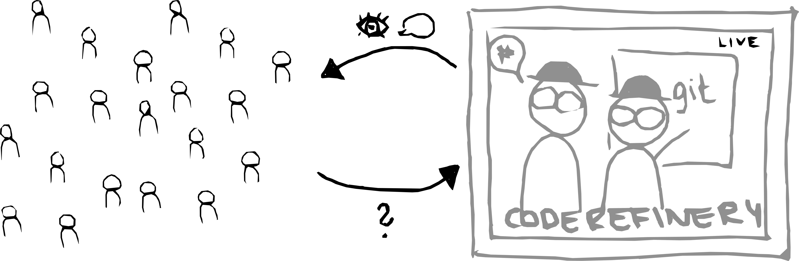
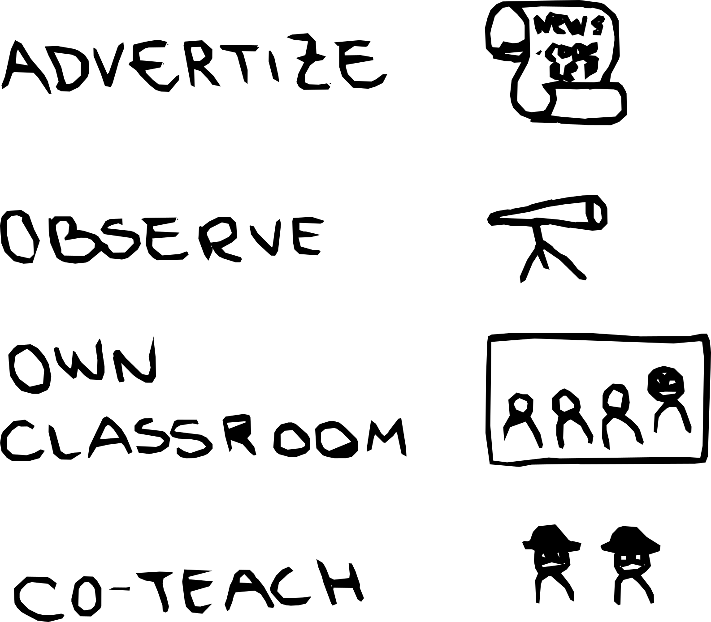

class: center, middle

## Bring your own Classroom to a CodeRefinery workshop

Samantha Wittke, CSC - IT Center for Science, Finland

Radovan Bast, UiT - The Arctic University of Norway

## RSECon, Newcastle 2024

---

# Table of Content

  

1. About the CodeRefinery project and workshops

2. Bring your own classroom

3. How can you join?

---

# CodeRefinery - A hub for FAIR research software practices

- Project currently funded by [NeIC](https://neic.no/)

- Tightly connected to [Nordic RSE](https://nordic-rse.org/)

- Two main online workshops a year, free of charge, everyone welcome

- We teach topics which are .emph[helpful for researchers] and .emph[essential for RSEs]

     
---

# [Available lesson material](https://coderefinery.org/lessons/)

.left-column50[
- **Introduction to version control**

- **Collaborative version control**

- **Reproducible research**

- **Social coding and open software**

]

.right-column50[

- **Documenting research software**

- **Reusable and reproducible Jupyter notebooks**

- **Automated testing**

- **Modular code development**
]

### Developed over [9 online and 29 in-person](https://coderefinery.org/workshops/past/) workshops

- We reach over [500 persons/year](https://coderefinery.org/about/statistics/)
- Over [30 instructors/speakers](https://coderefinery.org/about/contributors/)
- We stream our workshops - for many reasons

---

# Problem with large streamed workshops?

.center[
Interactivity & sense of community

]

 

# What can help?

- Tools (e.g. collaborative notes)
- Bring your own classroom

---

# Bring your own classroom

.center[

]

- (Local) partners host a "watching party"
- Online or in-person
- Own team lead as support
- Small group

---

# Experiences

.quote[
[...] allowed us to advance with the **implementation of our vision** for
Research Data & Software Management training and the implementation of TU Delft
Research Software Policy [...]
]
(Paula Martinez Lavanchy, TU Delft, NL)

.quote[
[...] I think your format really **allows to reach the biggest possible
audience**, while also fostering the **creation of local communities**. [...]
]
(Lisanna Paladin, EMBL, DE)

---

# Experiences

.quote[
[...] One of the biggest **challenge is to keep the whole classroom from first to last
day** ... I think it's impossible 🙂 [...] 
]
(Candy Deck, NTNU, NO)

.quote[
[...] In general, I believe **attending these workshops as a group helped tremendously**
compared to attending individually [...] due to being able to learn together and discuss
in person with team mates. 
]
(Jakob Sauer Jørgensen, DTU, DK)

 

Read more in our [blogpost](https://coderefinery.org/blog/bring-your-own-classroom/)!

---

# What have we learned?

- The format is new and confusing

- Exercise session .emph[timing is crucial]

- Collaborative document needs to be managed

- .emph[Clearly communicate] what learners are supposed to be doing

- Feedback from local hosts is invaluable for further developing the format, **Thank you <3**

---

# Benefits of bringing your own classroom

- Get the .emph[interactivity] of own classroom without organizing a full course

- Get onboarding and orientation

- .emph[Side quests] according to own work/need

- Work with .emph[own people] - direct support and help-line

- .emph[Train-the-trainer]: We can help you to get started

- .emph[Community] as test-bed: Let's try out new ideas together

---

# How can you / your organization join?

.center[

]

---

# Thank you for your attention!

#### Join us

- Contact: [CodeRefinery Zulip chat](https://coderefinery.zulipchat.com) & support@coderefinery.org

- Website: [coderefinery.org](https://coderefinery.org/)

- [Next Workshop](https://coderefinery.github.io/2024-09-10-workshop) starting September 10th! 

#### These slides

XX

#### Credits and license

- Slide 2: Logos, (c) respective organizations
- All other images: CodeRefinery project, CC-BY 4.0
- All text: CodeRefinery project, CC-BY 4.0
