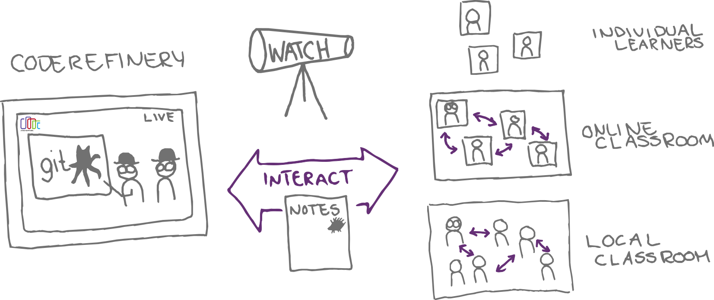
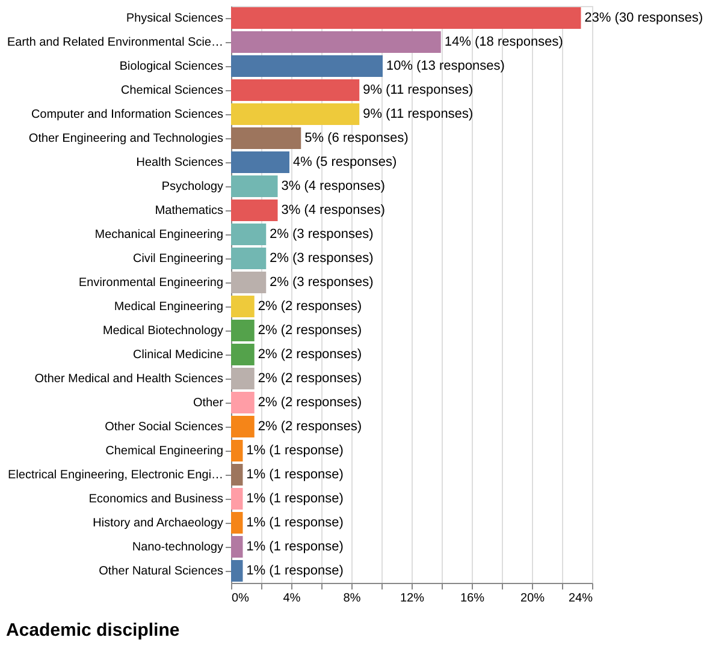

class: center, middle, gray-background

&nbsp;

## Competence Development, the CodeRefinery way

Radovan Bast, UiT - The Arctic University of Norway

### [Digital Curriculum](https://digitalcurriculum.au.dk/conference) Closing Conference, Aarhus, 2024

---

## About me

.left-column30[

]

.right-column70[
- Theoretical chemist turned research software engineer.

- I write research software and teach programming to researchers and lead the
  [CodeRefinery project](https://coderefinery.org).

- I lead the [high-performance computing group](https://hpc.uit.no) and the
  [research software engineering group](https://research-software.uit.no) at UiT.
]

---

.left-column60[
- What is CodeRefinery?

- The evolution of .emph[research software engineering] (RSE) - and my lessons learned

- Learning software engineering craft in the .emph[age of AI]?

- Thoughts about how to support .emph[career development] of RSEs

- Fostering .emph[collaboration] between RSEs and researchers

- Which .emph[competences] might be needed in the future?
]

.right-column30[
## Plan for today

]

---

## What is CodeRefinery?

- A hub for FAIR research software practices
- A project since 2016, funded by [NeIC](https://neic.no/) and many partners
- Training network
- Reaching about [500 learners/year](https://coderefinery.org/workshops/past/)
- Reusable [lesson materials](https://coderefinery.org/lessons/)
- Community

### Relation to research software engineering

- We teach topics which are **helpful for researchers** and **essential for RSEs**
- [Nordic RSE](https://nordic-rse.org/) colleagues hang out and discuss on the
  [CodeRefinery community chat](https://coderefinery.zulipchat.com/)

.center[

]

---

.center[

]

.cite[Heidi Seibold, CC-BY 4.0, https://twitter.com/HeidiBaya/status/1579385587865649153]

Similar projects:
[UNIVERSE-HPC](https://www.universe-hpc.ac.uk/),
[DIGITAL RESEARCH ACADEMY](https://digital-research.academy/),
[INTERSECT](https://intersect-training.org/), and probably many more ...

---

## How YOU can participate

- [Join our next workshop](https://coderefinery.org/workshops/upcoming/)
- Tell others about it
- Provide a local classroom or **join as observer**
- Use our material and give feedback

---

## How your organization can participate

.center[

]

- [Join our next workshop](https://coderefinery.org/workshops/upcoming/)
- Tell your students and researchers about it

---

## How we teach: <ins>together</ins>

.left-column80[
- Co-teaching: Pilot and co-pilot

- Live-streamed and recorded

- Emphasis on high quality screen-share and audio

- Offer multiple paths for learners to choose

- Q&A are written, anonymous, and published

- Collect feedback during and after events

- All our material and output is open source

- Scale with "bring your own classroom"
]

.right-column20[

]

---

## Results from [post-workshop survey 2024](https://github.com/coderefinery/2024-post-workshop-survey)

- Sent out to workshop participants from 2022 and 2023
- 129 answers

---

---

---

---
class: middle, inverse, center

# The evolution of research software engineering (RSE)

---

## Software-related challenges in research

.cite[https://doi.org/10.1371/journal.pbio.1001745]

---

## Software-related challenges in research

.cite[https://doi.org/10.1371/journal.pbio.1001745]

---

## Software-related challenges in research

.cite[https://doi.org/10.1371/journal.pbio.1001745]

---

## Research software engineers

.. are people who combine .emph[professional software expertise] with an .emph[understanding of research] .cite[https://researchsoftware.org/]

- Often people **who grew up in research** and liked computing and programming

- ... or people **who come from software development** drawn towards meaningful and impactful work of academia

### About the term "RSE"

- Term "research software engineer" was coined in 2012 at the Collaborations Workshop organized by the Software Sustainability Institute.
- [Podcast celebrating 10 years of RSE](https://www.software.ac.uk/news/celebrating-10-years-rse)
- [Society of Research Software Engineering](https://society-rse.org/)
- Recent conference: [RSECon 2024](https://rsecon24.society-rse.org/)
- May 2024: First [Nordic-RSE](https://nordic-rse.org/) conference.

---

## How has the role of RSEs changed in academia

- Students and researchers who work on RSE, often in isolation, without knowing about the RSE community, and often not credited for their RSE work
- RSE appears as job title
- .emph[Centralized RSE groups] appear as support units

## What future trends might we expect?

- .emph[Career paths] for RSEs
- More academic .emph[credit] for open science and reusable software
- More collaboration between RSEs and university libraries
- RSEs have access to .emph[grant applications] and can build their own groups
- Organizations which recognize this early will have a .emph[competitive advantage]
- The .emph[in-person contact] will become more important but also less easy to achieve

---

## Lessons learned from running a local RSE group

---

## Lessons learned from running a local RSE group

- We expected more questions about code review and code structure.

- Surprisingly many questions about statistics and AI model choices and
  "niche" libraries.

- Students and researchers love it but university has "no dedicated budget for it".

- It helps to have sponsors high up in the administration. Spend time on
  explaining it well.

- We can see that people are happy but we need to measure it.

- Document as you go (like when you visit your general practitioner).

---
class: middle, inverse, center

# Learning software engineering craft in the age of AI?

With the rise of AI, how do we ensure that essential software engineering
skills are not overlooked? How do we balance the excitement around AI with the
need for robust software infrastructures?

---

## AI tools used in software engineering: Q&A

---

## AI tools used in software engineering: Code completion

---

## AI tools used in software engineering

.left-column50[
### Sometimes I am the mentor

- Code completion

- Write a test based on an implementation

- Write an implementation based on a test

- ...
]

.right-column50[
### Sometimes I am the apprentice

- Explain a concept

- Improve code

- Show a better alternative

- ...
]

---
class: middle, inverse, center

# AI tools might help to democratize access to programming

## Will we still need training in programming?

---
class: middle, inverse, center

Erwin Knoll's law of media accuracy:

## "Everything you read in the newspapers is absolutely true except for the rare story of which you happen to have firsthand knowledge."

---

## We need experts with craftsmanship, skill mastery, and critical thinking

### Moving solutions from laptop to supercomputer and from one person to another

- Sharing knowledge involves: Papers, data, code, models, dependencies, computational steps, licensing, reusability.

### Software development is often adapting previous solutions to new problems

- AI generated result might not optimize for being easy for humans to understand and transform.
- But we need to understand if we want to adapt.
- Choice of language/technology and .emph[maintainability].

---

## Other risks

- Tool dependency and lock-in.

- Lack of oversight: Ethical considerations like bias and fairness.

- Lack of diversity.

- Erosion of creativity and innovation?
   - But then again sometimes I use AI as a mentor that presents solutions that are new to me.

---
class: middle, inverse, center

# Thoughts about how to support career development of RSEs

How can institutions support RSEs in developing sustainable academic careers,
particularly in light of the hybrid roles many of them occupy (part researcher,
part engineer).

---
class: middle, inverse, center

# .huge[70/20/10]

# .huge[model]

---

### Recognition

- Encourage own funding applications.
- Make it possible to build own groups.

### Learning from others

- 1-2 days/week immersion in a research group (or vice versa).
- .emph[Exchange programs] for staff to learn from other institutions.

### Encourage sharing work

- Being able to showcase work on CV does not have to be a way to lose staff but
  can be a way to attract staff.

### If we want to teach we also have to learn

- .emph[Freedom to experiment] with the tools we are expected to teach.
- Encourage .emph[open-source work] to support the tools we depend on.

---

## Remember how you learned about tab completion?

.left-column50[

]

.right-column50[
You saw somebody else use it.

.quote["Oh, that's cool, I want that too"]

The value of .emph[seeing somebody else work] and .emph[mentoring] is huge.
]

---
class: middle, inverse, center

# Fostering collaboration between RSEs and researchers

What are some best practices for fostering collaboration between RSEs and
researchers, and how can these be scaled across different institutions and
disciplines?

---

.left-column50[

https://nordic-rse.org/communities/map/
]

.right-column40[
- We cannot have experts in everything everywhere.

- How to collaborate across funding silos?

- Identify those who want to help and allow them to.

- We may need to adjust time reporting and .emph[cost objects]/projects.
]

---

## Centralized support has the tendency to reduce to emails

- Many questions never get asked via email or ticketing system.

- Guide/mentor instead of just fixing it ("teach how to fish").

- Sometimes the best way to get feedback about services is the coffee room ->
  create spaces where researchers and RSE support can meet.

- It has been very effective for us to introduce .emph[office hours].

---

.left-column40[
# The [Xy problem](http://xyproblem.info/)

]

.right-column60[
- Researcher wants to do X
- Researcher thinks that **y** is a way to solve X
- Researcher tries **y** and hits a problem
- .emph[Researcher asks for help with **y**]
- After much interaction it becomes clear that the researcher really wants
  help with X, and that **y** wasn't even a suitable solution for X

### Reverse Xy problem

- Staff answers what users ask for but doesn't go deeper.
- Reason: Issues can get closed faster, which appears good.

.cite[thanks to R. Darst for pointing this out]
]

---
class: middle, inverse, center

# Which competences might be needed in the future?

---

## Which competences might be needed in the future? (1/2)

### Sharing work with your future self (and others)

- Papers, data, code, models, dependencies, computational steps.

- Dependency management and .emph[containerization] (operating system inside a file).

- Navigating the licensing landscape.

- Sharing a problem.

---

## Containerization allows us to do "time travel"

.left-column40[
### Most codes are used longer than they can be maintained

Eventually they become "impossible" to install -> **containerize into an older OS**
]

.right-column40[
### Multi-user systems need to be conservative

Researcher needs latest software -> **containerize into a more recent OS**
]

---

## Which competences might be needed in the future? (2/2)

### Learning and training others

- We all need .emph[training in how to train] and how to mentor.

- .emph[Co-teaching] is a great way to onboard, get better quality, and reduce
  stress.

- .emph[FAIR practices] also for training material.

- For technical topics, the lone lecturer with their own private PowerPoint/PDF
  slide deck might be a thing of the past.

### Being able to decommission services

- Papers are "forever" but services are not. The main skill in decommissioning
  is possibly communication.

---
class: middle, inverse

# In some courses you rent a good environment for 2 days but we want you to own the result and be able to share it.

## These slides: https://example.org

All text: CC-BY 4.0
