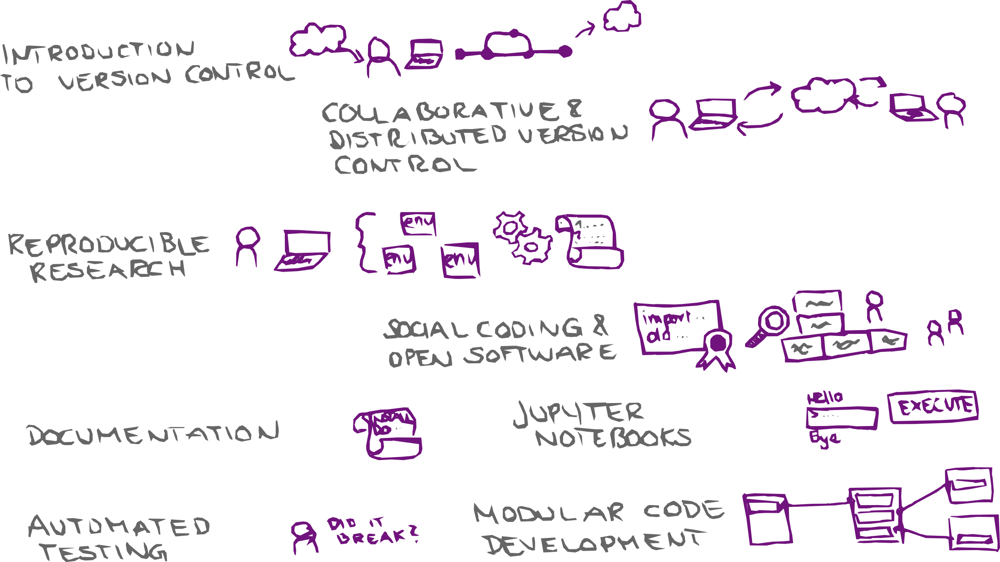

class: center, middle, gray-background

# What can CodeRefinery do for code developers?

**Diana Iuşan**

*Uppsala University*

#### Talk at the Swedish e-Science Academy, 2024-10-17

---

## Team and project: [https://coderefinery.org](https://coderefinery.org/)

### What is CodeRefinery?

- A hub for FAIR research software practices
- A project since 2016, currently funded by [NeIC](https://neic.no/)
- Training network
- Reusable [lesson materials](https://coderefinery.org/lessons/)
- Community

---
.left-column50[

### What we do

- We teach and co-organize
- Share lessons, video recordings, manuals
- All open source
]

.right-column50[

]

---

### Collaboration across funding borders

0.9 FTE (2 persons) + [10 persons in-kind + volunteers](https://coderefinery.org/about/contributors/)

Co-advertize and co-organize with us

---

# [Available lesson materials](https://coderefinery.org/lessons/)

.center[

All lessons are open source (CC-BY) and [recordings](https://www.youtube.com/channel/UC47aupE7HKGduAjXKt1Gwrg) are available 
]

---

# [Available lesson materials](https://coderefinery.org/lessons/)

- **Introduction to version control**: Git and GitHub for own projects
- **Collaborative version control**: Branching, pull/merge requests, forks, and collaboration.
- **Reproducible research**: Reproducible dependencies, environments, and computational steps.
- **Social coding and open software**: Software and data licensing and software citation.
- **How to document your research software**
- **Reusable and reproducible Jupyter notebooks**
- **Automated testing**: Motivation, test design, and tools.
- **Modular code development**: Organizing projects as they grow.

---

# Lesson example: Testing

We use [Sphinx](https://www.sphinx-doc.org/)/[sphinx-lesson](https://github.com/coderefinery/sphinx-lesson) to build our lessons from Markdown.

.center[

]

We demonstrate GitHub actions for automated testing.

<!--
Sphinx format with all markdown, no slides, multi-collaborator effort, built
around exercises, minimum one larger exercise per lesson, solutions in
dropdown, discussion suggestions, instructor guide, making things citable is
WIP, ...
-->

---

## Another example: Git lesson

.center[

]

### You can try our [lesson template](https://coderefinery.github.io/sphinx-lesson-template/)

---

## Workshop setup

- lessons are streamed
- individual learners:
     - do the exercises on their own
     - interact via the collaborative document
- teams or classrooms, may be remote or on-site
     - do exercises together
     - interact with the team leader, helpers, and instructors via the collaborative document

---
## Workshop setup

---

## Collaborative document: Markdown

- Interactive, anonymous, parallel, async
- New question every 1-2 minutes!
- ASCII-graph feedback

We publish Q&A for each workshop: [Example](https://coderefinery.github.io/2024-03-12-workshop/questions/)

---

## Results from [post-workshop survey 2024](https://github.com/coderefinery/2024-post-workshop-survey)

- Sent out to workshop participants from 2022 and 2023
- 129 answers

---

---

---

---

### Workshops

**[10 online and 28 in-person](https://coderefinery.org/workshops/past/) "standard" workshops**

- We reach over [500 persons/year](https://coderefinery.org/about/statistics/)
- Over [30 instructors/speakers](https://coderefinery.org/about/contributors/)
- Over [100 helpers/ exercise leaders](https://coderefinery.org/about/contributors/)
- "Bring Your Own Code" sessions
- in addition: "on-demand" workshops to targeted audiences

---
.center[
# Thank you for your attention!

     
]
