class: center, middle, gray-background

## The CodeRefinery project for training in research software engineering

Johan Hellsvik, PDC center for high performance computing, KTH Royal Institute of Technology, Sweden

#### Talk at The HPC Training Ecosystem in Europe workshop – October 2024

---

# Team and project: [coderefinery.org](https://coderefinery.org/)

.left-column50[
### What we are

- A hub for FAIR research software practices
- Since 2016, now **phase 3 until 2025**
- Currently funded by [NeIC](https://neic.no/)
- Training network
- Community

### What we do

- We teach and co-organize
- Share lessons, video recordings, manuals
- All open source
]

.right-column50[
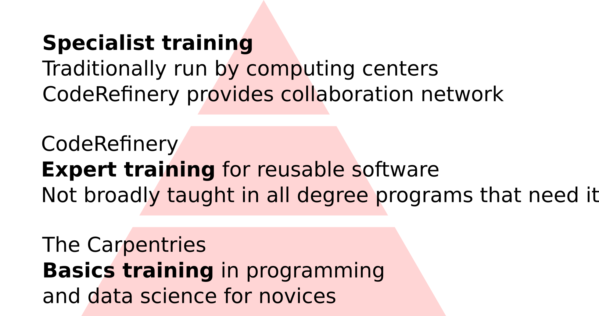
]

---
.center[

]

.cite[Heidi Seibold, CC-BY 4.0, https://twitter.com/HeidiBaya/status/1579385587865649153]

Similar projects:
[UNIVERSE-HPC](https://www.universe-hpc.ac.uk/),
[DIGITAL RESEARCH ACADEMY](https://digital-research.academy/),
[INTERSECT](https://intersect-training.org/), and probably many more ...

---

# [Available lesson material](https://coderefinery.org/lessons/)

.left-column50[
- **Introduction to version control**: Git and GitHub for own projects
- **Collaborative version control**: Branching, pull/merge requests, forks, and collaboration.
- **Reproducible research**: Reproducible dependencies, environments, and computational steps.
- **Social coding and open software**: Software and data licensing and software citation.
- **How to document your research software**
- **Reusable and reproducible Jupyter notebooks**
]

.right-column50[
- **Automated testing**: Motivation, test design, and tools.
- **Modular code development**: Organizing projects as they grow from one screen-full to larger.

### Tested in [10 online and 29 in-person](https://coderefinery.org/workshops/past/) workshops

- We reach over [500 persons/year](https://coderefinery.org/about/statistics/)
- Over [30 instructors/speakers](https://coderefinery.org/about/contributors/)
- Over [100 helpers/ exercise leaders](https://coderefinery.org/about/contributors/)
]

---

# Lessons

We use [Sphinx](https://www.sphinx-doc.org/)/[sphinx-lesson](https://github.com/coderefinery/sphinx-lesson) to build our lessons from Markdown.

.center[
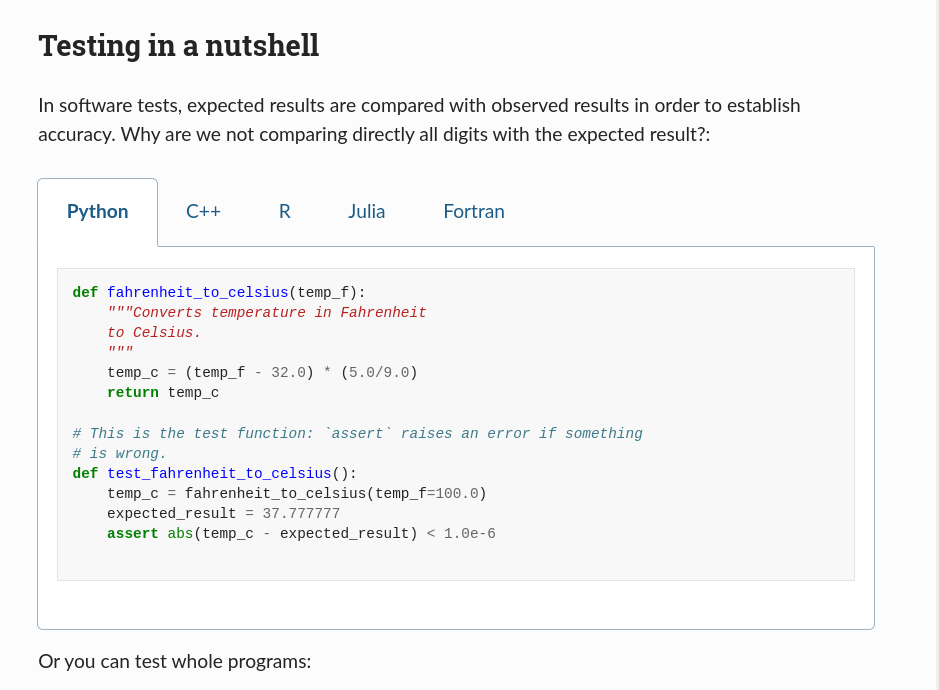
]

<!--
Sphinx format with all markdown, no slides, multi-collaborator effort, built
around exercises, minimum one larger exercise per lesson, solutions in
dropdown, discussion suggestions, instructor guide, making things citable is
WIP, ...
-->

---

## Another example: Git lesson

.center[
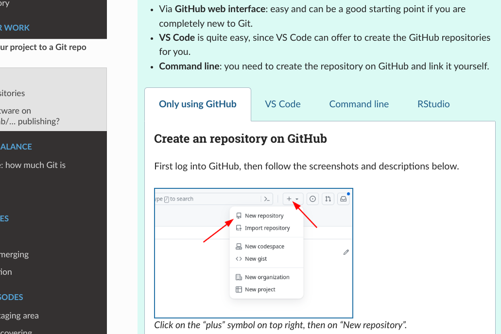
]

### You can try our [lesson template](https://coderefinery.github.io/sphinx-lesson-template/)

---

# Collaborative document: Markdown

- Interactive, anonymous, parallel, async
- New question every 1-2 minutes!
- ASCII-graph feedback

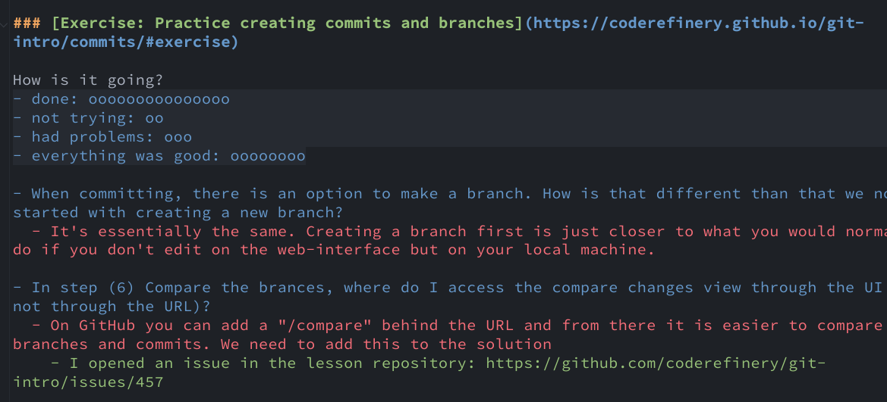

We publish Q&A for each workshop: [Example](https://coderefinery.github.io/2024-03-12-workshop/questions/)

---

# Connection to high-performance computing

- Many partners with HPC involvement

- Aalto University very active in inviting others to join HPC kickstart

- [Tuesday Tools & Techniques for High Performance Computing](https://scicomp.aalto.fi/training/scip/ttt4hpc-2024/)

- [ENCCS instructor training](https://enccs.github.io/instructor-training/) -> Materials based on CR train-the-trainer

- NRIS (Norway) and LUMI (EuroHPC-JU) have adopted our training approach and material as template

- We started sharing tools across borders at https://github.com/nordichpc

---

# What we have learned

## About motivating/teaching

- Teaching isn't a lecture anymore. It's more
  .emph[like a live TV production], which *can* be as interactive as people in
  a room.

- .emph[Co-teaching] is a great way to onboard, get better quality, and reduce
  stress

- .emph[Good enough practices] better than perfect practices not
  applied

- Instead of "good for others": ".emph[good for your future you] and as side
  effect good for others"

---

# What we have learned

## About scaling

- .emph["bring your own classroom"] seems to be a way to scale

- .emph[Installation instructions and on-boarding] become more important

- We don't "see" classrooms -> .emph[feedback mechanism] in Q&A doc

- Make exercises longer to .emph[give classrooms the chance to interact]

---

.left-column50[
## Future: Community project

- .emph[Communicate value] for volunteers and organizations

- Research groups send their students to us instead of
  creating isolated material

- .emph[More collaboration] with similar projects ("helper exchange program")

- Governance is .emph[community-driven]
]

.right-column50[
## Teaching format

- Continue .emph[large-scale workshops]

- Support .emph[local events]

- More asynchronous content coupled with online events
  (".emph[flipped classroom] approach")
]

---

## How you or your organization can participate

.center[
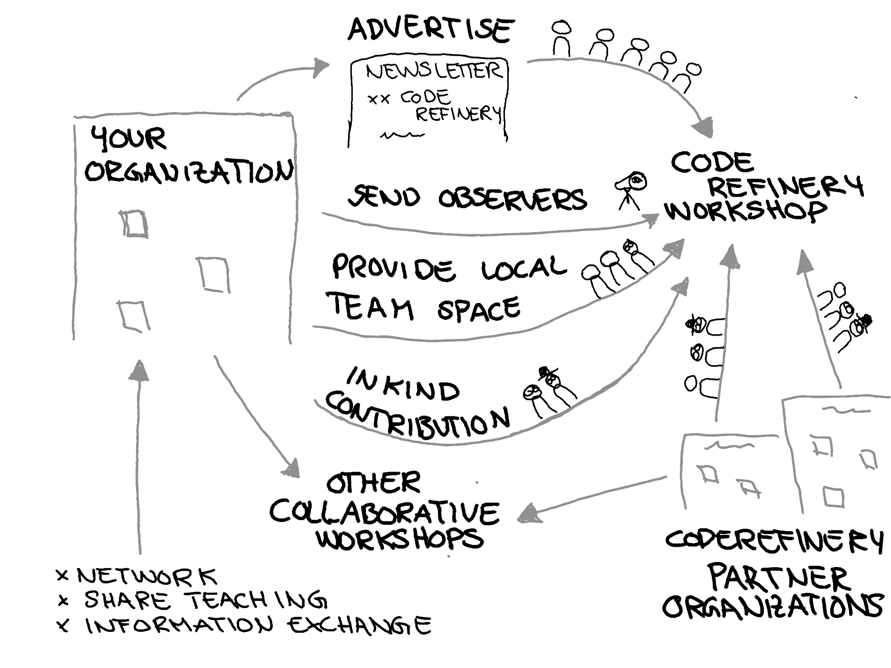
]

- **Join our next workshop** autumn 2024; follow our [newsletter](https://coderefinery.org/about/newsletter/) to get involved
- Tell your students and researchers about it
- Send one or more **exercise teams** or **join as observer**
- Use our material and give feedback

---

# What is in it for you?

- .emph[Joining is easier than organizing]:
  It is easier to bring 10% to an event than to organize the 100% yourself

- .emph[Material exchange]: let's not reinvent the wheel

- .emph[Train-the-trainer]: we can help you to get started

- .emph[Community as test-bed]: let's try out new ideas together

---

# We try to make it easier to join

.left-column60[
- **Chat with us**: https://coderefinery.zulipchat.com (ask questions about coding or learn about new tools)

- [Onboarding manual](https://coderefinery.github.io/manuals/onboarding/)

- [Blog](https://coderefinery.org/blog/)

- [Newsletter and chat digest](https://coderefinery.org/about/newsletter/)

- [X/Twitter](https://twitter.com/coderefine)

- [Mastodon](https://fosstodon.org/@coderefinery)

- [Support e-mail](support@coderefinery.org)
]

.right-column40[
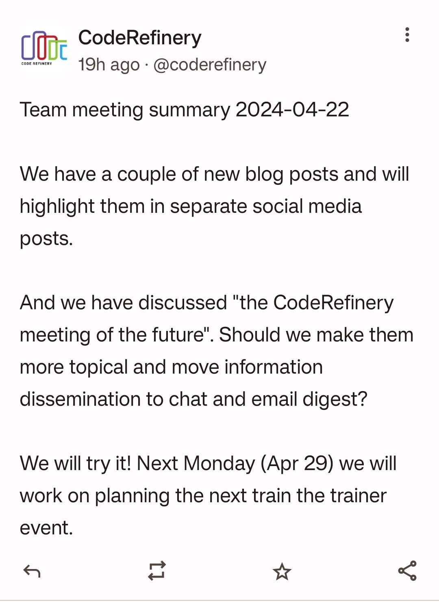
]

---

## Results from [post-workshop survey 2024](https://github.com/coderefinery/2024-post-workshop-survey)

- Sent out to workshop participants from 2022 and 2023
- 129 answers

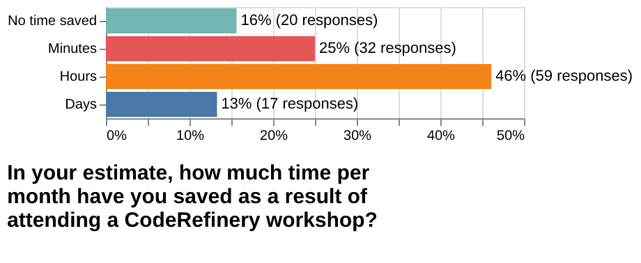

---

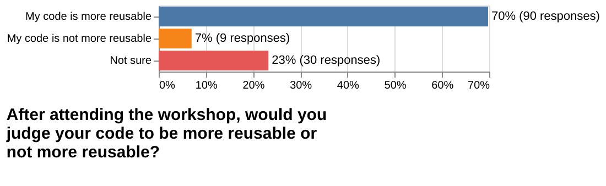

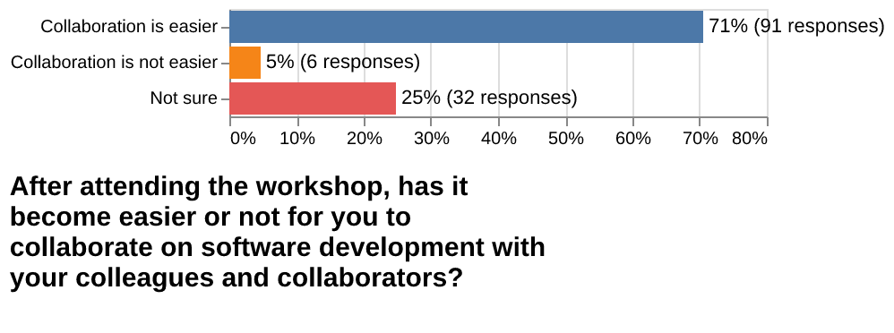

---

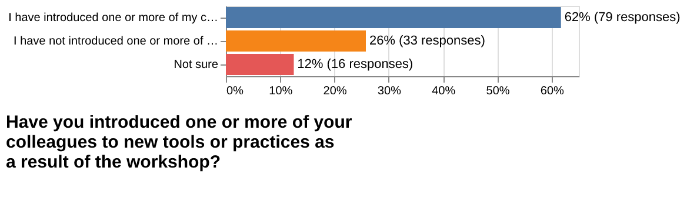

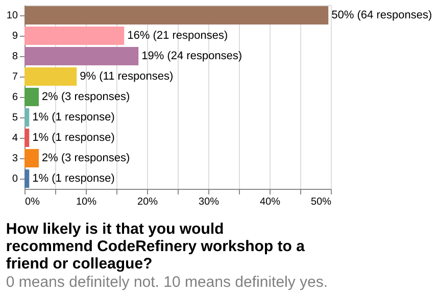

---

# Collaboration across funding borders

0.9 FTE (2 persons) + [10 persons in-kind + volunteers](https://coderefinery.org/about/contributors/)

Co-advertize and co-organize with us

---

# Thank you for your attention!

## Credits and license

### Text

- All text: CodeRefinery project, CC-BY 4.0

### Images

- Slide 3: H. Seibold, "6 helpful steps for reproducible research", CC-BY 4.0
- Slide 12: S. Wittke
- Slide 18: ATC tower, P. R. Miller, CC-BY 2.0
- Slide 18: Monitor setup, R. Darst
- Slide 18: Logos, (c) respective organizations
- All other images: CodeRefinery project, CC-BY 4.0
