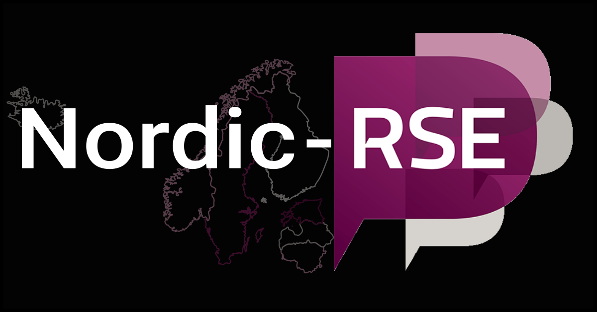

class: center, middle, gray-background


## The CodeRefinery project for training in research software engineering

Johan Hellsvik, PDC center for high performance computing, KTH Royal Institute of Technology, Sweden

#### Talk at LiU Open & Reproducible Research Group meeting – May 2024

---

# Team and project: [coderefinery.org](https://coderefinery.org/)

.left-column50[
### What we are

- A hub for FAIR research software practices
- Since 2016, now **phase 3 until 2025**
- Currently funded by [NeIC](https://neic.no/)
- Training network
- Community


### What we do

- We teach and co-organize
- Share lessons, video recordings, manuals
- All open source
]

.right-column50[

]

---
.center[

]

.cite[Heidi Seibold, CC-BY 4.0, https://twitter.com/HeidiBaya/status/1579385587865649153]

Similar projects:
[UNIVERSE-HPC](https://www.universe-hpc.ac.uk/),
[DIGITAL RESEARCH ACADEMY](https://digital-research.academy/),
[INTERSECT](https://intersect-training.org/), and probably many more ...

---

# [Available lesson material](https://coderefinery.org/lessons/)

.left-column50[
- **Introduction to version control**: Git and GitHub for own projects
- **Collaborative version control**: Branching, pull/merge requests, forks, and collaboration.
- **Reproducible research**: Reproducible dependencies, environments, and computational steps.
- **Social coding and open software**: Software and data licensing and software citation.
- **How to document your research software**
- **Reusable and reproducible Jupyter notebooks**
]

.right-column50[
- **Automated testing**: Motivation, test design, and tools.
- **Modular code development**: Organizing projects as they grow from one screen-full to larger.


### Tested in [9 online and 28 in-person](https://coderefinery.org/workshops/past/) workshops

- We reach over [500 persons/year](https://coderefinery.org/about/statistics/)
- Over [30 instructors/speakers](https://coderefinery.org/about/contributors/)
- Over [100 helpers/ exercise leaders](https://coderefinery.org/about/contributors/)
]

---

# Relation to research software engineering

- We teach topics which are .emph[helpful for researchers] and .emph[essential for RSEs].

- [Nordic RSE](https://nordic-rse.org/) colleagues hang out and discuss on the
  [CodeRefinery community chat](https://coderefinery.zulipchat.com/)

.center[

]

---

# Lessons

We use [Sphinx](https://www.sphinx-doc.org/)/[sphinx-lesson](https://github.com/coderefinery/sphinx-lesson) to build our lessons from Markdown.

.center[

]

<!--
Sphinx format with all markdown, no slides, multi-collaborator effort, built
around exercises, minimum one larger exercise per lesson, solutions in
dropdown, discussion suggestions, instructor guide, making things citable is
WIP, ...
-->

---

## Another example: Git lesson

.center[

]

### You can try our [lesson template](https://coderefinery.github.io/sphinx-lesson-template/)

---

# How to participate as a learner

.center[

]

---

## Results from [post-workshop survey 2024](https://github.com/coderefinery/2024-post-workshop-survey)

- Sent out to workshop participants from 2022 and 2023
- 129 answers


---


---


---

# Collaboration across funding borders


0.9 FTE (2 persons) + [10 persons in-kind + volunteers](https://coderefinery.org/about/contributors/)


Co-advertize and co-organize with us


---

# Connection to high-performance computing

- Many partners with HPC involvement

- Aalto University very active in inviting others to join HPC kickstart

- [Tuesday Tools & Techniques for High Performance Computing](https://scicomp.aalto.fi/training/scip/ttt4hpc-2024/)

- [ENCCS instructor training](https://enccs.github.io/instructor-training/) -> Materials based on CR train-the-trainer

- NRIS (Norway) and LUMI (EuroHPC-JU) have adopted our training approach and material as template

- We started sharing tools across borders at https://github.com/nordichpc

---

# What we have learned

## About motivating/teaching

- Teaching isn't a lecture anymore. It's more
  .emph[like a live TV production], which *can* be as interactive as people in
  a room.

- .emph[Co-teaching] is a great way to onboard, get better quality, and reduce
  stress

- .emph[Good enough practices] better than perfect practices not
  applied

- Instead of "good for others": ".emph[good for your future you] and as side
  effect good for others"

---

# What we have learned

## About scaling

- .emph["bring your own classroom"] seems to be a way to scale

- .emph[Installation instructions and on-boarding] become more important

- We don't "see" classrooms -> .emph[feedback mechanism] in Q&A doc

- Make exercises longer to .emph[give classrooms the chance to interact]

---

# Collaborative document: Markdown

- Interactive, anonymous, parallel, async
- New question every 1-2 minutes!
- ASCII-graph feedback


We publish Q&A for each workshop: [Example](https://coderefinery.github.io/2024-03-12-workshop/questions/)

---

.left-column50[
## Future: Community project

- .emph[Communicate value] for volunteers and organizations

- Research groups send their students to us instead of
  creating isolated material

- .emph[More collaboration] with similar projects ("helper exchange program")

- Governance is .emph[community-driven]
]

.right-column50[
## Teaching format

- Continue .emph[large-scale workshops]

- Support .emph[local events]

- More asynchronous content coupled with online events
  (".emph[flipped classroom] approach")
]

---

## How you or your organization can participate

.center[

]

- **Join our next workshop** autumn 2024; follow our [newsletter](https://coderefinery.org/about/newsletter/) to get involved
- Tell your students and researchers about it
- Send one or more **exercise teams** or **join as observer**
- Use our material and give feedback

---

# What is in it for you?

- .emph[Joining is easier than organizing]:
  It is easier to bring 10% to an event than to organize the 100% yourself

- .emph[Material exchange]: let's not reinvent the wheel

- .emph[Train-the-trainer]: we can help you to get started

- .emph[Community as test-bed]: let's try out new ideas together

---

# We try to make it easier to join

.left-column60[
- **Chat with us**: https://coderefinery.zulipchat.com (ask questions about coding or learn about new tools)

- [Onboarding manual](https://coderefinery.github.io/manuals/onboarding/)

- [Blog](https://coderefinery.org/blog/)

- [Newsletter and chat digest](https://coderefinery.org/about/newsletter/)

- [X/Twitter](https://twitter.com/coderefine)

- [Mastodon](https://fosstodon.org/@coderefinery)

- [Support e-mail](support@coderefinery.org)
]

.right-column40[

]

---

# Research software engineering for computational materials science

- How can skills taught and learned in CodeRefinery workshops be put to use for the field of computational materials science?

- The National Academic Infrastructure for Supercomputing in Sweden (NAISS) caters for users of high performing computing resources at higher education institutes in Sweden.

- The PDC center for higher permance computing, KTH, is part of NAISS. PDC is operating the Dardel HPE Cray EX supercomputer, equipped with AMD CPUs and GPUs

- Staff at PDC collaborate with staff at other NAISS centers and the LUMI supercomputer. Expertise on one specific application program at one center, can be shared between centers.

---

# Computational material science codes available on Dardel (selected)

- [The Relativistic Spin Polarized tookit (RSPt)](https://www.pdc.kth.se/software/software/RSPt/index_general.html), a code for electronic structure calculations based on the Full-Potential Linear Muffin-Tin Orbital (FP-LMTO) method.

- The [Quantum ESPRESSO](https://www.pdc.kth.se/software/software/Quantum-ESPRESSO/index_general.html) integrated suite of open-source computer codes for electronic-structure calculations and materials modeling at the nanoscale

- [CP2K](https://www.pdc.kth.se/software/software/cp2k/index_general.html), a program to perform atomistic and molecular simulations of solid state, liquid, molecular, and biological systems.

---

## Building and testing programs

- For maintaining and installing (new versions) of materials theory codes on Dardel, we are mainly using the EasyBuild system.

- A program that has been EasyBuilt and installed on Dardel can (often) be straightforwardly ported to a build for LUMI.

- Vice versa, a build on LUMI can be ported for Dardel. The easyconfig build configuration for Elk on Dardel has been ported to LUMI.

- Example: For the Elk electronic structure code, compare

  - Dardel [elk-9.2.12-cpeGNU-23.03.eb](https://github.com/PDC-support/PDC-SoftwareStack/blob/master/easybuild/easyconfigs/e/elk-9.2.12-cpeGNU-23.03.eb)
  - LUMI [Elk-8.7.10-cpeGNU-22.12.eb](https://github.com/Lumi-supercomputer/LUMI-EasyBuild-contrib/blob/main/easybuild/easyconfigs/e/Elk/Elk-8.7.10-cpeGNU-22.12.eb)

- To build Elk 9.2.12 on Dardel under CPE 23.03

  ```
  ml PDC/23.03 easybuild-user/4.8.2
  eb elk-9.2.12-cpeGNU-23.03.eb --robot
  ```

Reference page: [Installing software using EasyBuild](https://www.pdc.kth.se/support/documents/software_development/easybuild.html)

---

# Development of teaching material for application programs

- Example: Calculate the magnetic phase diagram of bcc Fe with the [UppASD](https://www.pdc.kth.se/software/software/UppASD/index_general.html) code for atomistic spin dynamics. Exercise instructions: [Determination of Tc of a ferromagnetic material](https://uppasd.github.io/UppASD-manual/tutorial/#determination-of-t-c-of-a-ferromagnetic-material)

- Teaching material for UppASD has been extended and further developed in connection to an autumn school on UppASD in October 2022.

- The material has been built with Sphinx/sphinx-lesson, edited in style and spirit of CodeRefinery lessons
  - [UppASD manual](https://uppasd.github.io/UppASD-manual/)
  - [UppASD tutorial](https://uppasd.github.io/UppASD-tutorial/)
  - [UppASD autumn school 2022](https://www.pdc.kth.se/about/events/training/uppasd-autumn-school-2022-1.1187827)

---

# Porting programs to GPU architectures

- Nvidia's GPUs and the CUDA framework, has been the dominating paradigm for GPU computing for ~15 years.

- For AMD GPUs, the corresponding framework is heterogeneous interface for portability (HIP)

- Many application programs need yet to be ported to GPU architecture
  - Hang on to existing code base, or start from scratch?
  - How to develop and maintain code for different backends (Nvidia, AMD, Intel, etc)?
  - Porting projects requires a team with expertise in the domain field, general research software engineering, and selected GPU coding paradigms.

---

class: center, middle, inverse

.center[

]

# [Nordic RSE](https://nordic-rse.org/) Conference

May 30 - 31, at Aalto University campus in Otaniemi, Espoo, Finland

[https://nordic-rse.org/events/2024-in-person-conference/](https://nordic-rse.org/events/2024-in-person-conference/)

---

# Thank you for your attention!

## Credits and license

### Text

- All text: CodeRefinery project, CC-BY 4.0


### Images

- Slide 3: H. Seibold, "6 helpful steps for reproducible research", CC-BY 4.0
- Slides 5, 8, 18: S. Wittke
- Slide 12: ATC tower, P. R. Miller, CC-BY 2.0
- Slide 12: Monitor setup, R. Darst
- Slide 12: Logos, (c) respective organizations
- All other images: CodeRefinery project, CC-BY 4.0
