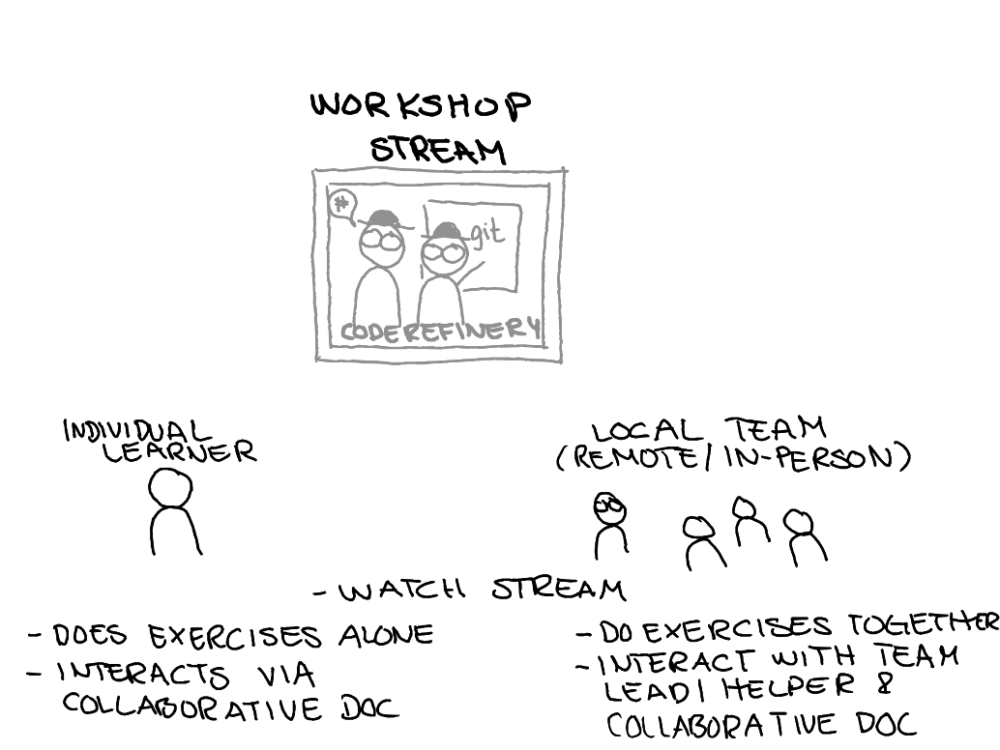

class: center, middle, gray-background

## Collaboratively training the next generation of Research Software Engineers

Samantha Wittke, CSC - IT Center for Science, Finland

Radovan Bast, UiT - The Arctic University of Norway

## ACM SIG HPC Education webinar, April 2024

---

# Team and project: [coderefinery.org](https://coderefinery.org/)

.left-column50[
### What we are

- A hub for FAIR research software practices
- Since 2016, now **phase 3 until 2025**
- Currently funded by [NeIC](https://neic.no/)
- Training network
- Community

### What we do

- We teach and co-organize
- Share lessons, video recordings, manuals
- All open source
]

.right-column50[

]

---

.cite[Heidi Seibold, CC-BY 4.0, https://twitter.com/HeidiBaya/status/1579385587865649153]

---

# [Available lesson material](https://coderefinery.org/lessons/)

.left-column50[
- **Introduction to version control**: Using Git and GitHub for own projects
- **Collaborative version control**: Apply branching, pull/merge requests, forks, and collaboration.
- **Reproducible research**: Documenting dependencies, environments, and computational steps in a reproducible way.
- **Social coding and open software**: Software and data licensing and software citation best practices.
- **Documentation**: with Markdown and Sphinx.
- **Jupyter notebooks**: Best practices for reusable and reproducible notebooks.
]

.right-column50[
- **Automated testing**: Test design and tools that are typically used for automated testing of software.
- **Modular code development**: How to partition and organize projects as they grow from one screen-full to larger.

### Tested in [9 online and 28 in-person](https://coderefinery.org/workshops/past/) workshops

- We reach over [500 persons/year](https://coderefinery.org/about/statistics/)
- Over [30 instructors/speakers](https://coderefinery.org/about/contributors/)
- Over [100 helpers/ exercise leaders](https://coderefinery.org/about/contributors/)
]

---

# Lessons

We use [Sphinx](https://www.sphinx-doc.org/)/[sphinx-lesson](https://github.com/coderefinery/sphinx-lesson) to build our lessons from Markdown.

.center[

]

<!--
Sphinx format with all markdown, no slides, multi-collaborator effort, built
around exercises, minimum one larger exercise per lesson, solutions in
dropdown, discussion suggestions, instructor guide, making things citable is
WIP, ...
-->

---

## TODO: here I will add a screenshot from the Git lesson

---

---

# Feedback survey results

TODO: summarize here in 3 slides

---

# Collaboration across funding borders

0.9 FTE (2 persons) + [10 persons in-kind + volunteers](https://coderefinery.org/about/contributors/)

Co-advertize and co-organize with us

---

# What we have learned

## About motivating/teaching

- Teaching isn't a lecture anymore. It's more
  .emph[like a live TV production], which *can* be as interactive as people in
  a room.

- .emph[Co-teaching] is a great way to onboard, get better quality, and reduce
  stress

- .emph[Good enough practices] better than perfect practices not
  applied

- Instead of "good for others": ".emph[good for your future you] and as side
  effect good for others"

---

# What we have learned

## About scaling

- "bring your own classroom" seems to be a way to scale

- .emph[Installation instructions and on-boarding] become more important

- We don't "see" classrooms -> .emph[feedback mechanism] in Q&A doc

- Make exercises longer to .emph[give classrooms the chance to interact]

---

# Collaborative document: Markdown

- Interactive, anonymous, parallel, async
- New question every 1-2 minutes!
- ASCII-graph feedback

TODO: update to show Q and A and a poll

We publish Q&A for each workshop: [Example](https://coderefinery.github.io/2024-03-12-workshop/questions/)

---

.left-column50[
## Future: Community project

- Communicate value for volunteers and organizations

- Research groups send their students to us instead of
  creating isolated material

- More collaboration with similar projects ("helper exchange program")

- Governance is community-driven
]

.right-column50[
## Teaching format

- Continue large-scale workshops

- Support local events

- More asynchronous content coupled with online events
]

---

## How you or your organization can participate

.center[

]

- **Join our next workshop** autumn 2024; follow our [newsletter](https://coderefinery.org/about/newsletter/) to get involved
- Tell your students and researchers about it
- Send one or more **exercise teams** or **join as observer**
- Use our material and give feedback

---

# We try to make it easier to join

.left-column60[
- **Chat with us**: https://coderefinery.zulipchat.com (ask questions about coding or learn about new tools)

- [Blog](https://coderefinery.org/blog/),
  [Newsletter and chat digest](https://coderefinery.org/about/newsletter/),
  [Twitter](https://twitter.com/coderefine),
  [Mastodon](https://fosstodon.org/@coderefinery),
  [Support](support@coderefinery.org)
]

.right-column40[

]

---

class: center, middle, inverse

# [Nordic RSE](https://nordic-rse.org/) Conference

May 30 - 31, at Aalto University campus in Otaniemi, Espoo, Finland

[https://nordic-rse.org/events/2024-in-person-conference/](https://nordic-rse.org/events/2024-in-person-conference/)

---
class: center, middle, inverse

## These slides: TODO

---

# Credits and license

## Text

- All text: CodeRefinery project, CC-BY 4.0

## Images

- Slide 3: H. Seibold, "6 helpful steps for reproducible research", CC-BY 4.0
- Slides 6, 11, 12, 18: S. Wittke
- Slide 14: ATC tower, P. R. Miller, CC-BY 2.0
- Slide 14: Monitor setup, R. Darst
- Slide 14: Logos, (c) respective organizations
- All other images: CodeRefinery project, CC-BY 4.0
