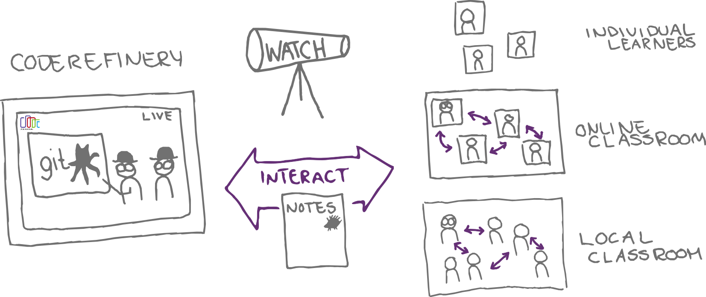

class: center, middle

## - Ways of teaching 

Samantha Wittke

CodeRefinery project manager, CSC - IT Center for Science, Finland

samantha.wittke@csc.fi

#### Meeting with LAIF WP1- Training 17.11.2025  

---

# CodeRefinery - the project

- Partnership / Training collaborative
     - 9 universities and infrastructure providers 
     - under Nordic e-Infrastructure Collaboration
- ~20 people working in-kind together with a broader community

 

## coderefinery.org

 

---

# Our mission since 2016

- **Hands-on training** in practical tools and techniques for researchers who code
- Focus on integration into normal researcher workflow
- Reusable teaching materials
- Course format development
- Open community for Research Software Engineers and support enthusiasts

.center[

]

Similar efforts:
[INTERSECT](https://intersect-training.org/), [Suresoft](https://suresoft.dev/), 
[Digital Research Academy](https://digital-research.academy/), [The Carpentries FAIR RS](https://carpentries-incubator.github.io/fair-research-software/), [FAIR2](https://github.com/FAIR2-for-research-software) and probably many more ..

---

# [Available lesson materials](https://coderefinery.org/lessons/) - All CC-BY

- Introduction to version control & collaborative version control
- Reproducible research
- Social coding and open software
- Documentation
- Reusable and reproducible Jupyter notebooks
- Automated testing
- Modular code development

\+ [Installation guide](https://coderefinery.github.io/installation/)

### Developed over [11 online and 29 in-person](https://coderefinery.org/workshops/past/) workshops

- We reach over [500 persons/year](https://coderefinery.org/about/statistics/)
- Over [30 instructors/speakers/contributors](https://coderefinery.org/about/contributors/)

---

# How we teach and develop

 

## 1. "Bring your own classroom" 
→  Maximum reach without losing local connection
## 2. Collaborative lesson development 
with markdown, sphinx and GitHub pages
## 3. Practical train the trainer

---

# 1. Bring your own classroom

.center[

]

 
* Participants get local support, social learning, and community formation
* Central instructors focus on teaching; hubs focus on mentoring

---

# 2. Collaborative lesson development

 

- Lessons: <https://github.com/coderefinery/> (open license: CC-BY)
- **Markdown** source, built with **Sphinx** + GitHub Actions 
- →  **GitHub Pages** (self-learning ready)
- `CITATION.cff` → Zenodo DOI
- Maintainer + contribution guide (in progress)

[CodeRefinery Lesson template](https://coderefinery.github.io/sphinx-lesson/)
* [Tabs](https://coderefinery.github.io/git-intro/commits/#solution-and-walk-through)
* [Scaffolding](https://coderefinery.github.io/reproducible-research/workflow-management/)

 

→  Versioned, reviewable, remixable content

---

# 3. Training collaborative

### CodeRefinery teaching philosophy 

* Training as a community skill
* Co-teaching and practical instructor onboarding -> lowering barrier
  * Zoom, collab notes, terminal and screenshare setup, GitHub
* Teaching as a shared practice across institutions

### Train the trainer / facilitator

- [Training materials](https://coderefinery.github.io/train-the-trainer/)
- [Operation manuals](https://coderefinery.github.io/manuals/)

---
class: center, middle

# Thank you for the invitation

## Happy to answer any questions you may have :)
