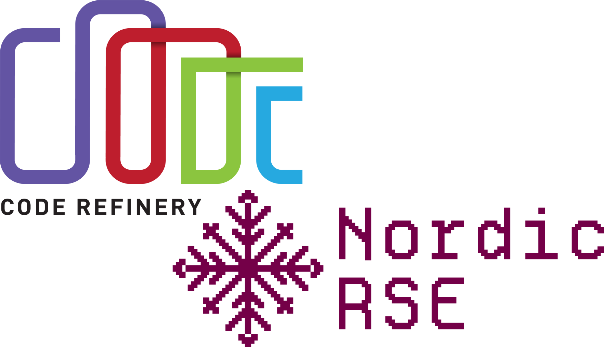
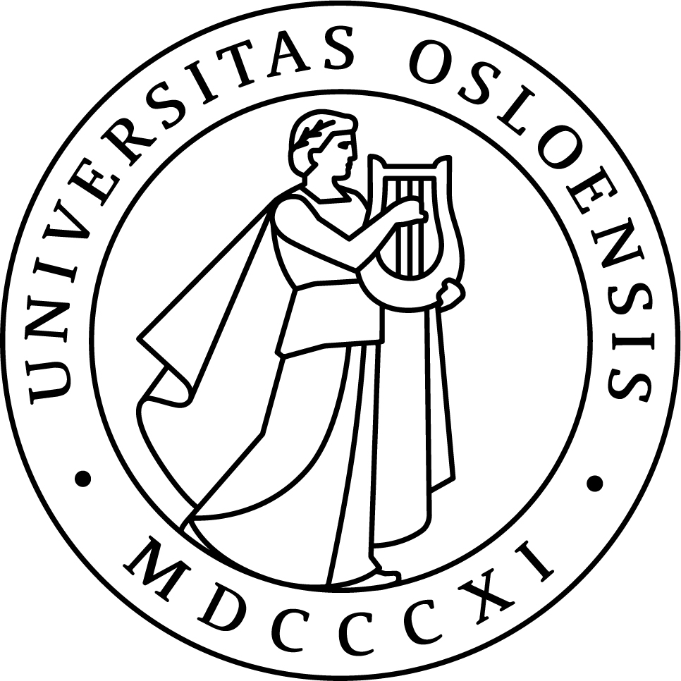
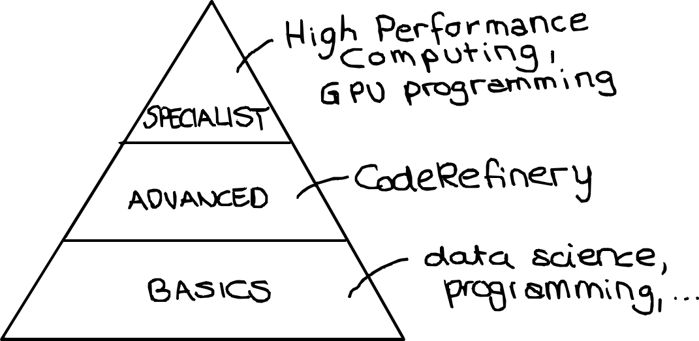
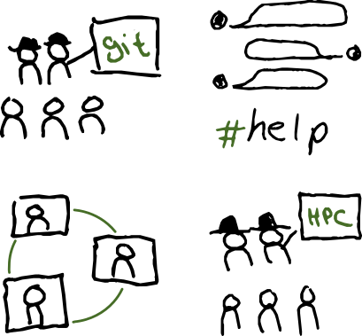

class: center, middle

## CodeRefinery: Where Research Software Engineers can begin and grow

Samantha Wittke, CSC - IT Center for Science, Finland

#### Nordic-RSE conference, May 2025

---

# Content for today

 

- The CodeRefinery project

- CodeRefinery workshops

- How to engage with, contribute to, and benefit from the resources

---

# The problem - Research code challenges

 

- Many researchers write code but lack formal training beyond programming

- Collaboration on code can be frustrating and inefficient

- Research code is often poorly documented and non-reproducible

- Good coding practices are often not part of standard academic training

 
 

.center[.remark["It works on my machine"]]

---

# Enter, CodeRefinery

**Our mission since 2016:** 

- A community-driven, publicly funded project
- Hands-on training in practical coding tools for research
- Focus on “good enough” software practices to improve efficiency
- Support for Open Science and FAIR software development

.center[

]

Similar efforts:
[INTERSECT](https://intersect-training.org/), [SURESOFT](https://suresoft.dev/), [DIGITAL RESEARCH ACADEMY](https://digital-research.academy/), [The Carpentries FAIR RS](https://carpentries-incubator.github.io/fair-research-software/) and probably many more ...

---

# Our workshops - interactive & hands-on

- **Format:** Online, streamed and reverse hybrid through local classrooms
- **Hands-on exercises** – Not just lectures, but real tool experience
- **Collaborative learning** – Learn alongside peers with expert guidance
- **Beginner-friendly** – No prior experience with the tools we teach required!

---

# [Available lesson material](https://coderefinery.org/lessons/) - All CC-BY

.left-column50[
- Introduction to version control

- Collaborative version control

- Reproducible research

- Social coding and open software

]

.right-column50[

- Documentation

- Reusable and reproducible Jupyter notebooks

- Automated testing

- Modular code development
]

 

### Developed over [10 online and 29 in-person](https://coderefinery.org/workshops/past/) workshops

- We reach over [500 persons/year](https://coderefinery.org/about/statistics/)
- Over [30 instructors/speakers](https://coderefinery.org/about/contributors/)

---

# Beyond the workshop - community

.center[

]

- **Networking** – Connect with peers and experts
- **Collaborative projects** – Work with others on teaching and outreach
- **Specialized workshops** – Covering High-Performance Computing (HPC) and more
- **Open learning materials** – Use, modify, and contribute!

---

## How you can benefit

✅ Join a workshop as a learner or observer

✅ Bring your team and learn together

✅ Host a local classroom for others to learn together

✅ Use CodeRefinery materials for your own training

## How you can contribute

 🙌 **Teach with us** – Become a co-instructor

 📝 **Contribute to lesson materials** – Improve and expand lesson content
 
 💡 **Provide feedback** – Help us refine teaching and materials

---

# Relation to Research Software Engineering

- We teach topics which are .emph[helpful for researchers] and .emph[essential for RSEs]

- Visiting a CodeRefinery workshop can spark interest in RSEng

- Connecting made easy: [CodeRefinery community chat](https://coderefinery.zulipchat.com/) also hosts the Nordic-RSE community!

 

.center[

]

---

# Get involved!

- Visit [coderefinery.org](https://coderefinery.org/)

- Follow [newsletter](https://coderefinery.org/about/newsletter/)

- Check out our [blog](https://coderefinery.org/blog/)

- Register for an [upcoming workshop](https://coderefinery.org/workshops/upcoming/)

- Become an [ambassador](https://coderefinery.org/join/individuals/#coderefinery-ambassador)

- Join our community discussions in [Zulip](https://coderefinery.zulipchat.com)

- Follow us on social media (BlueSky, Mastodon, LinkedIn) & stay connected

- Contact us if you have any questions, [support e-mail](support@coderefinery.org)

---
class: center, middle, inverse

## These slides: 

---

# Credits and license

## Text

- All text: CodeRefinery project, CC-BY 4.0

## Images

- Slide 1: Logos, (c) respective organizations
- Slide 1: Nordic-RSE logo, (c) Nordic-RSE
- All other images: CodeRefinery project, CC-BY 4.0
