class: center, middle

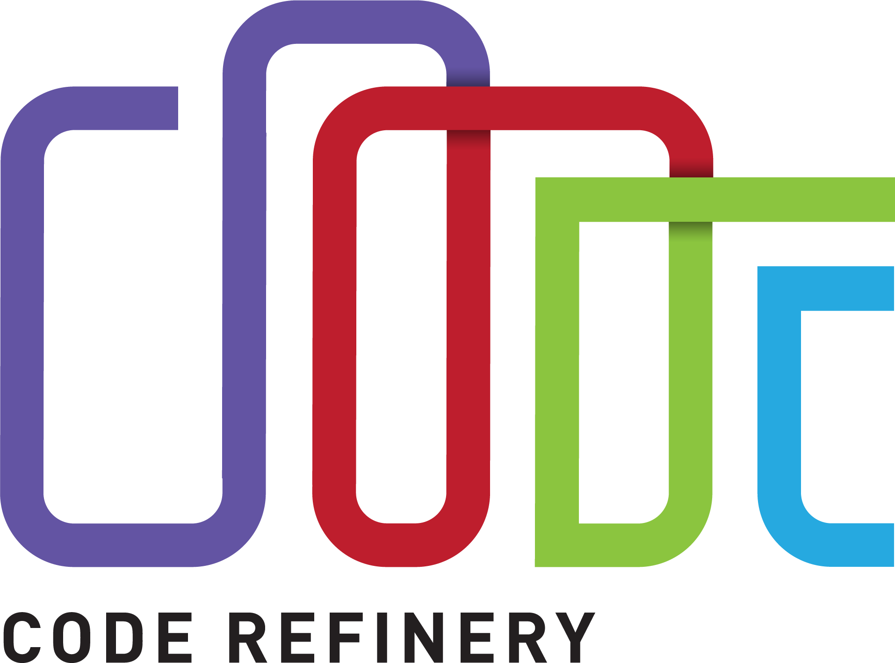

## CodeRefinery training materials

Samantha Wittke, CSC - IT Center for Science, Finland

#### RSECon25 - dRTP training catalog BoF

---

# CodeRefinery - the project

- Partnership / Training collaborative
     - 9 universities and infrastructure providers 
     - under Nordic e-Infrastructure Collaboration
- ~20 people working in-kind together with a broader community

 

**coderefinery.org**

 

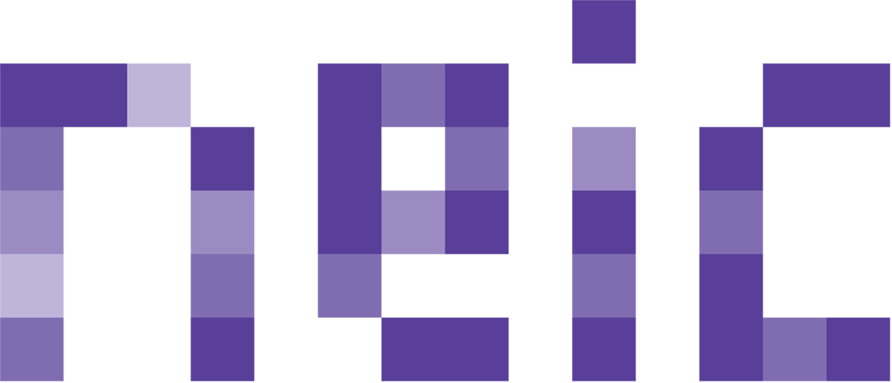

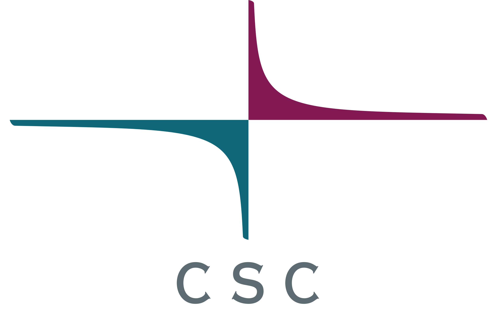

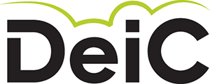
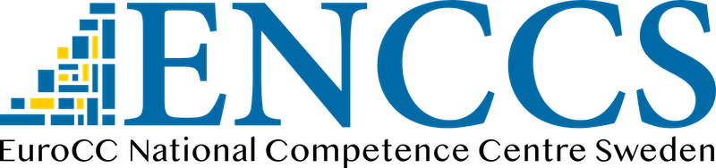

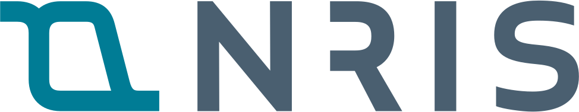
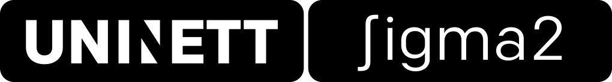

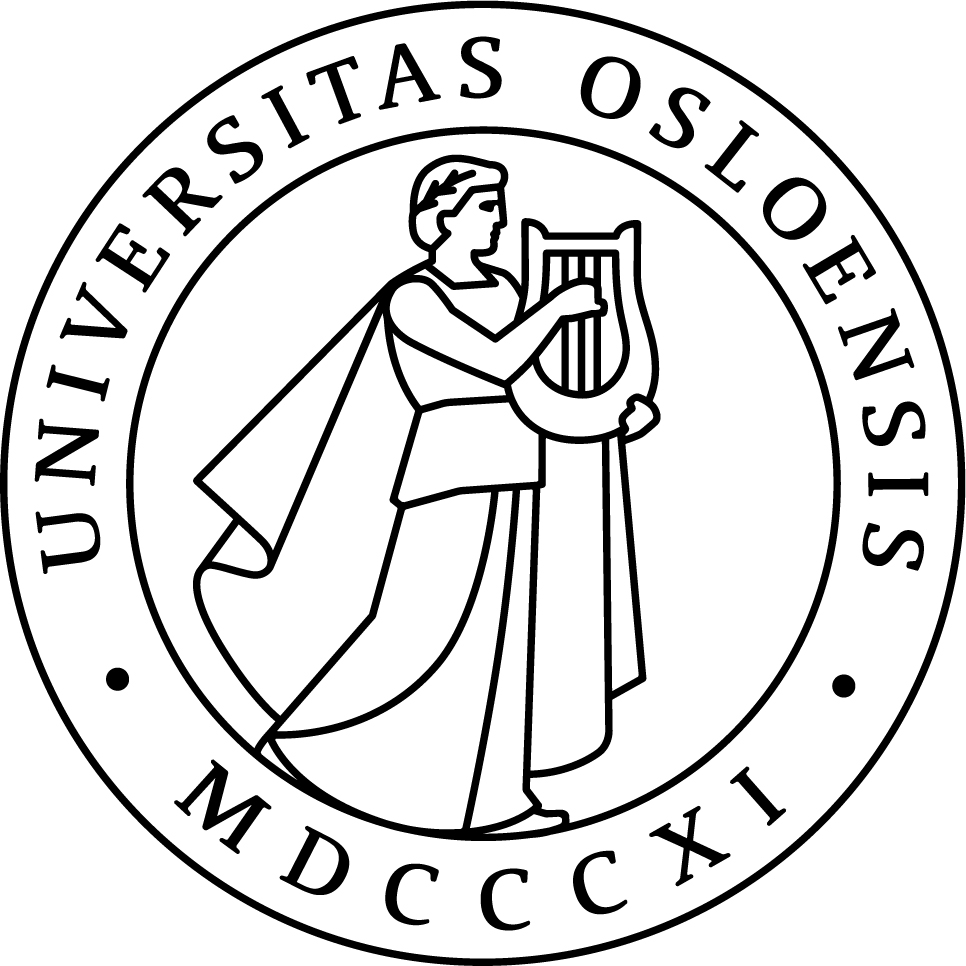

---

# Our mission since 2016

- Hands-on training in practical tools and techniques for researchers who code
- Focus on integration into normal researcher workflow
- Reusable teaching materials
- Course format development
- Open community for RSE and support enthusiasts

.center[
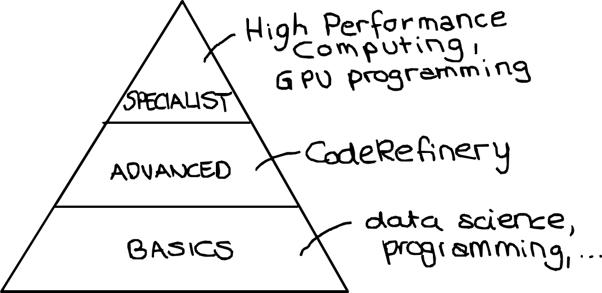
]

Similar efforts:
[INTERSECT](https://intersect-training.org/), [Suresoft](https://suresoft.dev/), 
[Digital Research Academy](https://digital-research.academy/), [The Carpentries FAIR RS](https://carpentries-incubator.github.io/fair-research-software/), [FAIR2](https://github.com/FAIR2-for-research-software) and probably many more ..

---

# [Available lesson materials](https://coderefinery.org/lessons/) - All CC-BY

- Introduction to version control & collaborative version control
- Reproducible research
- Social coding and open software
- Documentation
- Reusable and reproducible Jupyter notebooks
- Automated testing
- Modular code development

 

### Developed over [11 online and 29 in-person](https://coderefinery.org/workshops/past/) workshops

- We reach over [500 persons/year](https://coderefinery.org/about/statistics/)
- Over [30 instructors/speakers/contributors](https://coderefinery.org/about/contributors/)

---

# FAIR training material

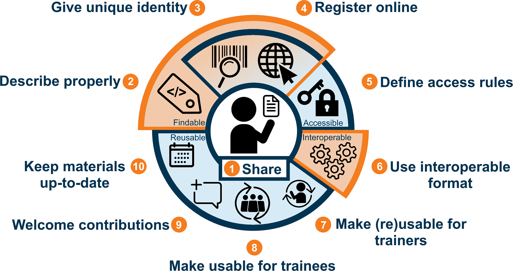

> Wiegers, L., & van Gelder, C. W. G. (2019). Illustration for "Ten simple rules for making training materials FAIR" (1.0). Zenodo. https://doi.org/10.5281/zenodo.3593258

---

# Where are we wrt to FAIR training materials?

1. Share - GitHub ✔️
2. Describe properly - CFF but no full metadata 🛠️
3. Give unique identity - Zenodo DOI ✔️
4. Register online ❎
5. Define access rules - open ✔️
6. Use interoperable format - markdown, sphinx & GitHub pages ✔️
7. Make reusable for trainers - CC-BY & instructor notes ✔️
8. Make usable for trainees - audience, prerequisites & learning objectives ✔️
9. Welcome contributions - we do but no CONTRIBUTING file 🛠️
10. Keep materials up to date - before every workshop ✔️

---

# CodeRefinery in the dRTP grid

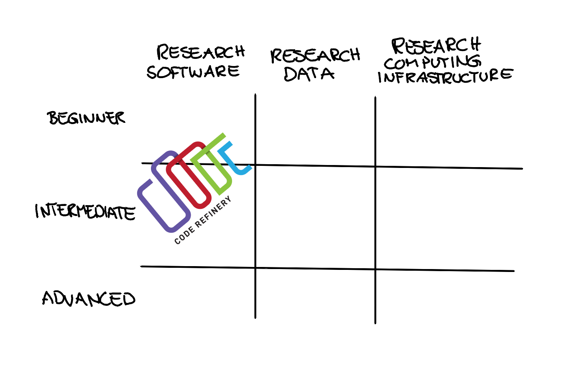

---

class: center, middle, inverse

# Happy to connect!
