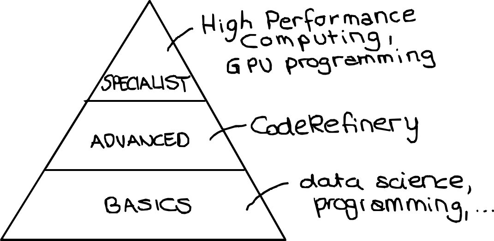
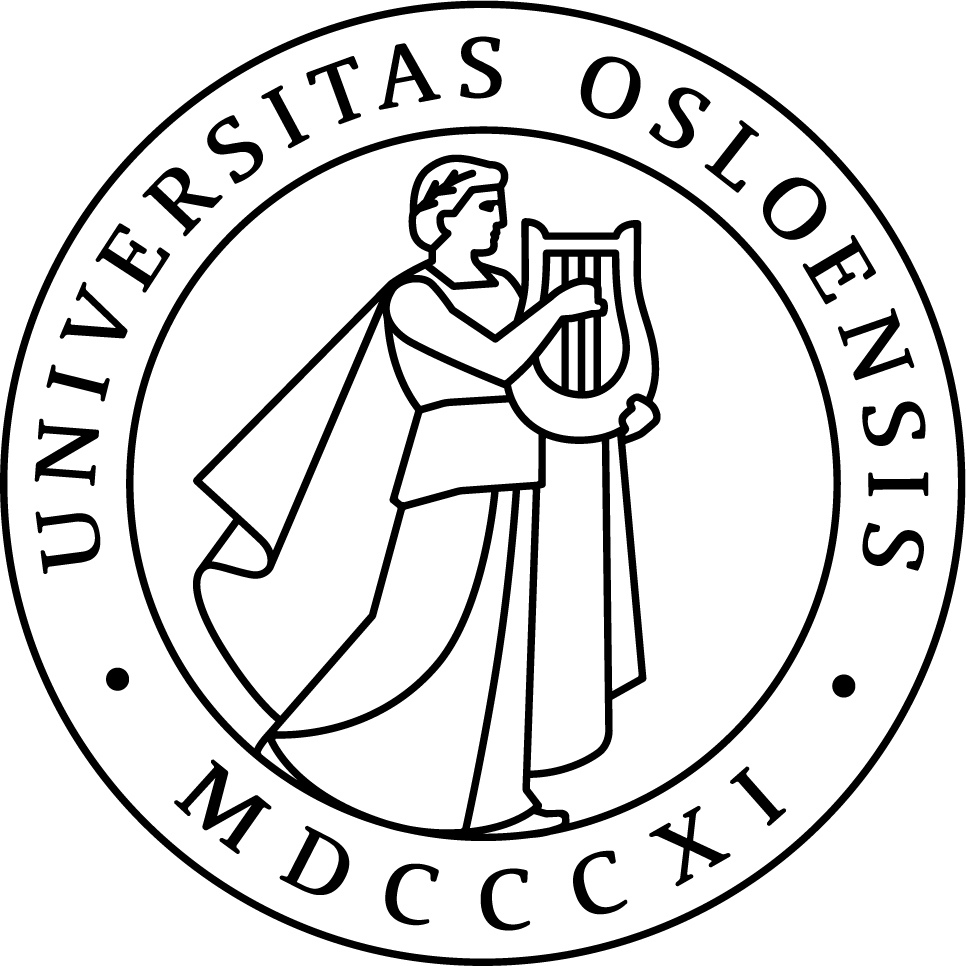

class: center, middle, gray-background

## RSE by accident: From CodeRefinery to Nordic-RSE and beyond

Samantha Wittke, CSC - IT Center for Science, Finland

#### EPCC visit, May 2025

---

# Content for today

 

- The CodeRefinery project

- CodeRefinery workshops

- How to engage with, contribute to, and benefit from our resources

- Nordic-RSE

---

# The problem - Research code challenges

 

- Many researchers write code but lack formal training beyond programming

- Collaboration on code can be frustrating and inefficient

- Research code is often poorly documented and non-reproducible

- Good coding practices are often not part of standard academic training

 
 

.center[.remark["It works on my machine"]]

---

# Enter, CodeRefinery

**Our mission since 2016:** 

- A community-driven, publicly funded project
- Hands-on training in practical coding tools for research
- Focus on “good enough” software practices to improve efficiency
- Support for Open Science and FAIR software development

.center[

]

Similar efforts:
[INTERSECT](https://intersect-training.org/), [SURESOFT](https://suresoft.dev/), [DIGITAL RESEARCH ACADEMY](https://digital-research.academy/), [The Carpentries FAIR RS](https://carpentries-incubator.github.io/fair-research-software/) and probably many more ...

---

# We teach practical skills for researchers

.remark[Topics which are .emph[helpful for researchers] and .emph[essential for RSEs].]

- **Git & Version Control** – No more lost files or confusion over changes
- **Reproducible Research** – Ensure results can be verified and reused
- **Collaborative Coding** – Work efficiently with colleagues & open-source communities
- **Efficient Coding Techniques** – Write cleaner, modular, and scalable code
- **Documentation & Testing** – Make your code understandable and error-free
- **Open Science & FAIR Principles** – Share your work for maximum impact

[All Lesson materials available under CC BY 4.0 license](https://coderefinery.org/lessons/)

---

# Our workshops - interactive & hands-on

- **Format:** Online and reverse hybrid through local classrooms
- **Hands-on exercises** – Not just lectures, but real tool experience
- **Collaborative learning** – Learn alongside peers with expert guidance
- **Beginner-friendly** – No prior experience with the tools we teach required!

---

# Collaboration across funding borders

[~ 15 people in-kind + volunteers](https://coderefinery.org/about/contributors/)

---

# Beyond the workshop - community

.center[

]

- **Networking** – Connect with peers and experts.
- **Collaborative projects** – Work with others on teaching and outreach.
- **Specialized workshops** – Covering High-Performance Computing (HPC) and more.
- **Open learning materials** – Use, modify, and contribute!

---

## How you can benefit

✅ Join a workshop as a learner or observer

✅ Bring your team and learn together

✅ Host a local classroom for others to learn together

✅ Use CodeRefinery materials for your own training

## How you can contribute

 🙌 **Teach with us** – Become a co-instructor

 📝 **Contribute to lesson materials** – Improve and expand lesson content
 
 💡 **Provide feedback** – Help us refine teaching and materials

---

# Success stories and impact

### Tested in [10 large online and 28 in-person](https://coderefinery.org/workshops/past/) workshops

- We reach over [500 persons/year](https://coderefinery.org/about/statistics/)
- Over [30 instructors / speakers](https://coderefinery.org/about/contributors/)
- Over [100 helpers / exercise leaders](https://coderefinery.org/about/contributors/)

.remark["Thank you for six great days of learning Git, testing, modular code, Sphinx (!) and more. I already started incorporating Sphinx in my current project."]

.remark["I write my codes now in such a way that the person who will be taking over my job would have less time figuring out what is going on."]

-> [Results from post-workshop survey 2024](https://coderefinery.org/blog/2024/08/10/post-workshop-survey/)

---

# Relation to Research Software Engineering

- We teach topics which are .emph[helpful for researchers] and .emph[essential for RSEs].

- [Nordic-RSE](https://nordic-rse.org/) colleagues hang out and discuss on the
  [CodeRefinery community chat](https://coderefinery.zulipchat.com/)

.center[

]

---

class: Nordic-background

# [Nordic-RSE](https://nordic-rse.org/)

The Nordic Research Software Engineers association hopes to **promote the careers of RSEs** and the advancement of Science by:

- being a networking platform for specialized research supporters,
- provide a community and professional development network for RSEs,
- organizing events to bring RSEs and related people together, and
- support whose who want to bring RSE services and skills to their community.

---

# Nordic RSE Conference 2025

.center[

]

 
 

- May 20 -21, 2025 in Gothenburg, Sweden
- Next week, 45 registrations (+10 from last year!)  

---

# Follow or get involved!

Join our community discussions in [Zulip](https://coderefinery.zulipchat.com)
Follow us on social media (BlueSky, Mastodon, LinkedIn)

.left-column50[

- Visit [coderefinery.org](https://coderefinery.org/)

- [CodeRefinery blog](https://coderefinery.org/blog/)

- [CodeRefinery newsletter](https://coderefinery.org/about/newsletter/)

- Register for an [upcoming workshop](https://coderefinery.org/workshops/upcoming/)

- Become an [ambassador](https://coderefinery.org/join/individuals/#coderefinery-ambassador)

- Support e-mail: support@coderefinery.org

]

.right-column50[

- Visit [nodic-rse.org](https://nordic-rse.org/)

- [Nordic-RSE blog](https://nordic-rse.org/blog/)

- [Nordic-RSE newsletter](https://forms.gle/paPBnvsw5GAXUzBN6)

- Support e-mail: secretary@nordic-rse.org

]
---
class: center, middle, inverse

## These slides: 

---

# Credits and license

## Text

- All text: CodeRefinery project, CC-BY 4.0

## Images

- Slide 5: ATC tower, P. R. Miller, CC-BY 2.0
- Slide 5: Monitor setup, R. Darst
- Slide 5: Logos, (c) respective organizations
- Slide 17: Nordic-RSE logo, (c) Nordic-RSE
- All other images: CodeRefinery project, CC-BY 4.0
