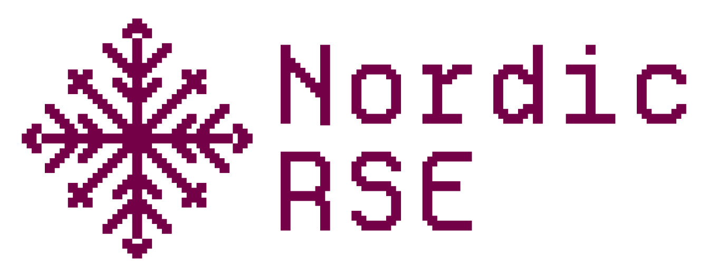

class: center, middle, gray-background

## CodeRefinery: A Community for Teaching, Learning, and Growing Together

Samantha Wittke, CSC - IT Center for Science, Finland

#### HiRSE seminar, March 2025

---

# Content for today

- The CodeRefinery project
- CodeRefinery workshops
- The community
- How to engage, contribute, and benefit from our resources

---

# The problem - Research code challenges

.left-column50[
- Many researchers write code but lack formal training.
- Collaboration on code can be frustrating and inefficient.
- Research often relies on poorly documented, non-reproducible code.
- Good coding practices are often not part of standard academic training.
]

.right-column40[
 
 
.remark["It works on my machine"]
]

---

# Enter, CodeRefinery

.left-column50[
**Our mission:** 

- A community-driven, publicly funded project.
- Hands-on training in practical coding tools for research.
- Focus on “good enough” software practices to improve efficiency.
- Support for Open Science and FAIR software development.

...since 2016
]

.right-column50[

 
 

Similar efforts:
[UNIVERSE-HPC](https://www.universe-hpc.ac.uk/), [DIGITAL RESEARCH ACADEMY](https://digital-research.academy/),[INTERSECT](https://intersect-training.org/), [SURESOFT](https://suresoft.dev/) and probably many more ...

]

---

# Collaboration across funding borders

[~ 10 persons in-kind + volunteers](https://coderefinery.org/about/contributors/)

---

# What we teach: Practical skills for researchers

We teach topics which are .emph[helpful for researchers] and .emph[essential for RSEs].

- **Git & Version Control** – No more lost files or confusion over changes.
- **Reproducible Research** – Ensure results can be verified and reused.
- **Collaborative Coding** – Work efficiently with colleagues & open-source communities.
- **Efficient Coding Techniques** – Write cleaner, modular, and scalable code.
- **Documentation & Testing** – Make your code understandable and error-free.
- **Open Science & FAIR Principles** – Share your work for maximum impact.

[All Lesson materials available](https://coderefinery.org/lessons/)

.center[

]

---

# Our workshops - interactive & hands-on

- Format: Online and reverse hybrid through local classrooms.
- Hands-on exercises – Not just lectures, but real coding experience.
- Collaborative learning – Learn alongside peers with expert guidance.
- Beginner-friendly – No prior experience required!

---

# Collaborative document: Markdown

- Interactive, anonymous, parallel, async
- New question every 1-2 minutes!
- ASCII-graph feedback

We publish Q&A for each workshop: [Example](https://coderefinery.github.io/2024-03-12-workshop/questions/)

---

# Beyond the workshop - community

.center[

]

- Networking – Connect with peers and experts.
- Collaborative projects – Work with others on teaching and outreach.
- Specialized workshops – Covering High-Performance Computing (HPC) and more.
- Open learning materials – Use, modify, and contribute!

---

# How you can benefit

.center[

]

- ✅ Join a workshop as a learner
- ✅ Bring your team and learn together
- ✅ Host a local classroom for colleagues
- ✅ Use CodeRefinery materials for your own training

.remark[Joining is easier than organizing alone]

---

# How you can contribute

 🙌 **Teach with us** – Become a co-instructor.

 📝 **Contribute to lesson materials** – Improve and expand our content.
 
 💡 **Provide feedback** – Help us refine our approach.
 
 🚀 **Share your knowledge** – Run your own training events using our materials.

---

# Success stories and impact

### Tested in [10 large online and 28 in-person](https://coderefinery.org/workshops/past/) workshops

- We reach over [500 persons/year](https://coderefinery.org/about/statistics/)
- Over [30 instructors/speakers](https://coderefinery.org/about/contributors/)
- Over [100 helpers/ exercise leaders](https://coderefinery.org/about/contributors/)

.remark["Thank you for six great days of learning Git, testing, modular code, Sphinx (!) and more. I already started incorporating Sphinx in my current project.]

.remark["I write my codes now in such a way that the person who will be taking over my job would have less time figuring out what is going on."]

--- 

# Results from [post-workshop survey 2024](https://github.com/coderefinery/2024-post-workshop-survey)

- Sent out to workshop participants from 2022 and 2023
- 129 answers

---

---

---

# Get involved!

- Visit [coderefinery.org](https://coderefinery.org/)
- Follow [newsletter](https://coderefinery.org/about/newsletter/)
- Check out our [blog](https://coderefinery.org/blog/)
- Register for an [upcoming workshop](https://coderefinery.org/workshops/upcoming/)
- Become an [ambassador](https://coderefinery.org/join/individuals/#coderefinery-ambassador)
- Join our community discussions in [Zulip](https://coderefinery.zulipchat.com)
- Follow us on social media (BlueSky, Mastodon, LinkedIn) & stay connected
- Contact us if you have any questions, [Support e-mail](support@coderefinery.org)

---

## Next workshop

.center[

]

- March 25-27 and April 1-3, 2025 09-13.30 CET 
- For free and online
- Registration open: <https://coderefinery.github.io/2025-03-25-workshop>

---

# [Nordic RSE](https://nordic-rse.org/) Conference

.center[

]

- May 20 -21, 2025 in Gothenburg, Sweden
- Registration and abstract submission open: <https://nordic-rse.org/nrse2025/>

---
class: center, middle, inverse

## These slides: TODO: upload

---

# Credits and license

## Text

- All text: CodeRefinery project, CC-BY 4.0

## Images

- Slide 12: ATC tower, P. R. Miller, CC-BY 2.0
- Slide 12: Monitor setup, R. Darst
- Slide 12: Logos, (c) respective organizations
- Slide XX: Nordic-RSE logo, (c) Nordic-RSE
- All other images: CodeRefinery project, CC-BY 4.0
