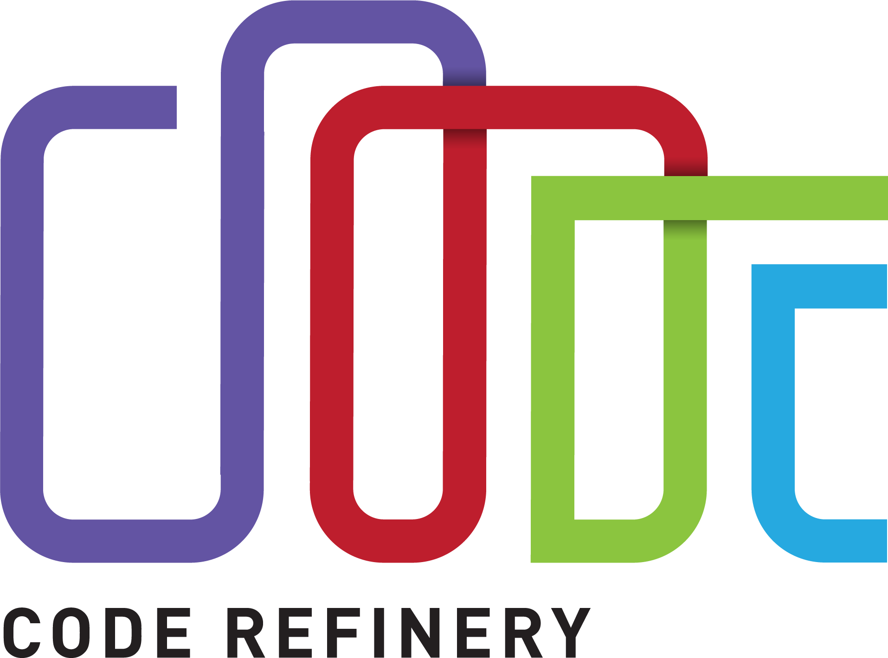
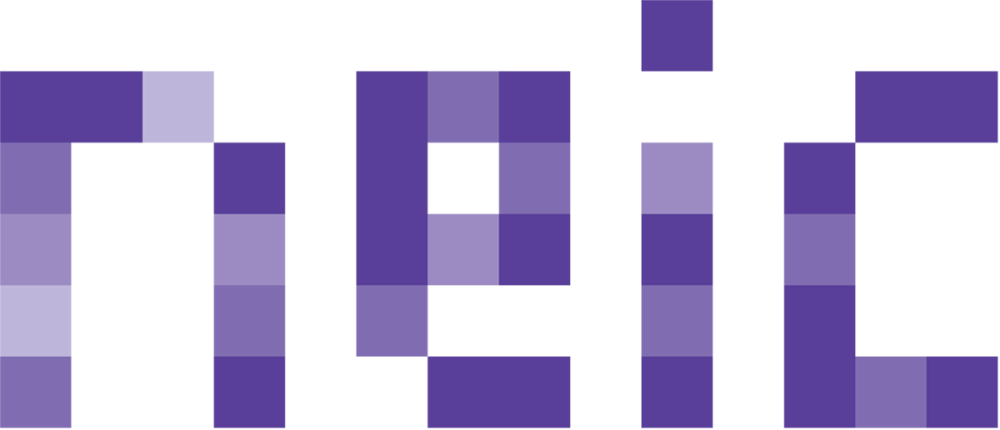
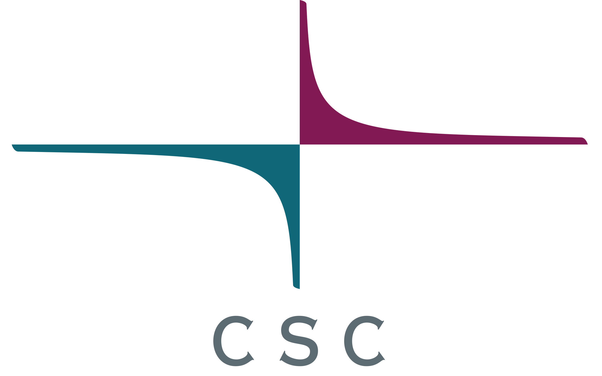
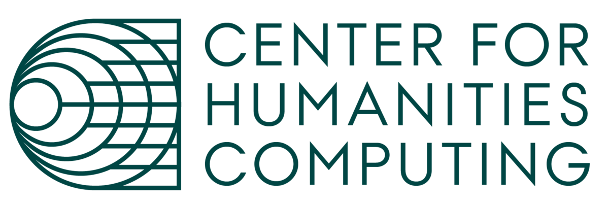
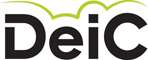
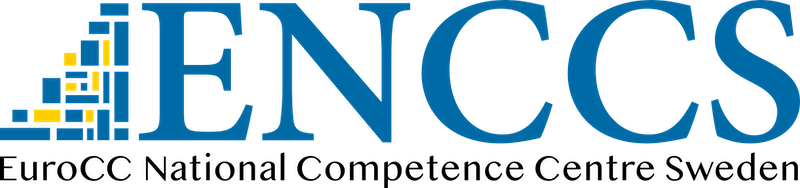
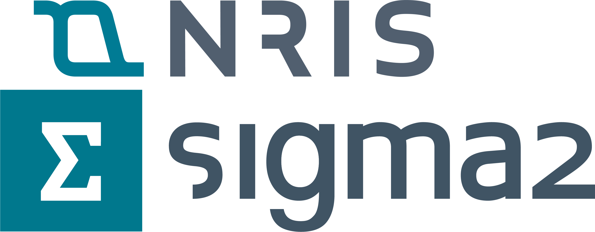
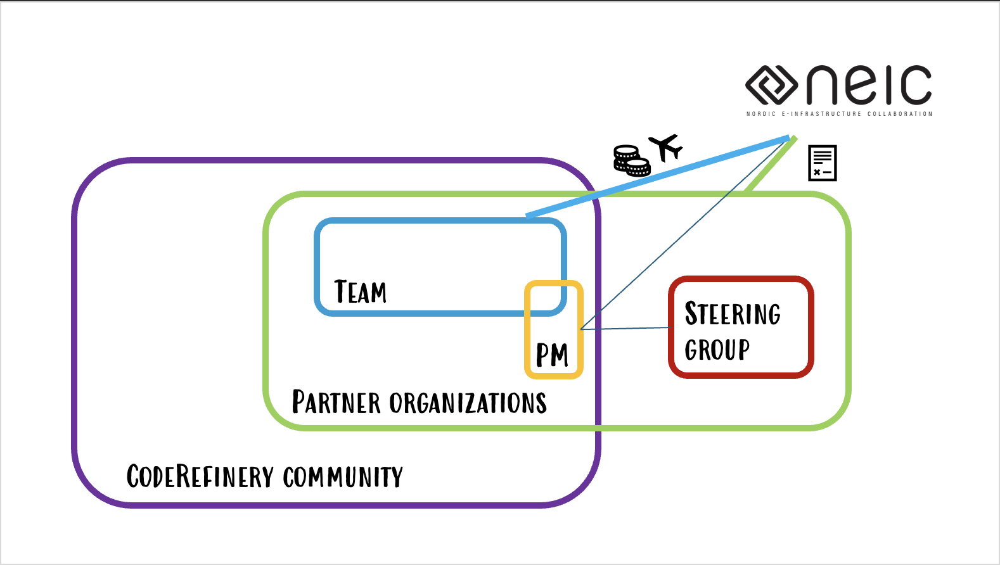
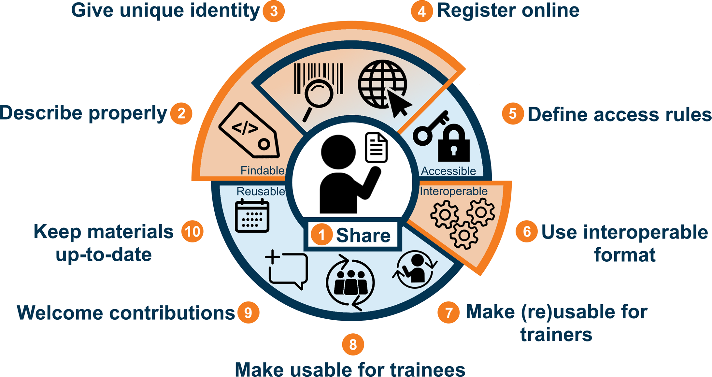

<!-- cicero
engine: remark
js:
  - https://cdnjs.cloudflare.com/ajax/libs/remark/0.14.0/remark.min.js
css:
  - 2026_ELIXIR_BYOC.css
highlight: monokai
-->

class: center, middle



## Making training materials FAIR - the CodeRefinery way











#### FAIR training working group - October 2026

Samantha Wittke, CSC - IT Center for Science, Finland (samantha.wittke@csc.fi)

---

# CodeRefinery - A training network for research computing 

- Project currently funded fully in-kind by partner organizations, hosted under [NeIC](https://neic.no/) until end 2026

- Tightly connected to [Nordic RSE](https://nordic-rse.org/) community, but community goes beyond Nordics

- Lesson materials and operation manuals

- [14 large online and 29 in-person](https://coderefinery.org/workshops/past/) workshops, reaching over [500 persons/year](https://coderefinery.org/about/statistics/)

---

# The CodeRefinery community

.center[


]

- Community makes suggestions and edits our lesson materials!
- Review: PM -> maintainers

---

## Where are we wrt to FAIR training materials?

.left-column60[
.center[

]]

.right-column40[
<br>

.small[
Wiegers, L., & van Gelder, C. W. G. (2019). Illustration for "Ten simple rules for making training materials FAIR" (1.0). Zenodo. https://doi.org/10.5281/zenodo.3593258]
<br>
<br>
]


1. Share - Public GitHub ✔️
2. Describe properly - CFF, bioschemas 🛠️
3. Give unique identity - Zenodo DOI ✔️
4. Register online - OpenAIRE via Zenodo 🛠️
5. Define access rules - open ✔️
6. Use interoperable format - markdown, sphinx & GitHub pages ✔️
7. Make reusable for trainers - CC-BY & instructor notes 🛠️
8. Make usable for trainees - audience, prerequisites & learning objectives 🛠️
9. Welcome contributions - [Lesson contribution guide](https://coderefinery.github.io/manuals/lesson-contribution/), not with lessons yet 🛠️
10. Keep materials up to date - before every workshop, starting to have maintainers ✔️

---

# One file to rule them all: `metadata.yml`

The only file edited by hand: `metadata.yml`

On push to main:

- -> CITATION.cff ("cite this repository")
- -> bioschemas.yml (JSON-LD)

<br>

On GitHub release: 

- -> new Zenodo version (same concept id, source zip, PDF + links to repo and live material)

---

# What goes into `metadata.yml`

```yaml
title: "How to document your research software"
abstract: "... an overview of the different ways how a code project can be documented ..."
version: "2026-08-03"
doi: "10.5281/zenodo.8280234"          # concept DOI, never changes once set
url: "https://coderefinery.github.io/documentation/"
license: "CC-BY-4.0"
repository-code: "https://github.com/coderefinery/documentation"
keywords: ["Documentation", "Sphinx"]
educationalLevel: "Beginner"           # Bioschemas-only fields ...
inLanguage: "en-UK"
teaches: "Understand the importance of writing code documentation ..."
learningResourceType: "lesson"
authors:
- name: "CodeRefinery"
- family-names: "Doe"
  given-names: "Jane"
```

.small[Everyone listed is an .emph[author] (Zenodo `creators`), so they end up in the citation.]

---

# Releasing a new version

Good moment: .emph[after a workshop]

1. Update `metadata.yml`: bump `version` to today's date, .emph[check the author list]
   - not all contributions happen on GitHub (discussions, reviews)!
2. Merge to main -> `CITATION.cff` and `bioschemas.yml` regenerate
3. Wait for GitHub Pages to rebuild
4. Create a GitHub release, tag = version date
5. Check Zenodo: new version under same concept DOI, zip + PDF attached, metadata matches

<br>

.center[Details: [Releasing a new version of a lesson](https://coderefinery.github.io/manuals/lesson-version/)]

---

# What reusers see

Every lesson has a .emph["Reusing"] page, e.g. [Reproducible research](https://coderefinery.github.io/reproducible-research/reusing/)

- .emph[How to cite]: DOI + `CITATION.cff`

- .emph[Structured metadata]: rendered at build time from `metadata.yml` (Sphinx directive), embedded as JSON-LD on every page

- .emph[License]: CC-BY 4.0 for the material

<br>

.quote[This lesson material is free to reuse, adapt, and cite. This page collects everything you need to do so.]

---

# Work in progress

- Metadata setup is .emph[not yet part of the lesson template]: scripts and workflows are copied into each repository

- .emph[Lesson maintainers] are only a suggestion: `maintainers` field exists, but is not used yet

- Some Bioschemas fields still empty (`audience`, `competencyRequired`, `accessibilitySummary`)

- Audience information mostly on workshop pages, not in each lesson; learner personas

- Contribution guide lives in the manuals, not in each lesson repository

---

# Thank you!

## Questions?

- Contact:  samantha.wittke@csc.fi

- Website: [coderefinery.org](https://coderefinery.org/)

- Lessons: [coderefinery.org/lessons](https://coderefinery.org/lessons/) · Zenodo: [zenodo.org/communities/coderefinery](https://zenodo.org/communities/coderefinery)

<br>

#### Credits and license

- Garcia L, Batut B, Burke ML, et al. (2020) Ten simple rules for making training materials FAIR. PLoS Comput Biol 16(5): e1007854. https://doi.org/10.1371/journal.pcbi.1007854
- All logos, (c) respective organizations
- All text: CodeRefinery project, CC-BY 4.0
