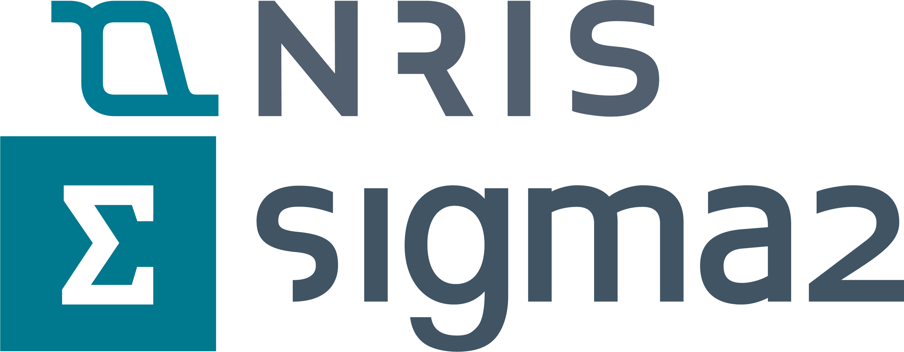
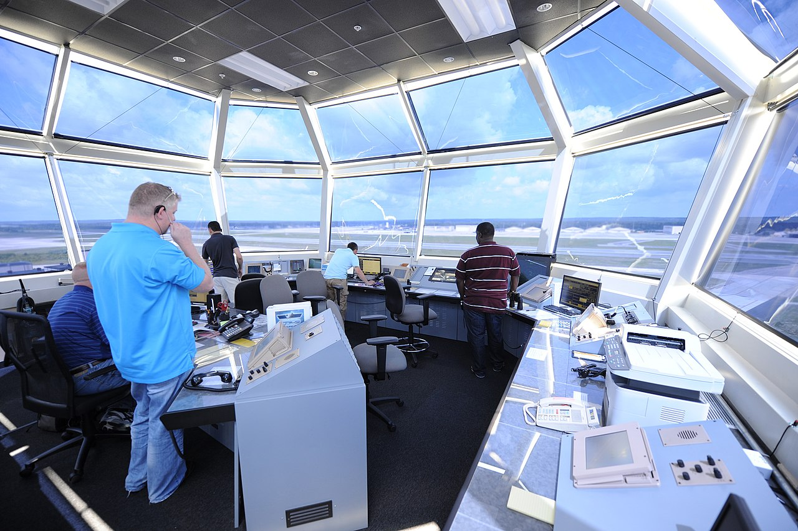
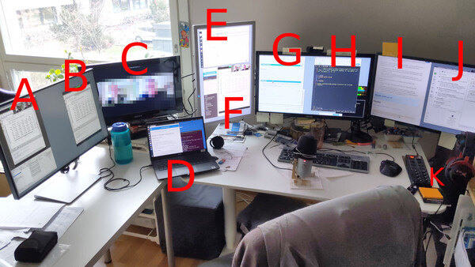
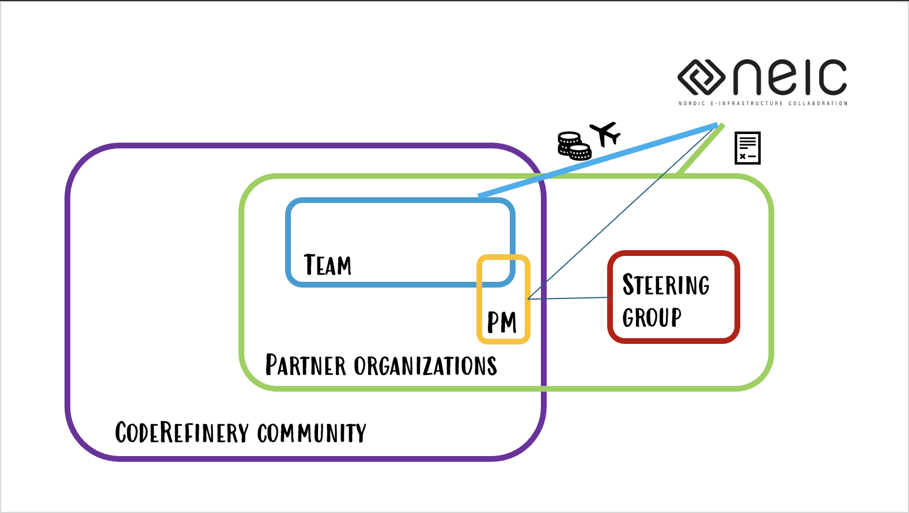
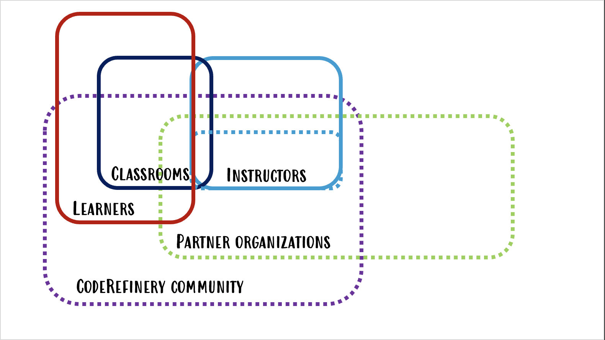
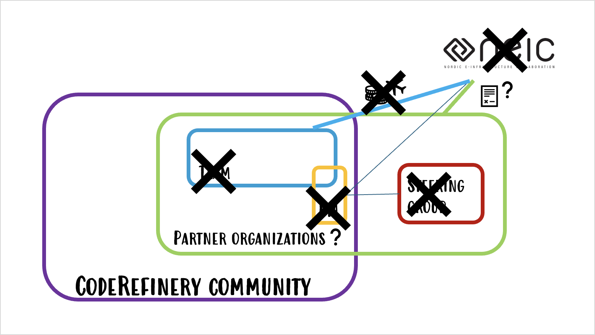

<!-- cicero
engine: remark
js:
  - https://cdnjs.cloudflare.com/ajax/libs/remark/0.14.0/remark.min.js
css:
  - 2026_ELIXIR_BYOC.css
highlight: monokai
-->

class: center, middle

## Teaching Together at Scale: Lessons from the CodeRefinery Training Network

#### International Research Software Conference, September 2026

Samantha Wittke, CSC - IT Center for Science, Finland (samantha.wittke@csc.fi)

---

# CodeRefinery - A training network for research computing 

- Project currently funded fully in-kind by partner organizations, hosted under [NeIC](https://neic.no/) until end 2026

- Tightly connected to [Nordic RSE](https://nordic-rse.org/) community, but community goes beyond Nordics

- Two main online workshops a year, free of charge, everyone welcome (short lectures + hands-on exercises, streamed live and recorded)

- [13 large online and 29 in-person](https://coderefinery.org/workshops/past/) workshops, reaching over [500 persons/year](https://coderefinery.org/about/statistics/)

- We teach topics which are .emph[helpful for researchers] and .emph[essential for RSEs]

     
---

# Collaboration across funding borders

[~ 20 persons in-kind + volunteers](https://coderefinery.org/about/contributors/) · [Over 30 instructors/speakers](https://coderefinery.org/about/contributors/)

---

# The CodeRefinery community

.center[

]

- Community hangs out on our [Zulip chat](https://coderefinery.zulipchat.com)
- Team meets weekly online and annually in-person
- SG, NeIC and PM meet quarterly

---

# [Reusable lesson material](https://coderefinery.org/lessons/)

.left-column50[
- Introduction to version control

- Collaborative version control

- Reproducible research

- Social coding and open software

]

.right-column50[

- Documentation

- Responsible use of generative AI in assisted coding

- Automated testing

- Modular code development
]

  

.center[.emph[All under CC-BY 4.0 and now with DOI and basic metadata!]]

---

# Bring your own classroom

.center[

]

 

- (Local) partners host a "watching party" -> connection
- Get the interaction without running own course
- Onboarding via/to CodeRefinery

Read more in our [blogpost](https://coderefinery.org/blog/bring-your-own-classroom/)!

---

# Who is in the classrooms?

.center[

]

---

# What have we learned? (1/3) - workshop setup

 

- Busy learners: 6 half days is a lot of time to reserve -> .emph[modularity and recordings]

- .emph[Reminder] e-mails in the morning of the event 

- Collaborative document needs to be .emph[managed], answers on different levels are appreciated

- Day by day feedback with .emph[time to answer] during the course

---

# What have we learned? (2/3) - stream & classrooms

 

- The format is unusual and requires some getting used to

- Exercise session .emph[timing is crucial]

- .emph[Clearly communicate] what learners are supposed to be doing

- Separate registrations for keeping data where it needs to be

- Needs cookies to bring people to the classrooms and advertizing expertize

- Feedback from local hosts is invaluable for further developing the format, **Thank you <3**

---

# What have we learned? (3/3) - teaching & development

 

- Co-teaching format does not work for everyone

- Co-teaching needs .emph[practice and familiarity] -> 3 step onboarding before each workshops

- .emph[Reserve time] for lesson + installation instruction maintenance

- .emph[Lesson maintainers] to move lessons forward (avoid non-decisions, and keep contributors engaged)

---

# Future

.center[

]

- Working on .emph[sustainability] beyond project -> Governance updates, manuals, uni curriculum integration, training on setup

- Growing contributor community requires .emph[lesson maintainers]

- More metadata and .emph[better contributor recognition]

---

# What we can offer

- Join a workshop as an observer

- Local classroom .emph[onboarding and support]

- Instructor training (co-teaching, technical setup)

- Collaborative lesson development

- .emph[Technical streaming setup] 

-> Contact us at support@coderefinery.org or samantha.wittke@csc.fi !

---

# Thank you for your attention!

## Questions?

- Contact: [CodeRefinery Zulip chat](https://coderefinery.zulipchat.com) & support@coderefinery.org

- Website: [coderefinery.org](https://coderefinery.org/)

- [Next Workshop](https://coderefinery.github.io/2026-09-22-workshop/) starting September 22nd! 

 

#### Credits and license

- ATC tower: CC BY 2.0 (Peter R. Miller)
- All logos, (c) respective organizations
- All other images: CodeRefinery project, CC-BY 4.0
- All text: CodeRefinery project, CC-BY 4.0
