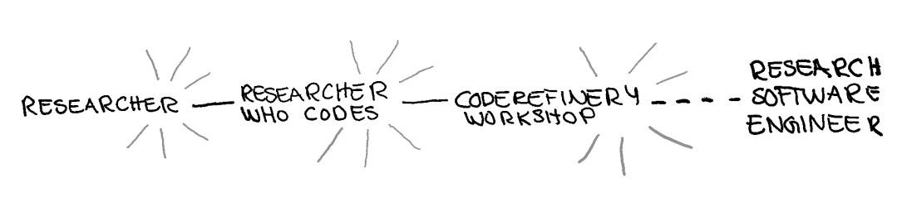
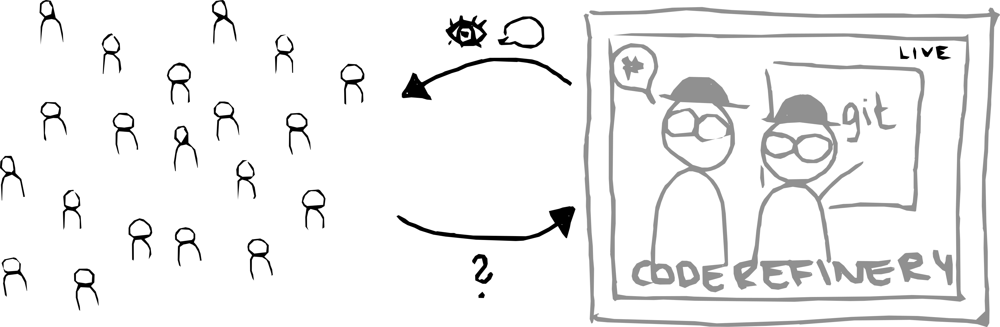

<!-- cicero
engine: remark
js:
  - https://cdnjs.cloudflare.com/ajax/libs/remark/0.14.0/remark.min.js
css:
  - 2026_ELIXIR_BYOC.css
highlight: monokai
-->

class: center, middle

## Teaching Together at Scale: Lessons from the CodeRefinery Training Network

#### International Research Software Conference, September 2026

.small[Dr. Samantha Wittke, CSC - IT Center for Science, Finland (samantha.wittke@csc.fi)]

---

# What is this presentation about?

  

1. The CodeRefinery project and workshops

2. The bring your own classroom approach

3. How we can support each other

---

# CodeRefinery - A hub for FAIR research software practices

- Project currently funded by [NeIC](https://neic.no/) and partner organizations 

- Tightly connected to [Nordic RSE](https://nordic-rse.org/)

- Two main online workshops a year, free of charge, everyone welcome

- We teach topics which are .emph[helpful for researchers] and .emph[essential for RSEs]

     
---

# Collaboration across funding borders

[~ 10 persons in-kind + volunteers](https://coderefinery.org/about/contributors/)

---

# [Available lesson material](https://coderefinery.org/lessons/)

.left-column50[
- Introduction to version control

- Collaborative version control

- Reproducible research

- Social coding and open software

]

.right-column50[

- Documentation

- Responsible use of generative AI in assisted coding

- Automated testing

- Modular code development
]

### Developed over [13 large online and 29 in-person](https://coderefinery.org/workshops/past/) workshops

- We reach over [500 persons/year](https://coderefinery.org/about/statistics/)
- Over [30 instructors/speakers](https://coderefinery.org/about/contributors/)
- We stream our workshops - for many reasons

---

## Problem with large streamed workshops?

.center[
Interactivity & sense of community

]

 

## What can help?

- Tools (e.g. collaborative notes)
- Bring your own classroom

---

# Bring your own classroom

.center[

]

 

- (Local) partners host a "watching party"
- Open for anyone or own research group
- Online or in-person
- Own team lead as support
- Small group

---

# Experiences

.quote-small[
[...] allowed us to advance with the **implementation of our vision** for
Research Data & Software Management training [...]
]
.small[(Paula Martinez Lavanchy, TU Delft, NL)]

.quote-small[
[...] really **allows to reach the biggest possible
audience**, while also fostering the **creation of local communities**. [...]
]
.small[(Lisanna Paladin, EMBL, DE)]

.quote-small[
[...] One of the biggest **challenge is to keep the whole classroom from first to last
day** ... I think it's impossible 🙂 [...] 
]
.small[(Candy Deck, NTNU, NO)]

.quote-small[
[...] I believe **attending these workshops as a group helped tremendously**
compared to attending individually [...] due to being able to learn together and discuss
in person with team mates. 
]
.small[(Jakob Sauer Jørgensen, DTU, DK)]

Read more in our [blogpost](https://coderefinery.org/blog/bring-your-own-classroom/)!

---

# What have we learned?

 

- The format is unusual and requires some getting used to

- Exercise session .emph[timing is crucial]

- Collaborative document needs to be managed

- .emph[Clearly communicate] what learners are supposed to be doing

- Feedback from local hosts is invaluable for further developing the format, **Thank you <3**

---

# Benefits of bring your own classroom

 

- Get the .emph[interactivity] of own classroom without organizing a full course

- Get onboarding and orientation

- .emph[Side quests] according to own work/need

- Work with .emph[own people] - direct support and help-line

- .emph[Train-the-trainer]: We can help you to get started

- .emph[Community] as test-bed: Let's try out new ideas together

---

# What we can offer

- Join a workshop as an observer

- Local classroom .emph[onboarding and support]

- Instructor training (co-teaching, technical setup)

- Collaborative lesson development

- .emph[Technical streaming setup] 

-> Contact us at support@coderefinery.org !

---

# Thank you for your attention!

#### Join us

- Contact: [CodeRefinery Zulip chat](https://coderefinery.zulipchat.com) & support@coderefinery.org

- Website: [coderefinery.org](https://coderefinery.org/)

- [Next Workshop](https://coderefinery.github.io/2026-09-22-workshop/) starting September 22nd! 

 

#### Credits and license

- Slide 2: Logos, (c) respective organizations
- All other images: CodeRefinery project, CC-BY 4.0
- All text: CodeRefinery project, CC-BY 4.0
