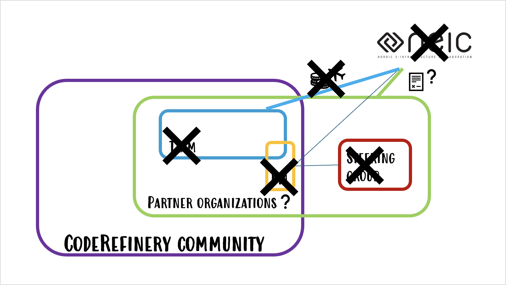

<!-- cicero
engine: remark
js:
  - https://cdnjs.cloudflare.com/ajax/libs/remark/0.14.0/remark.min.js
css:
  - 2026_ELIXIR_BYOC.css
highlight: monokai
-->

class: center, middle

## CodeRefinery Townhall 

#### October 2026

Samantha Wittke, CSC - IT Center for Science, Finland (samantha.wittke@csc.fi)

---

# Warm up question to you

In one word: what does CodeRefinery mean to you?

---

# CodeRefinery - A training network for research computing 

- Project currently funded fully in-kind by partner organizations, hosted under [NeIC](https://neic.no/) until end 2026

- Tightly connected to [Nordic RSE](https://nordic-rse.org/) community, but community goes beyond Nordics

- Lesson materials and operation manuals

- [14 large online and 29 in-person](https://coderefinery.org/workshops/past/) workshops, reaching over [500 persons/year](https://coderefinery.org/about/statistics/)

---

# The CodeRefinery community

.center[

]

- Community hangs out on our [Zulip chat](https://coderefinery.zulipchat.com)
- Team meets weekly online and annually in-person
- SG, NeIC and PM meet quarterly

---

# Future

.center[

]

- Collaboration Agreement -> in-kind contribution
- Travel and running funds

### What will live on regardless

- CC-BY lessons with DOI
- Zulip community
- Operation manuals

---

# What we know and do not know (yet)

.left-column50[

- No NeIC
- CSC to take ownership for 2027
- Partner organizations are commited 
- 

]

.right-column50[

- indico registration
- Meetup funds

]

---

# What we are working on

- Working on .emph[sustainability] beyond project -> Governance updates, manuals, uni curriculum integration, training on setup

- Growing contributor community requires .emph[lesson maintainers]

- More metadata and .emph[better contributor recognition]

- Sustainable teaching methods working with volunteers

---

# We need your input - questions follow

-> Will go into discussions with steering group and blog post.

---

# Needs and values

What do you or your organization get from CodeRefinery that you couldn't easily get elsewhere?

---

# Unclear topics

What have you always wondered about CodeRefinery but never asked?

---

# Paths forward

What should definitely continue, what could change, and what could stop?

---

# Wishes

If you could change one thing about CodeRefinery, what would it be?

#### Credits and license

- All logos, (c) respective organizations
- All other images: CodeRefinery project, CC-BY 4.0
- All text: CodeRefinery project, CC-BY 4.0
