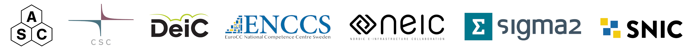
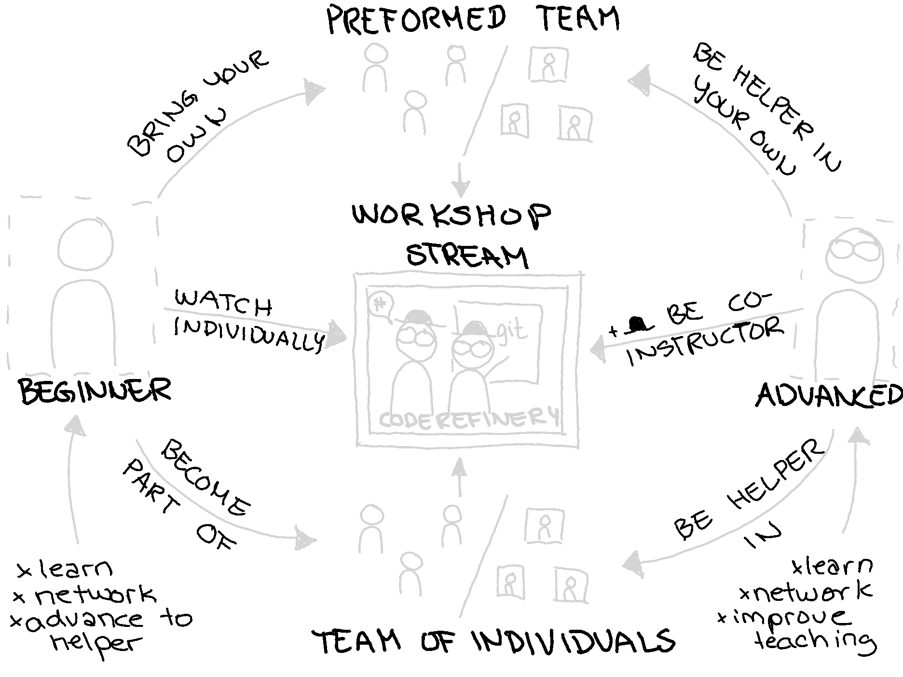

class: center, middle

## ISC 2022

# CodeRefinery

## Samantha Wittke, CSC - IT center for science, Finland

www.coderefinery.org

---

## CodeRefinery

We teach tools and practices for the
development of reproducible and reusable research software.

### We wish to provide

- .emph[For organizations]: an opportunity to pool competence and offer more training
  and development opportunities than they could individually.
- .emph[For volunteers and the team]: a community around teaching and opportunity for
  skill development, both in pedagogy and practical skills.
- .emph[For learners]: a welcoming and useful environment for learning many necessary
  practical skills that may otherwise not be explicitly taught.

---

---

## Workshop topics around FAIR software practices 

* basic and collaborative Git, 
* social coding and open software, 
* reproducibility, 
* documentation, 
* automated testing and 
* modular code development

### Last workshopin spring 2022

* *11* instructors and organizers, 
* *>20* volunteer helpers, 
* *297* participants from all over the world (mainly Nordics and Europe)  

--- 

## Low barriers for participating in different roles

---

---

---

## Come join us!

*Community teaching workshop*

June 21., 12-15 CEST

Information and registration:
https://hackmd.io/@coderefinery/community-teaching-2022-summer

*CodeRefinery workshop*

September 20.-22. and 27.-29., 9-12 CEST

Information and registration:
https://coderefinery.org/workshops/upcoming/

*CodeRefinery chat*

Community hang-out:
https://coderefinery.zulipchat.com/

