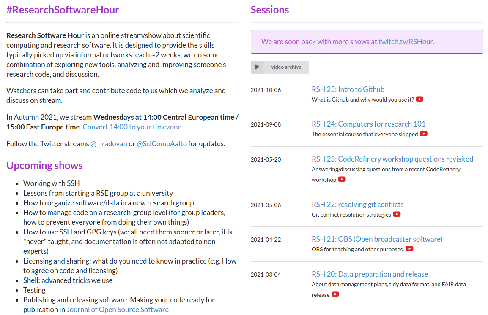

class: center, middle

## NeIC All-Hands Meeting 2022

# CodeRefinery: sustainability phase

## Radovan Bast [@\_\_radovan](https://twitter.com/__radovan)

Nordic e-Infrastructure Collaboration/
UiT The Arctic University of Norway

---

## CodeRefinery: hub for FAIR software practices

### CodeRefinery provides:

- For organizations: an .emph[opportunity to pool competence] and offer more training and development opportunities than they could individually.

- For volunteers and the team: a .emph[community around teaching] and opportunity for skill development, both in pedagogy and practical skills.

- For learners: a .emph[welcoming and useful environment for learning] many necessary practical skills that may otherwise not be explicitly taught. This can be through courses, hackathons, and the like.

---

.cite[Juliette Taka, Logilab and the OpenDreamKit project (2017), https://opendreamkit.org/2017/11/02/use-case-publishing-reproducible-notebooks/]

---

## CodeRefinery: bridging the gap

- https://carpentries.org/

---

## Research Software Hour

- https://researchsoftwarehour.github.io/
- Also [Research Software Seminar Series](https://nordic-rse.org/events/seminar-series/)

---

## Important but tricky points

### Governance: .emph[Clear distinction between NeIC project and community project]

- NeIC role needs to decrease over time if we want sustainability

- Make it possible and attractive for organizations to join also on short term

- Dynamic project leader(s) chosen by the community

- We will need legal support and organizational support in becoming independent

### Budget: 0.5-1 FTE from NeIC, rest is in-kind

- It can only work when both team member(s) and their organization want this

---

## CodeRefinery Hackathon

- Tuesday - Thursday, Jan 25-27
- Everybody welcome
- https://hackmd.io/@coderefinery/ahm-hackathon-2022

### Focus: online teaching

- How to scale and simplify online teaching, recording, and video production
