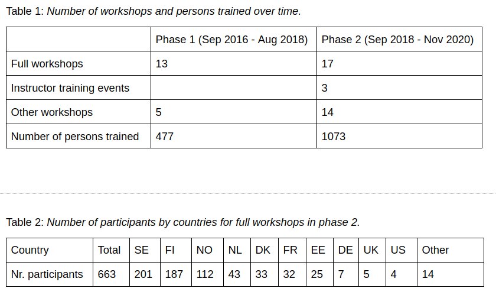

class: center, middle

# The CodeRefinery project

## Radovan Bast [@\_\_radovan](https://twitter.com/__radovan)

Nordic e-Infrastructure Collaboration/
UiT The Arctic University of Norway

---

## CodeRefinery

.left-column60[
We teach tools and practices for the
development of reproducible and reusable research software.

### We teach together!

- https://coderefinery.org
- https://coderefinery.org/workshops/past/
]
.right-column40[

]

---

.left-column70[
### Staff and hubs

- 12 persons are on contract (~ 3 FTE/year), funding until Oct 2021
- Major in-kind partner: [Aalto Scientific Computing](https://scicomp.aalto.fi/)
- Major training hubs: Aalto, Stockholm, Oslo, Trondheim

### Network

- 188 persons on <https://coderefinery.zulipchat.com/>
- 553 followers on [@coderefine](https://twitter.com/coderefine)

### Workshops

- Since 2016:
  - **30 full workshops**
  - 19 other workshops/events
  - 3 instructor training events
  - **over 1400 persons trained**
- last 3 workshops: **8 volunteer instructors**, over **60 volunteer helpers**
]
.right-column30[

]

---

## Typical curriculum

.left-column60[
- Basic and collaborative Git
- Social coding and open software
- Reproducible research
- Jupyter notebooks
- Code documentation
- Automated testing
- Modular code development
]
.right-column40[
### 3 days on-site in person

### Now: 6 half-days online
]

---

## A vision of reaching many people at once

.cite[Twitch: live streaming service popular in the gaming community]

---

## Scaling up during 2020: effective team work

- Previously: ~25 participants, ~2 helpers
- Now: 100 participants, 20+ helpers
- Lectures & code-along exercises in the main room: .emph[stream and also record]
- Get help and group exercises in a breakout room
- Participants can register as teams ("bring your own breakout room")
- Installation sessions and helper preparation sessions
- Asynchronous Q&A via [HackMD](https://hackmd.io/) ->
  we publish these ([example](https://coderefinery.github.io/2020-10-20-online/#questions-answers-and-feedback))

### More details

- [Operation manuals](https://coderefinery.github.io/manuals/):
  reference and training for our teaching style
- Blog post: https://coderefinery.org/blog/2020/07/31/mega-coderefinery/
- [Presentation at CarpentryCon@Home 2020](https://github.com/coderefinery/carpentrycon-2020)

---

## Growth

---

## Carpentries membership and coordination

[data and benefit]

[on-boarding new communities (social sciences and humanities)]

[Can we use something like pyramid type of figure? Carpentries is to provide
novices with basics and fundamentals of coding and data sciences, which are
essential to the next step where CR covers. If we should insist on the benefit
of supporting the Carpentries, the contributions we can make is to bottom-up of
researchers' skills and the benefit is to make CR visible to Carpentries
community and a better flow for skill up of the researchers? And that the
Nordic + Global online collaboration on teaching to reach people who are
difficult to reach?]

---

## Nordic research software engineers

### First online get-together held last week: .emph[100 registrants]

- https://nordic-rse.org/events/2020-online-get-together/

### First conference to take place May 27-28, 2021, Stockholm

---

## GitLab service

- Source code repository hosting for .emph[Nordic research software]
- .emph[580 users with projects, 108 groups, 986 projects]
- Notable projects: ARC/NT1, Earth Observation Laboratory, Centre for
  Integrated Remote Sensing and Forecasting for Arctic Operations, Symbioses,
  Nordic Language Processing Laboratory, EISCAT, UiT Master of Applied Computer
  Science, UiT Narvik R&D - Umbrella.
- Maintained by DeiC (very professional maintenance)

### Challenge

- .emph[Long-term funding] (now coupled to CodeRefinery funding)
- .emph[User support] (now CodeRefinery team)

---

## Value of the network and teamwork: success stories

### Python course

- Instead of each site developing their own course, we combined efforts and
  together developed one within 3 weeks:
  https://aaltoscicomp.github.io/python-for-scicomp/

### Research Software Hour

- Weekly online stream/show about scientific computing and research software
- https://researchsoftwarehour.github.io/

### Instructor training

- 3 instructor training events in one year, co-organized across
  borders

---

## What is CodeRefinery?

CodeRefinery's biggest development may not be *teaching*...

... is it *teaching together*?

---

## Future: our "ask"

### Can we really co-teach, instead of each partner re-inventing teaching?

CodeRefinery can bring and coordinate best practices:
- among infrastructure providers and other "hands-on teachers"
- creating a collaboration network of teaching
- reducing duplicated work
- teaching hybrid online/in person
- teaching best practices in *lesson development*
- teaching *collaboration*
- teaching *how to train others*

This can't be fully bottom-up.  .emph[We ask the NeIC board to help get us there, determine interest, and lobby.]

---

## CodeRefinery 2022: .emph[Community project]

Primary tasks:

- Classic "CodeRefinery workshops" with focus on best software practices, organized by partners
- Own training: both open tracks and sponsored personalized courses
- Coordinate other shared collaborative training events
- Train the trainer
- .emph[Seeking co-funding from NeIC and participating universities]

Secondary benefits:

- Continue coordinating Carpentries events in Nordics/Baltic countries
- Driving Nordic research software engineers network
- "Training support" of NeIC, for other projects
