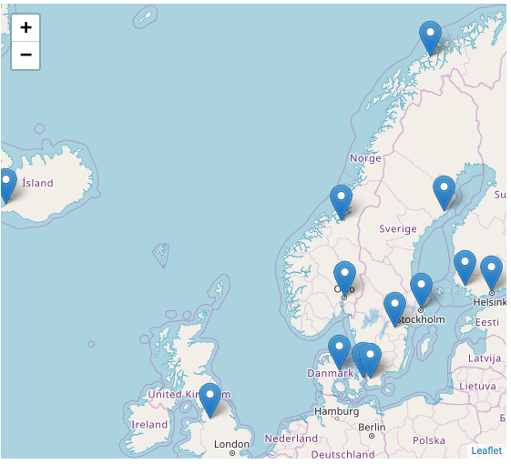

name: inverse
layout: true
class: middle

---

background-image: url(img/background.png)

---

layout: false

# CodeRefinery project phase 2 proposal

### 1) Why this project is needed
### 2) What we want to keep and what we need to change
### 3) How to become sustainable

---

class: split-50-50

# CodeRefinery workshops

Feedback: http://coderefinery.org/#what-do-our-participants-say-after-attending-a-workshop

.column[

]
.column[
## .blue[15] workshops delivered

## .blue[380] participants

## .blue[30] academic disciplines
]

---

# Impact

Post-workshop survey results (3-6 months after a workshop, 71 responses, 48% graduate students, 13% postdocs, 9% researchers, 9% professors, 19% other)

---

# Academic disciplines (1/2)

|            | discipline                                                               |
| ----------:|:------------------------------------------------------------------------ |
|        22% | Computer and Information Sciences                                        |
|        22% | Physical Sciences                                                        |
|        12% | Biological Sciences                                                      |
|         8% | Chemical Sciences                                                        |
|         7% | Earth and Related Environmental Sciences                                 |
|         4% | Mathematics                                                              |
|         3% | Electrical Engineering, Electronic Engineering, Information Engineering  |
|         3% | Mechanical Engineering                                                   |
|         2% | Medical Biotechnology                                                    |
|         2% | Health Sciences                                                          |
|         2% | Environmental Engineering                                                |
|         1% | Basic Medicine                                                           |
|         1% | Other Engineering and Technologies                                       |
|            | ...                                                                      |

---

# Academic disciplines (2/2)

|            | discipline                                                               |
| ----------:|:------------------------------------------------------------------------ |
|            | ...                                                                      |
|         1% | Economics and Business                                                   |
|         1% | Clinical Medicine                                                        |
|         1% | Psychology                                                               |
|         1% | Other Medical and Health Sciences                                        |
|         1% | Languages and Literature                                                 |
|         1% | Civil Engineering                                                        |
|         1% | Sociology                                                                |
|         1% | Other Natural Sciences                                                   |
|         1% | Nano-technology                                                          |
|         1% | Medical Engineering                                                      |
|         1% | Materials Engineering                                                    |
|         1% | Chemical Engineering                                                     |
|        <1% | Social and Economic Geography                                            |
|        <1% | Political Science                                                        |
|        <1% | History and Archaeology                                                  |
|        <1% | Educational Sciences                                                     |
|         2% | Other                                                                    |

---

# Outreach (1/2)

## Presentations

- Dalton meeting 2016, Uppsala (Radovan Bast)
- DIRAC meeting 2016, Odense (Radovan Bast)
- [NORDUnet conference 2016, Helsinki (Radovan Bast)](https://events.nordu.net/display/NDN2016/Welcome)
- [SNIC User Forum 2016, Lund (Radovan Bast)](http://cicero.xyz/v2/remark/github/coderefinery/talk-intro/snic-2016/talk.md/)
- [Workshop on Nordic Big Biomedical Data for Action 2016, Stockholm (Radovan Bast)](http://cicero.xyz/v2/remark/github/coderefinery/talk-intro/niasc-2016/talk.md/)
- [Sigma2 Metacenter meeting 2017, Tromsø (Radovan Bast)](http://cicero.xyz/v2/remark/github/coderefinery/talk-intro/sigma2-2017/talk.md/)
- [CodeRefinery day in Oslo, Apr 6, 2017 (Radovan Bast)](http://cicero.xyz/v2/remark/github/coderefinery/talk-intro/oslo-2017/talk.md/)
- [NeIC conference 2017, Umeå (Radovan Bast)](http://cicero.xyz/v2/remark/github/coderefinery/talk-intro/neic-2017/talk.md/)
- [NorduGrid conference 2017, Tromsø (Radovan Bast)](http://cicero.xyz/v2/remark/github/coderefinery/talk-intro/nordugrid-2017/talk.md/)
- [NORDUnet workshop, Sep 12-15, 2017, Copenhagen (Jyry Suvilehto)](http://cicero.xyz/v2/remark/github/coderefinery/talk-intro/ntw-2017/talk.md/)
- [Mid-term report presentation, NeIC Board meeting Sep 21, 2017, Copenhagen (Radovan Bast)](http://cicero.xyz/v2/remark/github/coderefinery/report/master/mid-term.md/)
- [DeiC conference 2017, Kolding (Radovan Bast)](http://cicero.xyz/v2/remark/github/coderefinery/talk-intro/deic-2017/talk.md/)
- [Nov 21-22, 2017, Narvik (Radovan Bast)](http://cicero.xyz/v2/remark/github/coderefinery/talk-intro/narvik-2017/talk.md/)
- [Short talk at the CarpentryCon 2018 conference, Dublin (Kjartan Thor Wikfeldt)](http://cicero.xyz/v2/remark/github/wikfeldt/shorttalk-coderefinery/master/talk.md/)

---

# Outreach (2/2)

## Events

- [CodeRefinery day in Oslo, April 2017](https://www.uio.no/english/services/it/research/events/coderefinery-2017-april.html)

## Articles about CodeRefinery

- *The CodeRefinery Project*, [PDC December 2016 newsletter](https://www.pdc.kth.se/publications/pdc-newsletter-articles/2016-no-2/the-coderefinery-project-1.744952)
- *CodeRefinery Workshops*, [PDC June 2017 newsletter](https://www.pdc.kth.se/publications/pdc-newsletter-articles/2017-no-1/coderefinery-workshops-1.744807)
- *CodeRefinery and the Red Queen's race*, [CSC June 2017 blog post](https://www.csc.fi/web/blog/post/-/blogs/coderefinery-and-the-red-queen-s-race)
- *First Year of CodeRefinery*, [PDC December 2017 newsletter](https://www.pdc.kth.se/publications/pdc-newsletter-articles/2017-no-2/first-year-of-coderefinery-1.783468)
- *Better software leads to better science*, [Nordforsk January 2018 news article](https://www.nordforsk.org/en/news/better-software-leads-to-better-science?set_language=en)

---

# GitLab repository hosting for the Nordics

### Service statistics

- 121 users
- 156 projects
- 12 groups

### Notable projects/groups

- [Symbioses](http://akvaplan.niva.no/en/symbioses): simulating ecological impact of an oil spill
- [NorduGrid Advanced Resource Connector](http://www.nordugrid.org/arc/)
- [EISCAT](https://www.eiscat.se)
- [Earth Observation Laboratory](https://eo.uit.no): Remote Sensing Research at UiT - The Arctic University of Norway
- [Centre for Integrated Remote Sensing and Forecasting for Arctic Operations](https://cirfa.uit.no)

Cost: 50k NOK/year, still unknown to most Nordic researchers

---

# Automated testing use cases

### [Nordugrid ARC](http://www.nordugrid.org/arc/)

*"With GitLab we now not only have a version control system (git), but also a
very good platform for discussing changes to the source-code, performing
automatic build upon commits, and setting up a testing infrastructure. We are
using GitLab extensively now, and plan to expand the automatic deploy and
testing that GitLab offers in the near future." [Maiken Pedersen]*

### [Dalton and LSDalton](http://daltonprogram.org)

*"The Dalton project consists of several feature-rich programs. This is
reflected in the test set which is thus very demanding. Using the CodeRefinery
CI service, we are able to run the test set in a reasonable time, thus
accelerating the development workflow, and additionally it allows us to run the
individual tests in both serial and parallel mode." [Jógvan Magnus Haugaard Olsen]*

### [DIRAC](http://diracprogram.org)

Computes molecular properties using relativistic quantum chemical methods.

---

# Goals for follow-up project

- Include Estonia and Iceland to our network and activities
- Focus on **workshops** but keep services running
- In workshops **use own services**
- **Reach scale**
  - Training and promoting instructors
  - Good practice guides
  - Screen-casts
- Create hub for **Nordic reseach software engineers** (RSEs)
  - Workshops for instructors and RSEs
  - Organize a Nordic RSE conference
- Reach **sustainability** (more below)

---

# Network

### Aalto Science-IT (Richard Darst)

- Very fruitful collaboration with Richard Darst: lesson development and sharing of material,
  co-organized two CodeRefinery workshops
- Commitment to sponsoring two workshops per year as part of top-to-bottom, yearly training program
- Will spread this model through Finnish Grid and Cloud Infrastructure university partners.

### Nordic RSE

- https://www.pdc.kth.se/about/pdc-news/the-nordic-research-software-engineer-initiative-1.823934

### Possible future Carpentries partnership

- NeIC has granted support for 5 Software Carpentry workshops in the Nordics

---

# How to become sustainable in 3 years

- Grow the number of instructors
- Increase visibility of material
- Encourage re-use and modification of the material
- After phase 2 we will have certified "CodeRefinery instructors" distributed over the Nordics
- NeIC partners will contribute instructors in-kind to teach at ~2 workshops a year
  (great career development, Carpentries model)
- Call for invited workshops: host institutions will cover travel and lodging
- "CodeRefinery hubs": universities willing to host 1-2 workshops per year (good example: Aalto Science-IT)
- Institutions and NeIC partners contribute to 1 FTE for administration and coordination

---

# Conclusion

- There is significant need for workshops that are more advanced than Carpentries
- NeIC and partners have a working team
- Working drop-in model
- Little risk or uncertainty
- Career development opportunity for NeIC/IP staff

---

## *"CodeRefinery was the best course I have had. If you need some quote to support it for the future, just make something up from me."* [sic]
