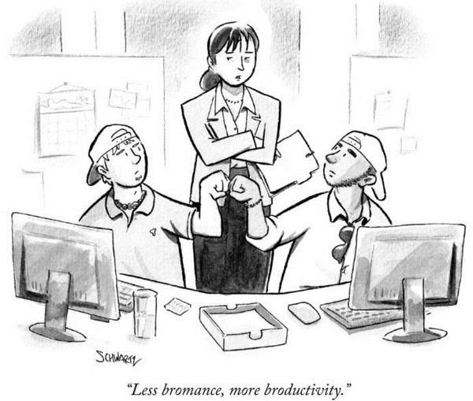
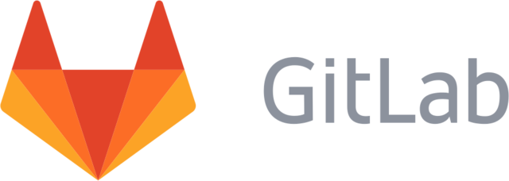
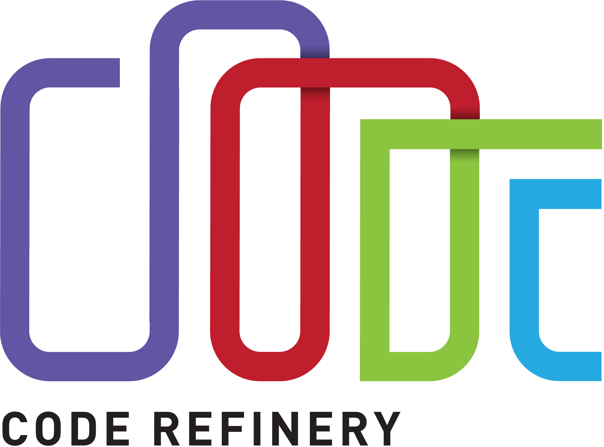

name: inverse
layout: true
class: middle

---

background-image: url(img/background.png)

---

layout: false

# CodeRefinery project mid-term report

## .blue[Part 1/3]

- Motivation
- Scope
- Team

## .blue[Part 2/3]

- Achievements
- Challenges
- Lessons learned

## .blue[Part 3/3]

- Outlook
- Recommendations

---

class: split-60-40

## Motivation: Better science with better software

.column[

(c) The New Yorker, Oct 17, 2016
]
.column[
- Provide researchers with **infrastructure**, **training**, and **guides** in the necessary tools
  and techniques to create sustainable, modular, reusable, and reproducible
  software
- Build **strong partnerships** with related initiatives
]

---

.left-column[

]
.right-column[
## CodeRefinery launched September 2016

- Nordic e-Infrastructure Collaboration project
- Funded for two years
- We are a team of enthusiasts located in DK, FI, NO, SE

### Team

- Bjørn Lindi
- Erik Edelmann
- Jyry Suvilehto
- Lukasz Bartosz Berger
- Nikolai Denissov
- Radovan Bast
- Risto Laurikainen
- Sabry Razick
- Sri Harsha Vathsavayi
- Thor Wikfeldt

### Alumni

- Pinja Koskinen
]

---

## Steering group members

- Gerd Behrmann, DK, Technical advisor
- Hans A. Eide, NO
- Lene Krøl Andersen, DK
- Marti Louhivuori, DK
- Michaela Barth, SE, Chair
- Rossen Apostolov, SE

---

## [Ten simple rules for making research software more robust](https://doi.org/10.1371/journal.pcbi.1005412)

**M. Taschuk, G. Wilson** (2017). PLoS Comput Biol 13(4): e1005412.

- Use **version control**
- **Document** your code and usage
- Make common operations easy to control
- **Version** your releases
- **Reuse** software (within reason)
- Rely on **build tools** and package managers for installation
- Do not require root or other special privileges to install or run
- Eliminate hard-coded paths
- Include a small **test set** that can be run to ensure the software is actually working
- Produce identical results when given identical inputs

---

class: split-40-60

## Workshop roadshow

.column[
- Dec 2016 - Helsinki
- Feb 2017 - Stockholm
- May 2017 - Copenhagen
- May 2017 - Stockholm (meetup)
- May 2017 - Umeå (NeIC 2017)
- Jun 2017 - Tromsø
- Sep 2017 - Manchester (RSE)
- Oct 2017 - Umeå
- Oct 2017 - Aarhus
- Nov 2017 - Linköping
- Dec 2017 - Helsinki
- Feb 2018 - Trondheim
- Mar 2018 - Turku
- Apr 2018 - Odense
- May 2018 - Uppsala
- Jun 2018 - Oslo
- Aug 2018 - Reykjavík
]
.column[

]

---

template: inverse

## Part 2/3

### - Achievements
### - Challenges
### - Lessons learned

---

## Workshops/events held

- Dec 2016 - Helsinki (3-day workshop, 21 participants)
- Feb 2017 - Stockholm (3-day workshop, 27 participants)
- Apr 2017 - Oslo (1-day meetup, 10 participants)
- May 2017 - Copenhagen (3-day workshop, 19 participants)
- May 2017 - Stockholm (afternoon meetup, 20 participants)
- May 2017 - Umeå (workshop at NeIC 2017, 10 participants)
- Jun 2017 - Tromsø (3-day workshop, 20 participants)
- Sep 2017 - Manchester (1.5 h workshop, 20 participants)

### Typical course website and schedule: http://coderefinery.org/workshops/2017-06-19-tromso/

- In less than 4 months after project start we have developed and deployed our first workshop.
- Busy workshop schedule in the first half of the project period.
- Project team has absorbed this pressure and delivered an excellent job.

---

## Lesson material

- [Introduction to version control](https://coderefinery.github.io/git-intro/)
- [Documentation](https://coderefinery.github.io/documentation/)
- [Jupyter notebooks](https://github.com/coderefinery/jupyter)
- [Collaborative distributed version control](https://coderefinery.github.io/git-collaborative/)
- [Managing complexity and modular code development](http://cicero.xyz/v2/remark/github/bast/talk-complexity/master/talk.md/)
- [Automated testing](https://coderefinery.github.io/testing/)
- [DevOps, automation, and continuous integration](https://coderefinery.github.io/automation/)
- [Building portable code with CMake](https://coderefinery.github.io/cmake/)
- [Integrated development environments](https://coderefinery.github.io/IDEs/)
- [Archaeology with Git](https://coderefinery.github.io/git-archaeology/)
- [Git branch design](https://coderefinery.github.io/git-branch-design/)
- [Mixed Martial Arts: Interfacing Fortran, C, C++, and Python](https://coderefinery.github.io/mma/)

### Suggestions for future topics

- Contribution guides
- How to open-source a project
- Software licenses
- Reproducible science

---

## Lesson format

- Interactive
- Type-along
- Hands-on
- Minimize slides
- Alternate 10-15 minute demonstrations with exercises
- Progress feedback with green/red sticky notes (inspired by Software Carpentry)
- Collect feedback after each lesson
- Software carpentry style format for online material to encourage/simplify transferral

---

## Workshops

### What works well

- We fill the rooms
- Most participants return second and third day
- Feedback is very useful

### Lessons learned

- Meet-ups are great for community building
- *Only confuse people with one new idea at a time - make examples that illustrate only one new point.* [Joe Armstrong]
- Room quality very important (two projectors)
- Local contact for room reservation, **email lists**, catering contact and practical questions is important

---

## Workshops

### What we need to improve

- Challenge: disciplines are at different levels
- Better include humanities
- Even more clearly communicate prerequisites and workshop outcomes
- Best practice guides in form of blogs
- Information channels have varying penetration according to country or discipline
- Decentralize paperwork and support requests

---

## Workshop feedback

- We collect feedback after each lesson
- *"Tell us one thing that was particularly good/useful but also one thing that we definitely need to improve".*
- Explicit
- Very useful for instructors
- Difficult to visualize/communicate our feedback surveys

### Examples

- Espoo: https://docs.google.com/document/d/1rSSe5CEm8piVrusXzyjUG0xeCAKh2rPbHthi7CKbk7o/
- Stockholm: https://docs.google.com/document/d/1Zc_P1CsW5ni0ubQQ2brD397qcRZmr32csWh8QoYcs_k/
- Copenhagen: https://docs.google.com/document/d/1vesWPNZIymNZxk7imoLGzekQtaCUZvQpCyOOYiZiKWY/
- Tromsø: https://docs.google.com/document/d/1Xn5cSRbvP618_FoFhEwIK9eZL6AMXs---A1x2xFo9gY/

---

## Workshop feedback

### What we need to improve

- We have no metrics about how effective our workshops are for the time **after** the workshop
- Solution: brief feedback form sent out 3-6 months after the workshop

---

template: inverse

## Infrastructure services

---

## Git repository hosting for Nordic research software

- Repository hosting
- Collaboration
- Code review
- Issue tracking
- Documentation

- http://coderefinery.org/repository/
- https://source.coderefinery.org
- Temporary service is excellently maintained by CSC staff

---

## Metrics

- Current: 49 projects, 45 users, 13 groups
- Goal: 1000 projects, 500 users

### Plans

- Migrate service to DeIC infrastructure
- Migrate users from https://source.uit.no (1249 projects, 586 users, 61 groups)
- Advertise service

### Risks

- We migrate the service away from CSC staff
- We migrate from a known solution to an unknown

---

## Plan: Continuous integration service

- [Travis CI](https://travis-ci.org), [GitLab CI](https://about.gitlab.com/gitlab-ci/), [Jenkins](https://jenkins.io), [Drone](https://github.com/drone/drone), [AppVeyor](https://www.appveyor.com), ...
- Test every changeset
- We plan to deploy a service which will make it easier for researchers to test their code

---

## Team and general observations

### What works well

- Excellent team
- Good team spirit
- Monday morning hello in the chat

### Lessons learned

- Project website is important
- Maximize transparency
- Minimize tool-set
- Google Drive
- Weekly video meetings with max. 60 minutes
- Minimize communication overhead (both towards team and towards NeIC) with an efficient website

---

## Team and general observations

### Challenges

- Team is generally not recruited from research groups
  (advantage: new perspective and experience in programming, disadvantage: sometimes creates gap)
- NeIC seems optimized for infrastructure services but course development falls outside
- Administrative overhead for a relatively small project
- Stakeholders and funding bodies like numbers and success stories but these can be difficult to quantify in workshops
- We have team members with 25% or less involvement: tricky both for management and the team member
- Team members have to report to partially disjoint stakeholders

---

## Outreach and visibility

### Web

- http://coderefinery.org
- https://neic.no/coderefinery/

### Twitter (72 followers)

- [@coderefine](https://twitter.com/coderefine)

### GitHub (37 repositories)

- [github.com/coderefinery](https://github.com/coderefinery)

### Mailing list (55 members, all opt-in)

- [coderefinery@googlegroups.com](https://groups.google.com/group/coderefinery)

---

## CodeRefinery in the press

- https://neic.no/news/2017/03/15/better-software-leads-to-better-science/
- https://www.deic.dk/news/2017-05-10/CodeRefinery
- https://www.pdc.kth.se/news/news-repository/coderefinery-workshop-in-espoo
- https://www.pdc.kth.se/newsletter/2017-1/pdc-newsletter-2017-no.-1
- https://csc.fi/de/web/blog/post/-/blogs/coderefinery-and-the-red-queen-s-race

---

## Logo: *Complexity expressed with simplicity*

---

template: inverse

## Part 3/3

### - Outlook
### - Recommendations

---

## Outlook

- Courses are and will be needed
- Courses need to be maintained after this project has ended
- Services will be needed and used but need to be better advertised
- Maintaining services is and probably will be cheap compared to salary costs

---

## Recommendations for follow-up project

- Support continuation of a GitLab service for 2 subsequent years and observe growth
- Closer collaboration with Software Carpentry
- Transfer course maintenance to the community (to volunteers)
- Recruit instructors from the research community
- Allocate administrative support for the project for training coordination and reporting
- Strike balance between discipline generality and discipline specificity to include humanities
- Consider shifting budget from instructor salaries to instructor mobility
- Consider more lightweight management structure if the overall budget is small
